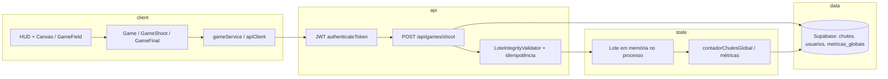

# Roadmap, checklist de lançamento e arquitetura do gameplay — GoldeOuro V1

Documento único de referência, alinhado ao repositório atual (ex.: `POST /api/games/shoot` em `server-fly.js`, fluxo de lotes R$ 1,00 V1, player em `goldeouro-player` com `Game*`, `gameService`, HUD/canvas).

**Data:** 2026-03-28.

---

## 1. Roadmap de desenvolvimento (visão completa)

### Fase A — V1 estável (agora)

- Congelar regras: valor fixo R$ 1,00 por chute, lote de tamanho configurável, “gol de ouro” por contador global.
- Fechar financeiro: PIX webhook + reconcile + RPC; migrações `reconcile_skip` e legados.
- Observabilidade: logs `[SHOOT]`, `[WEBHOOK]`, `[RECON]`, health/`ready` no Fly.
- Player: uma rota canónica de jogo (`Game` → `GameShoot` → `GameFinal`), `gameService` e API base estáveis.

### Fase B — V1.1 (pós-lançamento controlado)

- Valores de chute > R$ 1 (quando o backend deixar de rejeitar).
- Melhorias de UX: reconexão, estados de erro claros, analytics já iniciado (`analytics.js`).
- Testes automatizados mínimos no shoot + contrato API.

### Fase C — V2 (produto)

- Novos modos de jogo / probabilidades se mudarem da V1 “gol no último chute”.
- Escalabilidade: lotes e métricas se o tráfego exigir particionamento ou cache.
- Recursos sociais/gamificação já esboçados no player — ativar por feature flags.

---

## 2. Checklist de lançamento

### Produto e legal

- [ ] Termos, privacidade e idade/jogo a dinheiro revisados e publicados.
- [ ] Política de saque/depósito e limites comunicados no player.

### Infra

- [ ] `fly deploy` com `fly.toml` e secrets (JWT, Supabase, MP, webhook secret).
- [ ] `/health` e `/ready` OK; domínio e CORS alinhados ao player.
- [ ] Backup Supabase e plano de rollback de deploy.

### Pagamentos

- [ ] `MERCADOPAGO_WEBHOOK_SECRET` correto; teste PIX real pós-correção.
- [ ] RPC `creditar_pix_aprovado_mp` aplicada; legados `reconcile_skip` se necessário.

### Gameplay

- [ ] Fluxo: login → saldo → chute → resultado → saldo atualizado.
- [ ] Idempotência do shoot (retries não duplicam chute).
- [ ] Contador global / gol de ouro coerente após restart (carregamento de métricas).

### Player

- [ ] `VITE_*` / `environments.js` apontando para produção.
- [ ] PWA/cache: versão visível (`VersionBanner`) para evitar clientes velhos.

### Operações

- [ ] Runbook: “PIX não creditou”, “deploy falhou”, “saldo divergente”.
- [ ] Monitorização (Fly logs + alertas mínimos).

---

## 3. Arquitetura do gameplay (resumo)

- **Cliente:** escolha de direção/ação → `gameService` chama API com token.
- **API:** valida saldo, lote ativo, tamanho do lote, integridade pré/pós-chute; persiste `chutes`; atualiza lote e prémios; dispara lógica de “gol de ouro” / conclusão de lote.
- **Estado crítico:** parte do estado do lote vive **no processo Node** (`server-fly.js`); reinício de máquina exige coerência com DB e métricas carregadas — ponto sensível de arquitetura para escala.

---

## Como usar na prática

- **Roadmap:** priorizar Fase A até o checklist de lançamento estar verde.
- **Lançamento:** tratar o checklist como gate antes de tráfego pago alto.
- **Arquitetura:** documentar internamente que o lote em memória + Supabase é o núcleo do V1; qualquer segundo servidor ou múltiplas réplicas exige redesign (ou sticky sessions / estado em DB).
