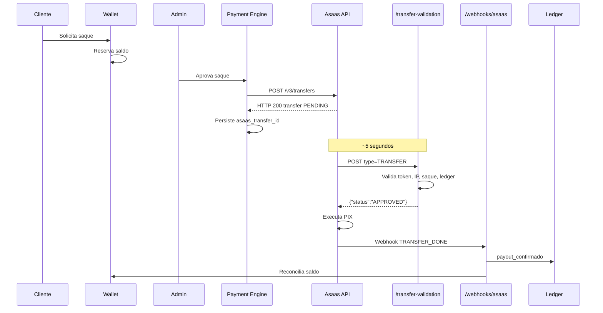

# P1.6 — Arquitetura: Webhook de Autorização de Transferência Asaas

**Projeto:** Gol de Ouro™ V1  
**Arquitetura:** Indesconectável Payment Engine™  
**Data:** 2026-06-29  
**Status:** Aprovado para implementação (auditoria Fase 0 = PASS)  
**Dependência:** P1.5CERT (PIX OUT HTTP 200 validado)

---

## 1. Objetivo

Eliminar intervenção humana (Token SMS/APP) no PIX OUT Asaas utilizando exclusivamente o **Transfer Authorization Webhook** oficial, mantendo compatibilidade com Mercado Pago, PIX IN, Wallet, Ledger e webhooks financeiros existentes.

---

## 2. Fluxo End-to-End



---

## 3. Separação de Responsabilidades

```
src/finance/webhooks/
├── processPaymentWebhook.js          # PIX IN + roteamento (inalterado)
├── processAsaasTransferWebhook.js    # TRANSFER_* financeiro (inalterado)
└── asaasTransferAuthorization.js     # NOVO — apenas autorização
```

| Rota | Responsabilidade | Resposta |
|------|------------------|----------|
| `POST /webhooks/asaas` | Eventos financeiros (`PAYMENT_*`, `TRANSFER_*`) | HTTP 200 + processamento assíncrono |
| `POST /webhooks/asaas/transfer-validation` | Autorização pré-execução | `{"status":"APPROVED"}` ou `REFUSED` **síncrono** |

---

## 4. Módulo `asaasTransferAuthorization.js`

### 4.1 Entrada

```javascript
{
  headers: { 'asaas-access-token': '...' },
  body: { type: 'TRANSFER', transfer: { id, status, value, externalReference, ... } },
  ip: '52.67.12.206',
  supabase,
  requestId
}
```

### 4.2 Pipeline de Validação

```
1. Gate ASAAS_TRANSFER_AUTH_ENABLED
2. Token (asaas-access-token) — timing-safe
3. IP allowlist (opcional, ASAAS_TRANSFER_AUTH_IP_CHECK)
4. Payload: type === TRANSFER, transfer.id presente
5. Lookup saque: asaas_transfer_id → payout_external_reference
6. Regras de negócio (todas devem passar):
   - transfer.status === PENDING
   - saque em aguardando_confirmacao ou in-flight
   - saque não terminal (processado/falhou/cancelado)
   - valor transfer.value ≈ saque.net_amount
   - externalReference bate (se presente em ambos)
   - ledger íntegro (sem COMPENSATED, sem payout_confirmado prévio)
   - provider Asaas (asaas_transfer_id ou asaas_payout_raw)
7. Idempotência: replay do mesmo transfer.id → APPROVED se já autorizado
8. Resposta síncrona < 10s
```

### 4.3 Saída

```javascript
// Aprovação
{ httpStatus: 200, body: { status: 'APPROVED' }, authorized: true }

// Recusa
{ httpStatus: 200, body: { status: 'REFUSED', refuseReason: '...' }, authorized: false }
```

> O Asaas exige HTTP 200 com corpo JSON contendo `status`. Recusas também retornam 200 (não 4xx).

---

## 5. Regras de Autorização

| Condição | Ação |
|----------|------|
| `transfer.status === PENDING` | Obrigatório |
| Saque `aguardando_confirmacao` | Autorizar se demais checks OK |
| Saque terminal | REFUSED |
| Saque não encontrado | REFUSED |
| Valor divergente (> R$ 0.01) | REFUSED |
| Token inválido | REFUSED (log 401 interno) |
| IP não allowlisted (se habilitado) | REFUSED |
| Ledger COMPENSATED | REFUSED |
| Replay idempotente (mesmo transfer, saque in-flight) | APPROVED |

---

## 6. Logs Estruturados

```
[ASAAS AUTH] request_id=... withdrawal_id=... correlation_id=... transfer_id=... authorized=true|false reason=... duration_ms=...
```

**Nunca** registrar tokens, API keys ou dados PIX completos.

---

## 7. Variáveis de Ambiente

| Variável | Default | Descrição |
|----------|---------|-----------|
| `ASAAS_TRANSFER_AUTH_ENABLED` | `false` | Master gate do endpoint |
| `ASAAS_TRANSFER_AUTH_TOKEN` | fallback `ASAAS_WEBHOOK_TOKEN` | Token esperado no header |
| `ASAAS_TRANSFER_AUTH_STRICT_MODE` | `true` | Exige token válido |
| `ASAAS_TRANSFER_AUTH_IP_CHECK` | `false` | Valida IP de origem Asaas |

---

## 8. Compatibilidade Provider Agnostic

| Provider | Impacto P1.6 |
|----------|--------------|
| **Asaas** | Novo módulo isolado — único beneficiário |
| **Mercado Pago** | Zero alterações |
| **Celcoin** | Zero alterações |
| **Wallet** | Zero alterações |
| **Ledger** | Zero alterações (auth não grava ledger) |
| **PIX IN** | Zero alterações |
| **Rollback** | Preservado — auth não interfere |

---

## 9. Plano de Rollback

1. **Imediato:** `ASAAS_TRANSFER_AUTH_ENABLED=false` → endpoint retorna 404
2. **Asaas:** desabilitar mecanismo no painel → volta SMS/APP ou bloqueio
3. **Código:** remover rota em `server-fly.js` (reversível via git)
4. **Sem migração DB:** nenhuma coluna nova obrigatória

---

## 10. Pré-requisitos de Homologação

### Sandbox
1. Habilitar mecanismo no painel Sandbox
2. Configurar URL do webhook de autorização
3. `ASAAS_TRANSFER_AUTH_ENABLED=true`
4. Executar `scripts/verify-asaas-transfer-authorization-p16.mjs`

### Produção Controlada
1. Account manager desativa autorização crítica
2. Janela operacional com gates PIX OUT já validados (P1.5MASTER)
3. 1 saque valor mínimo
4. Validar: auth webhook → TRANSFER_DONE → wallet → ledger

---

## 11. Riscos e Mitigações

| Risco | Mitigação |
|-------|-----------|
| Timeout 10s | Resposta síncrona, sem I/O pesado |
| 3 falhas = cancelamento | Monitorar logs; alertas |
| URL incorreta no painel | Documentar URL exata Fly |
| WAF bloqueia Asaas | Allowlist IPs oficiais |
| Race condition payout→auth | Aceitar saque in-flight + lookup por transfer.id |

---

## 12. Arquivos da Implementação

| Arquivo | Ação |
|---------|------|
| `src/finance/webhooks/asaasTransferAuthorization.js` | Criar |
| `src/finance/config/asaas-transfer-auth-config.js` | Criar |
| `server-fly.js` | Adicionar rota |
| `scripts/verify-asaas-transfer-authorization-p16.mjs` | Criar |

**Não alterar:** `processPaymentWebhook.js`, `processAsaasTransferWebhook.js`, `pix-mercado-pago.js`, wallet, ledger.
