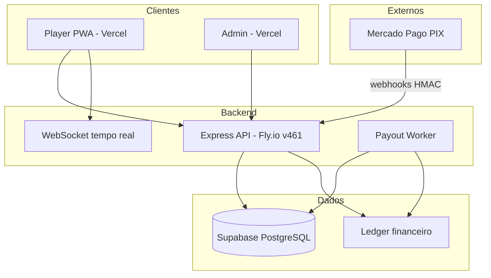

# V1.FINAL — Supreme Audit & Executive Report

**Gol de Ouro — Plataforma V1**  
**Data:** 2026-05-19  
**Audiência:** Sócios, investidores qualificados, liderança técnica  
**Modo:** read-only · baseline preservada · produção intacta

---

## Executive Summary

O **Gol de Ouro V1** é uma plataforma de entretenimento com economia real (PIX Mercado Pago, ledger financeiro, saques) já **em produção**, auditada em dezenas de missões controladas (V1.1A → V1.6) e encerrada oficialmente com **certificação operacional CERTIFIED WITH RESSALVAS** (score **88/100**, maturidade **Semi-autonomous**).

**O que foi provado:** integridade financeira crítica (zero saldo negativo, zero duplicatas ledger), runtime hardened e rastreável, webhooks com HMAC obrigatório, governança com runbooks e gates, baseline congelada para V2.

**O que não foi provado:** comportamento sob carga massiva, SOC2, alertas externos live, automação CI bloqueante em `main`.

**Veredito para stakeholders:** a V1 é **apta para operação contínua, captação transparente e expansão controlada** — não deve ser vendida como “enterprise scale-tested”.

| Indicador | Valor |
|-----------|-------|
| Runtime certificado | `a83c3cf` |
| Fly | **v461** |
| Player bundle | `index-B6M2smS9.js` |
| Certificação | CERTIFIED WITH RESSALVAS |
| Produção alterada nesta auditoria | **Não** |

---

## Visão estratégica

O Gol de Ouro ocupa o nicho de **jogo casual de alta frequência com liquidez PIX instantânea** — diferencial competitivo em mercados onde depósito/saque rápido define retenção.

A V1 entregou:

- Produto jogável em produção (PWA, gameplay penáltis, fila, áudio)
- Trilha financeira auditável (ledger, RPC anti-double-credit, reconcile)
- Postura de segurança em webhooks (fail-closed)
- Governança operacional madura para time enxuto

A **Engine V2** herdará esta baseline como contrato técnico — não como reescrita do zero.

---

## Arquitetura geral

**Princípios:** API stateless no Fly; estado financeiro no Postgres; crédito PIX via RPC atômica; webhooks idempotentes.

---

## Stack oficial

| Camada | Tecnologia | Produção |
|--------|------------|----------|
| Frontend jogador | React / Vite / PWA | Vercel · `goldeouro.lol` |
| Frontend admin | React / TypeScript | Vercel |
| Backend | Node.js 18+ / Express | Fly.io `goldeouro-backend-v2` |
| Banco | PostgreSQL (Supabase) | `gayopagjdrkcmkirmfvy` |
| Pagamentos | Mercado Pago PIX | Webhooks inbound/outbound |
| CI/CD | GitHub Actions | Deploy controlado; gates em examples |
| Observabilidade | Scripts + relatórios | Read-only; Uptime não ativo |

---

## Runtime & deploy

| Item | Baseline certificada |
|------|---------------------|
| `GET /meta` → `gitCommit` | `a83c3cffcc998ed3d1bd8d2e88619a9b03afb634` |
| Fly release | **461** |
| `GET /health` | ok · DB · Mercado Pago connected |
| Player bundle | `index-B6M2smS9.js` |

Deploy V1.1F consolidou hardening de webhook payout. Drift repo local vs runtime documentado (V1.2C) — **runtime live é a fonte da verdade**.

---

## Segurança

| Controle | Estado |
|----------|--------|
| JWT + Supabase Auth | Ativo |
| HMAC webhook depósito | **401** sem assinatura (live) |
| HMAC webhook payout | **401** sem assinatura (live) |
| RLS Supabase | Implementado |
| Rate limiting / middleware | Presente no backend |
| Replay / flood | Runbooks V1.2D |

---

## Sistema financeiro

**Inbound:** PIX → webhook → reconcile `pending` → RPC `claim_and_credit_approved_pix_deposit` → ledger `deposito`.

**Outbound:** saque → worker payout → ledger `saque` / `falha_payout` / `rollback`.

| Métrica live (baseline V1.2A/V1.6) | Valor | Status |
|-----------------------------------|------:|--------|
| saldo_negativo | 0 | OK |
| dups_corr_tipo | 0 | OK |
| approved_sem_ledger | 34 | Legado estável |
| pix_pending_old | 54 | Monitorado |
| payout_confirmado | 0 | Ressalva documentada |

---

## Ledger

Tabela `ledger_financeiro` com unicidade `(correlation_id, tipo)`. Tipos auditados: `deposito`, `saque`, `taxa`, `falha_payout`, `rollback`, etc.

Patch M1 (V1.1B) endureceu RPC contra double-credit e self-heal sem crédito indevido.

---

## Webhooks

| Rota | Função | Hardening |
|------|--------|-----------|
| `POST /api/payments/webhook` | Depósito PIX | HMAC V1.1D |
| `POST /webhooks/mercadopago` | Payout / MP | HMAC V1.1F |

Probes read-only confirmam rejeição **401** sem assinatura em produção.

---

## Payout

Worker dedicado com flags `payoutPixProcessingEnabled`. Auditoria V1.1E: 0 saldo negativo, saques com estados documentados. Liveness do processo: validar logs `[PAYOUT][WORKER][HEARTBEAT]`.

---

## Governança operacional

- **17+ runbooks** (`docs/runbooks/`)
- **INCIDENT-RESPONSE-FLOW** e classificação P0–P3
- **Activation gates** V1.5 / V1.5A (`pre-deploy-gate.js`)
- **Freeze governance** simulada V1.5
- **Change control:** snapshot PRE-APPLY antes de SQL em produção

---

## Observabilidade

| Fase | Entrega |
|------|---------|
| V1.2A | Runtime + financial health baseline |
| V1.2B | Alertas operacionais (read-only) |
| V1.2C | Drift & deploy integrity |
| V1.2E | Continuous verification |
| V1.5D | Plano monitoramento externo (não ativo) |

Scripts: `continuous-verification.js`, watchdogs, `v1-2a-runtime-financial-health.js`.

---

## Runbooks

Categorias: financeiro, runtime, segurança, workers. Exemplos críticos:

- `RUNBOOK-approved-sem-ledger.md`
- `RUNBOOK-duplicata-ledger.md`
- `RUNBOOK-hmac-failure.md`
- `RUNBOOK-runtime-drift.md`

---

## Activation gates

`scripts/activation/pre-deploy-gate.js` consolida runtime, financeiro, certificação externa (dry-run), anomalias e disponibilidade.

**Decisão atual:** REVIEW → sign-off humano antes de deploy.

---

## Resilience

V1.5: resilience engine, chaos readiness simulado, score consolidado **94** (HARDENED). Estado operacional pode ser DEGRADED em rede instável — cache documentado.

---

## Certificações

| Missão | Resultado |
|--------|-----------|
| V1.1G | PASS COM RESSALVAS (financeiro) |
| V1.1F | Webhook payout hardened |
| V1.6 | CERTIFIED WITH RESSALVAS (88/100) |
| V1.FINAL | Supreme audit (este documento) |

---

## Baseline congelada

Referência única: [V1-BASELINE-CERTIFIED.md](../certification/V1-BASELINE-CERTIFIED.md)  
Certificação institucional: [GOLDEOURO-V1-OFFICIAL-CERTIFICATION.md](../certification/GOLDEOURO-V1-OFFICIAL-CERTIFICATION.md)

---

## Riscos residuais (honestos)

1. Backlog legado 34 approved/ledger — não P0, estável  
2. payout_confirmado = 0 — transparência ao investidor  
3. Monitoramento externo não ativo  
4. Não stress-tested em escala  
5. Gate REVIEW — disciplina humana necessária  
6. Drift Git local vs produção  

---

## Roadmap V2 (estratégico)

| Horizonte | Iniciativa |
|-----------|------------|
| **Q1 pós-V1** | Ativar monitoramento externo (V1.5D checklist) |
| **Q1–Q2** | CI gate bloqueante em `main` (exemplo → workflow real) |
| **Q2** | Engine V2 — modularização, filas, observabilidade nativa |
| **Q2–Q3** | Stress test + capacity planning |
| **Contínuo** | Redução backlog U1–U4 com plano controlado |

---

## Conclusão executiva

A **V1 do Gol de Ouro está oficialmente encerrada e certificada** com ressalvas documentadas. A plataforma demonstra **maturidade operacional governada**, integridade financeira nos indicadores críticos e postura de segurança em produção real.

Para sócios e investidores: o ativo é **operacional, auditável e expansível** — com dívida técnica legada explícita e sem inflação de maturidade enterprise.

**Próximo passo recomendado:** apresentação executiva ([V1-FINAL-EXECUTIVE-DELIVERY-PRESENTATION.md](V1-FINAL-EXECUTIVE-DELIVERY-PRESENTATION.md)) + demo live ([V1-FINAL-LIVE-DEMONSTRATION-PLAN.md](V1-FINAL-LIVE-DEMONSTRATION-PLAN.md)).

---

_Relatório V1.FINAL — Supreme Audit. 2026-05-19._
