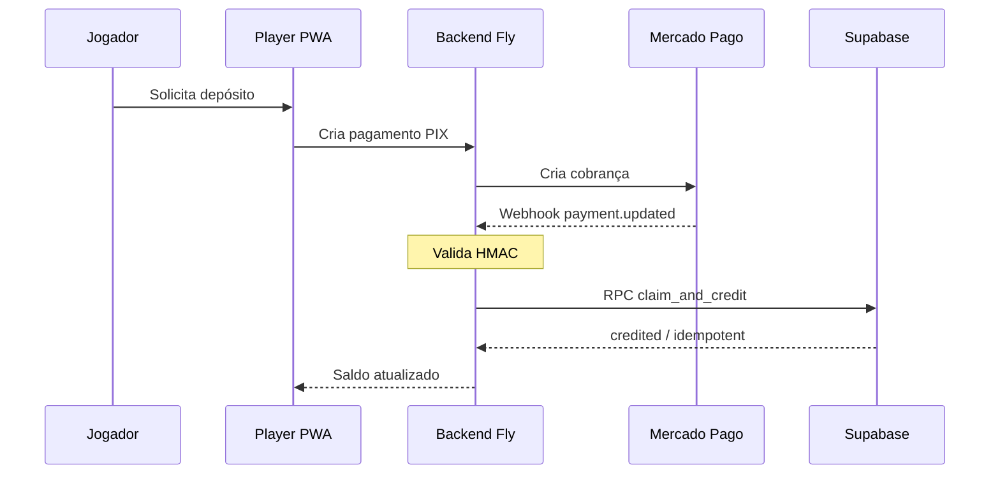
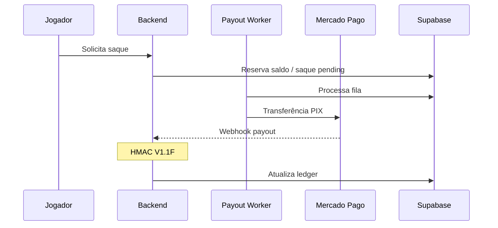
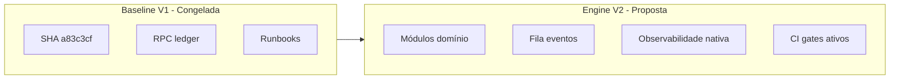

# V1.FINAL — Technical Dossier

**Gol de Ouro V1 — Dossiê técnico completo**  
**Data:** 2026-05-19 · **Audiência:** CTO, tech leads, due diligence técnica

---

## 1. Arquitetura completa

### 1.1 Visão de componentes

```mermaid
C4Context
  title Gol de Ouro V1 - Contexto
  Person(jogador, Jogador)
  Person(admin, Operador Admin)
  System(gol, Gol de Ouro Platform)
  System_Ext(mp, Mercado Pago)
  Rel(jogador, gol, PIX, jogo)
  Rel(admin, gol, Gestão)
  Rel(mp, gol, Webhooks)
```

### 1.2 Fluxo depósito PIX



### 1.3 Fluxo saque (payout)



---

## 2. Estrutura backend

```
goldeouro-backend/
├── controllers/          # auth, game, payment, usuario
├── routes/               # REST + health + webhooks
├── middlewares/          # auth, analytics, rate limit
├── database/             # schema, patches, RPC SQL
│   └── patches/          # V1.1B claim_and_credit...
├── src/
│   ├── websocket.js
│   ├── ai/
│   └── utils/            # logger, monitoring
├── scripts/
│   ├── operational/      # watchdogs, continuous-verification
│   ├── governance/       # autonomous-reliability-check
│   ├── resilience/       # v1-5-consolidated-run
│   ├── activation/       # pre-deploy-gate
│   ├── certification/    # v1-6, v1-final
│   └── v1-1b-m1-*.js     # gates apply/staging
├── docs/
│   ├── relatorios/       # V1.1A → V1.6
│   ├── runbooks/
│   ├── certification/
│   └── executive/        # V1.FINAL
└── goldeouro-player/     # PWA Vercel
```

---

## 3. Supabase (PostgreSQL)

| Área | Detalhe |
|------|---------|
| **Projeto prod** | `gayopagjdrkcmkirmfvy` |
| **Auth** | Supabase Auth + JWT backend |
| **RLS** | Row Level Security em tabelas sensíveis |
| **Tabelas críticas** | `usuarios`, `pagamentos_pix`, `ledger_financeiro`, `saques` |
| **RPC chave** | `claim_and_credit_approved_pix_deposit` |
| **Acesso scripts** | Service role read-only em auditorias |

### Ledger — relação

| Campo / conceito | Função |
|------------------|--------|
| `correlation_id` | Idempotência (payment_id, saque_id) |
| `tipo` | `deposito`, `saque`, `rollback`, `falha_payout`, … |
| UNIQUE `(correlation_id, tipo)` | Anti-duplicata |

---

## 4. Fly.io

| Parâmetro | Valor |
|-----------|-------|
| App | `goldeouro-backend-v2` |
| Release certificada | **461** |
| URL | `https://goldeouro-backend-v2.fly.dev` |
| Processos | API HTTP + worker payout (env flags) |

**Endpoints operacionais:**

| Rota | Uso |
|------|-----|
| `GET /meta` | SHA deploy, features |
| `GET /health` | Liveness + DB + MP |
| `GET /health/workers` | Flags worker |

---

## 5. Vercel

| App | Domínio | Artefato |
|-----|---------|----------|
| Player | `www.goldeouro.lol`, `app.goldeouro.lol` | `index-B6M2smS9.js` |
| Admin | (projeto admin no monorepo) | SPA |

Deploy player via GitHub → Vercel; bundle hash validado em certificação.

---

## 6. Webhooks

| Endpoint | Método | Segurança | Corpo típico |
|----------|--------|-----------|--------------|
| `/api/payments/webhook` | POST | HMAC MP depósito | `payment.updated` |
| `/webhooks/mercadopago` | POST | HMAC MP payout | `payment` / transfer |

**Comportamento certificado:** sem header de assinatura válido → **HTTP 401** (não processa).

---

## 7. RPCs

### `claim_and_credit_approved_pix_deposit`

| Aspecto | Detalhe |
|---------|---------|
| **Objetivo** | Creditar PIX approved uma única vez |
| **Idempotência** | `ON CONFLICT (correlation_id, tipo)` |
| **Self-heal** | Backfill ledger sem double-credit |
| **Patch** | `database/patches/V1.1B-M1-R3-*.sql` |
| **Apply prod** | V1.1B M1 controlado (relatórios apply) |

---

## 8. Workers

| Worker | Função | Observabilidade |
|--------|--------|-----------------|
| **Payout** | Processa saques PIX | `/health/workers`, logs Fly |
| **Reconcile** | `pending` → approved path | Backlog 54 (estável) |

---

## 9. Scripts operacionais

| Script | Missão |
|--------|--------|
| `v1-2a-runtime-financial-health.js` | Baseline runtime + finance |
| `v1-2c-runtime-drift-deploy-integrity.js` | Drift |
| `continuous-verification.js` | Verificação contínua |
| `pre-deploy-gate.js` | Gate 4 engines |
| `v1-6-operational-production-certification.js` | Certificação V1.6 |
| `v1-5-consolidated-run.js` | Resilience + activation |

---

## 10. Governança

```
docs/runbooks/
├── financeiro/     # ledger, saldo, pending
├── runtime/        # drift, bundle, fly
├── seguranca/      # hmac, replay, flood
├── workers/        # payout, reconcile, backlog
├── INCIDENT-RESPONSE-FLOW.md
└── CLASSIFICACAO-DE-INCIDENTES.md
```

---

## 11. Activation

| Artefato | Estado |
|----------|--------|
| `pre-deploy-gate.js` | Ativo (dry-run) |
| `.github/examples/activation-gate-predeploy-example.yml` | Comentado — não em workflows reais |
| V1.5D checklist | Plano monitoramento externo |

---

## 12. Monitoring

| Camada | V1 |
|--------|-----|
| Scripts read-only | ✅ |
| Relatórios JSON/MD | ✅ |
| Uptime Robot / PagerDuty | ❌ (plano V1.5D) |
| Dry-run alertas | ✅ V1.5C (0 envios reais) |

---

## 13. Resilience

| Engine | Output |
|--------|--------|
| `production-resilience-engine.js` | HARDENED |
| `controlled-chaos-readiness.js` | Simulado |
| `freeze-governance-simulator.js` | Dry-run |

---

## 14. CI readiness

| Item | Estado |
|------|--------|
| GitHub Actions deploy | Existente (histórico V1.1F) |
| Gate pré-deploy em CI | **Example only** |
| precommit-guard | Repo local |
| Bloqueio automático `main` | **Não ativo** |

---

## 15. Freeze baseline

Documento: [V1-BASELINE-CERTIFIED.md](../certification/V1-BASELINE-CERTIFIED.md)

| Campo | Valor congelado |
|-------|-----------------|
| gitCommit | `a83c3cff…` |
| flyVersion | 461 |
| playerBundle | `index-B6M2smS9.js` |
| score | 88 |
| maturity | Semi-autonomous |

---

## 16. Engine V2 — estrutura futura



| Princípio V2 | Herança V1 |
|--------------|------------|
| Não quebrar ledger | Snapshots + RPC versionada |
| Webhooks fail-closed | Mesmo contrato HMAC |
| Gates obrigatórios | pre-deploy-gate → CI real |
| Observabilidade | Ativar V1.5D |

---

## 17. Tabela de dependências

| De | Para | Protocolo |
|----|------|-----------|
| Player | Backend | HTTPS REST + WSS |
| Backend | Supabase | PostgREST / client |
| MP | Backend | Webhooks HTTPS |
| Backend | MP | REST API |
| Admin | Backend | HTTPS + JWT |
| Scripts audit | Supabase | Read-only service key |
| Scripts audit | Fly | flyctl / HTTPS |

---

## 18. Referências críticas

| Documento | Caminho |
|-----------|---------|
| Certificação V1.6 | `docs/relatorios/V1-6-OPERATIONAL-PRODUCTION-CERTIFICATION-2026-05-19.md` |
| Hardening webhook | `docs/relatorios/V1-1F-HARDENING-WEBHOOK-PAYOUT-2026-05-18.md` |
| RPC PIX ledger | `docs/relatorios/V1-1B-M1-APPLY-PRODUCAO-CONTROLADO-2026-05-18.md` |
| Supreme audit | `docs/executive/V1-FINAL-SUPREME-AUDIT-EXECUTIVE-REPORT.md` |

---

_Dossiê técnico V1.FINAL — 2026-05-19._
