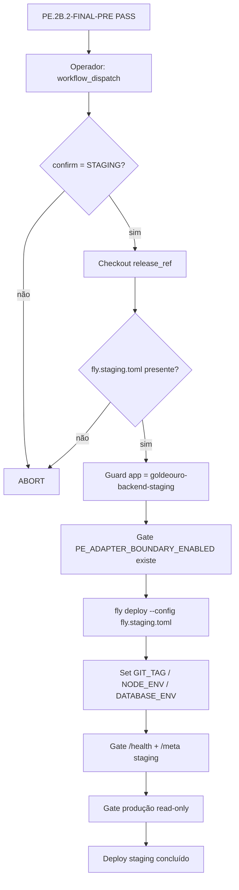

# Governança de Deploy Staging — Indesconectável Payment Engine™

**Gate:** PE.2B.2-FIXPIPE / PE.2B.2  
**App Fly:** `goldeouro-backend-staging`  
**Config:** `fly.staging.toml`  
**Workflow:** `.github/workflows/backend-deploy-staging.yml`  
**Produção:** `goldeouro-backend-v2` — **proibida** neste pipeline

---

## 1. Fluxo de deploy controlado



### Refs autorizadas (PE.2B.2)

| Tipo | Valor |
|------|-------|
| Tag default | `pe2b-adapter-boundary-safe` |
| Branch | `pe/pe2b-staging-deploy` |
| Commit técnico | `73bca758789ad6ba23561f9f5695abb2b20a3a9d` |

---

## 2. Pré-check (obrigatório antes do dispatch)

| # | Check | Comando / evidência |
|---|-------|---------------------|
| 1 | FINAL-PRE PASS | Relatório `PE.2B.2-FINAL-PRE-READONLY.md` |
| 2 | Branch/tag corretas | `git ls-remote` / GitHub |
| 3 | Working tree limpa | `git status --porcelain` vazio |
| 4 | Flag staging | `fly secrets list -a goldeouro-backend-staging` contém `PE_ADAPTER_BOUNDARY_ENABLED` |
| 5 | Flag valor `false` | Operador confirma (secret não expõe valor na listagem) |
| 6 | Staging saudável pré-deploy | `curl /health` + `/meta` → `b29d847` ou baseline conhecida |
| 7 | Produção intocada | `curl https://goldeouro-backend-v2.fly.dev/meta` |
| 8 | Workflow no GitHub | `backend-deploy-staging.yml` visível no branch |
| 9 | Config no GitHub | `fly.staging.toml` visível no branch |

---

## 3. Pós-check (obrigatório após deploy)

| # | Check | Critério |
|---|-------|----------|
| 1 | `/health` | `status=ok`, `database=connected` |
| 2 | `/meta.environment` | `staging` |
| 3 | `/meta.gitCommit` | SHA publicado |
| 4 | `productionRuntime` | `false` |
| 5 | `asaasEnv` | `sandbox` |
| 6 | `/health/workers` | payout worker OFF |
| 7 | Produção | `environment=production`, `productionRuntime=true` inalterados |
| 8 | P1.9 smoke | Recomendado antes de qualquer ativação de flag |

---

## 4. Rollback

### Rollback imediato (runtime)

```bash
flyctl releases rollback -a goldeouro-backend-staging
```

### Rollback de flag (se necessário)

```bash
flyctl secrets set PE_ADAPTER_BOUNDARY_ENABLED=false -a goldeouro-backend-staging
flyctl apps restart goldeouro-backend-staging
```

### Baseline conhecida (pré-PE.2B deploy)

| Campo | Valor |
|-------|-------|
| Commit | `b29d847` |
| Tag | `payment-engine-v1-runtime-baseline` |

### Rollback de código

Ver `docs/payment-engine/adapter-boundary/rollback-plan.md`

---

## 5. Critérios de abort

Abortar deploy ou executar rollback se:

1. Confirmação `STAGING` não fornecida no workflow
2. App alvo ≠ `goldeouro-backend-staging`
3. Config ≠ `fly.staging.toml` ou referência a `fly.toml` prod
4. `PE_ADAPTER_BOUNDARY_ENABLED` ausente ou `true` em staging
5. `/health` falhar após deploy
6. `/meta.environment` ≠ `staging`
7. `productionRuntime` = `true` em staging
8. Produção `/meta` indica alteração não autorizada
9. Divergência entre `RELEASE_SHA` e `/meta.gitCommit`

---

## 6. Separação staging × produção

| Dimensão | Staging | Produção |
|----------|---------|----------|
| App | `goldeouro-backend-staging` | `goldeouro-backend-v2` |
| Config | `fly.staging.toml` | `fly.toml` |
| Workflow | `backend-deploy-staging.yml` | `backend-deploy.yml` |
| NODE_ENV | `staging` | `production` |
| Workers | OFF | `payout_worker` ON |
| Supabase ref | `uatszaqzdqcwnfbipoxg` | `gayopagjdrkcmkirmfvy` |
| PSP | sandbox | production |

---

## 7. Autoridade

- **PE.2B.2-FIXPIPE** publica e audita o pipeline — **não autoriza deploy**
- **PE.2B.2-FINAL-PRE** deve retornar PASS antes do dispatch
- **PE.2B.2** executa o deploy controlado via workflow dispatch
