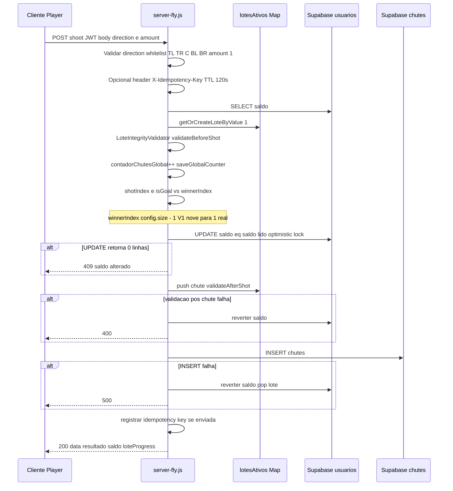

# Auditoria forense — sistema de jogo (produção)

**Data:** 2026-03-28  
**Modo:** somente leitura (código e documentação existentes)  
**Escopo:** `POST /api/games/shoot`, definição de resultado, saldo, vetores de ataque, consistência financeira  
**Artefato principal analisado:** `server-fly.js` (entrypoint `package.json` / `npm start`)

**Caminho no disco (Windows):** `E:\Chute de Ouro\goldeouro-backend\docs\relatorios\AUDITORIA-GAME-PRODUCAO-2026-03-28.md`  
*(Se um link quebrar, abra pelo Explorer ou pelo Cursor em **File → Open File** usando esse caminho.)*

---

## 1. Fluxo completo do jogo (backend como fonte da verdade)



**Regras de negócio relevantes (V1):**

- Aposta fixa **R$ 1,00** por chute; qualquer outro `amount` é rejeitado.
- **Gol** quando o índice do chute no lote (`lote.chutes.length` antes do `push`) é igual a `winnerIndex`, fixo em **`config.size - 1`** (para R$1, lote de 10 → gol sempre no **10.º** chute daquele lote).
- Prêmio de gol: **R$ 5,00** fixos; **Gol de Ouro** extra quando `contadorChutesGlobal % 1000 === 0` após incremento (**R$ 100,00** adicionais nesse caso).
- **Direção** afeta apenas apresentação no cliente; o resultado (`goal` / `miss`) vem da posição no lote, não da zona escolhida.

---

## 2. Shoot — validações solicitadas

### 2.1 Lock otimista (saldo)

**Presente.** O débito/crédito usa atualização condicional do saldo (trecho em `server-fly.js`, por volta das linhas 1252–1267):

```javascript
// Blindagem concorrência: reservar saldo com optimistic lock ANTES de avançar o lote (evita lost update)
const novoSaldo = isGoal
  ? Number(user.saldo) - betAmount + premio + premioGolDeOuro
  : Number(user.saldo) - betAmount;
const { data: updatedUser, error: saldoUpdateError } = await supabase
  .from('usuarios')
  .update({ saldo: novoSaldo })
  .eq('id', req.user.userId)
  .eq('saldo', user.saldo)
  .select('saldo')
  .single();
if (saldoUpdateError || !updatedUser) {
  return res.status(409).json({
    success: false,
    message: 'Saldo insuficiente ou alterado. Tente novamente.'
  });
}
```

**Observação:** o lock otimista cobre **saldo**, não o **lote** em si (estado em memória).

### 2.2 Consumo correto de saldo

- Em sucesso: `novoSaldo = saldo - 1` (miss) ou `saldo - 1 + premio + premioGolDeOuro` (goal).
- Em falha de validação pós-chute ou falha de `INSERT` em `chutes`, há **reversão** para `user.saldo` lido antes da operação e `pop` no array do lote quando aplicável.

### 2.3 Double execution

- **Mesmo usuário, requisições paralelas:** segunda atualização tende a falhar no `.eq('saldo', user.saldo)` após a primeira alterar o saldo → **409**.
- **Idempotência:** se `X-Idempotency-Key` for enviada e reutilizada dentro de **120 s**, retorno **409** com mensagem explícita. O player atual gera chave nova por tentativa (`gameService.js`), o que evita retry duplicado acidental, mas **não** impede dois chutes distintos.
- **Sem header de idempotência:** não há deduplicação server-side por requisição; depende de autenticação + rate limit + lock de saldo.

---

## 3. Resultado do jogo

### 3.1 Como o resultado é definido

- **Não** é sorteio independente por chute com RNG por tentativa.
- É **determinístico por posição no lote:** o gol ocorre exatamente na posição `winnerIndex` (última posição do lote na V1).
- `crypto.randomBytes` é usado na **geração do `loteId`**, não na decisão gol/miss de cada chute.

### 3.2 Manipulação client-side

- O cliente **não** envia o resultado; envia `direction` e `amount` (este último **forçado a 1** no servidor).
- A UI (`GameFinal.jsx`) usa `result.shot.isWinner` derivado da resposta (`result.result === 'goal'`), alinhado ao backend.

### 3.3 Validação no backend

- Direções validadas contra lista fixa.
- `LoteIntegrityValidator.validateAfterShot` confere se o `result` informado bate com `lote.chutes.length - 1 === lote.winnerIndex`.

---

## 4. Segurança — frontend vs backend

| Aspecto | Avaliação |
|--------|-----------|
| Resultado decidido no servidor | Sim |
| Cliente pode forçar `amount` > 1 | Não (rejeitado) |
| Direção altera probabilidade no servidor | Não (apenas validação de enum) |
| JWT obrigatório | Sim (`authenticateToken`) |

**Risco associado:** a resposta expõe **`loteProgress` (current, total, remaining)**. Com isso, um jogador pode **inferir quando o próximo chute será o último do lote** (`remaining === 1`), ou seja, quando o próximo chute **bem-sucedido** será gol (na ausência de corrida com outros jogadores pelo mesmo slot). Isso não “inventa” dinheiro, mas **altera estratégia e EV** em relação a um jogo percebido como “azar” por tentativa.

---

## 5. Consistência financeira

### 5.1 Aposta debitada

- Débito aplicado no mesmo `UPDATE` otimista que aplica prêmios (net em uma única escrita), o que é coerente para evitar estado intermediário inconsistente no saldo.

### 5.2 Ganhos creditados

- Crédito de prêmio embutido em `novoSaldo` quando `isGoal`.

### 5.3 Pontos de atenção

1. **`contadorChutesGlobal` e `saveGlobalCounter()`** executam **antes** do `UPDATE` otimista de saldo. Se o fluxo falhar depois (ex.: 409 no saldo), o contador global **já foi incrementado e persistido**, gerando possível **divergência** entre métricas globais e chutes financeiramente concluídos; impacta também o critério **Gol de Ouro** (múltiplo de 1000), que usa esse contador **neste ponto do código**.
2. **Lotes só em memória (`lotesAtivos`):** em **restart** ou **várias instâncias**, a continuidade do “lote de 10” não é garantida globalmente; documentação interna do repositório já registra riscos de lote órfão / multi-instância (ex.: `ENCERRAMENTO-PREMIUM-BLOCO-E-GAMEPLAY-V1.md`, `AUDITORIA-CONCORRENCIA-CHUTES-E-SALDO-READONLY-2026-03-09.md`).
3. **`total_apostas` / `total_ganhos` em `usuarios`:** o fluxo de shoot analisado **atualiza `saldo`**, não há evidência no mesmo handler de incremento desses campos — possível **inconsistência de relatório** vs. saldo (escopo de integridade de **métricas**, não necessariamente de saldo imediato).

---

## 6. Exploits e vetores de ataque

| Vetor | Descrição | Mitigação atual | Risco |
|-------|-----------|-----------------|-------|
| Spam de requisições | Muitos `POST /api/games/shoot` | Rate limit global + `/api/` (100 req / 15 min / IP), JWT | Médio (depende de IP / contas) |
| Replay de request | Reenvio idêntico | Idempotência **opcional** por header; sem header, replay pode debitar de novo | Baixo a médio |
| Manipulação de payload | `amount`, `direction` | `amount` fixado a 1; direção em whitelist | Baixo |
| Corrida em lote (vários jogadores) | Janela entre leitura de `shotIndex` e `push` | Validação pós-chute impede segundo “gol” inválido no mesmo lote em cenário de empate no 10º; requisições concorrentes no início do lote podem gerar **inconsistência de `shot_index`** no BD se não houver constraint única | Médio (dados / auditoria) |
| Multi-instância Fly | Cada processo com Map próprio | Soft/hard concurrency na app; não há lock distribuído de lote | **Alto** se `scale > 1` |
| Vazamento de progresso do lote | `loteProgress.remaining` | Nenhuma ofuscação | **Alto** (jogo justo percebido / estratégia) |
| Artefato legado | `server-fly-deploy.js` com lógica mais antiga | Garantir que produção rode apenas `server-fly.js` | Médio se confundir deploy |

---

## 7. Riscos classificados

- **Crítico (operacional / modelo):** estado de lote apenas em memória + escala horizontal ou restart → risco de **múltiplos lotes paralelos** ou **lotes órfãos**, com impacto em auditoria e possível quebra das premissas de “1 em 10”.
- **Alto (justiça do jogo):** exposição de **`loteProgress`** permite jogar **só perto do gol garantido** (10º chute), sujeito a corrida com outros usuários.
- **Alto (métricas / prêmio especial):** incremento de **`contadorChutesGlobal` antes de confirmar** saldo e persistência do chute → risco de **contador e Gol de Ouro desalinhados** com chutes efetivamente cobrados.
- **Médio:** ausência de idempotência quando o cliente não envia header; concorrência na borda do `await` do saldo e duplicidade de `shot_index` sem constraint no BD.
- **Baixo:** manipulação de resultado ou valor de aposta via payload em condições normais.

---

## 8. Veredito

**JOGO SEGURO PARA DINHEIRO REAL: NÃO**

**Motivo (síntese):** o backend é a fonte da verdade para **saldo** e **resultado** por requisição e usa **lock otimista no saldo**, o que mitiga perda dupla por lost update no mesmo usuário. Porém, para um produto de **dinheiro real** com promessa de jogo por azar/posição neutra, permanecem **lacunas relevantes**: (1) **vazamento de informação** que permite estratégia de jogo com EV distinto do esperado pelo usuário médio; (2) **arquitetura de lote em memória** sem persistência nem serialização distribuída, **inadequada** se houver mais de uma instância ou reinícios frequentes; (3) **ordem contador global vs. confirmação financeira**, com impacto em métricas e no **Gol de Ouro**.

**Condições em que o veredito poderia migrar para “SIM” (fora do escopo desta leitura, apenas critério):** lote e posição do chute **serializados** (fila/row lock/transaction no BD), **sem vazar** o progresso do lote ao cliente (ou redesign do modelo de jogo), **contador e eventos especiais** atrelados a transação **commitada**, **idempotência obrigatória** ou chave derivada de negócio, e **implícito** operacional **uma única instância** ou store compartilhado para lotes.

---

*Fim do relatório.*
