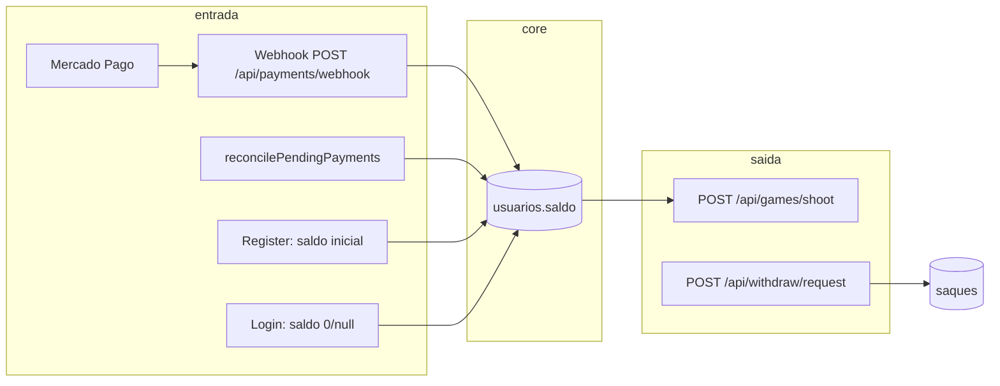

# BLOCO A1 — Auditoria forense financeira (fluxo de saldo)

**Data:** 2026-03-27  
**Escopo:** código inspecionado — principalmente `server-fly.js`, `config/system-config.js`, `goldeouro-player/src/services/gameService.js`.  
**Método:** leitura estática; sem testes de carga ou prova em produção nesta sessão.

---

## 1. Resumo executivo

O saldo do usuário vive em **`usuarios.saldo`** (Supabase). As alterações observadas no backend principal concentram-se em:

- **Crédito:** webhook Mercado Pago e job de reconciliação de PIX pendentes; **sem** lock otimista no `saldo` no crédito.
- **Débito/crédito de jogo:** `POST /api/games/shoot` com **lock otimista** `.eq('saldo', user.saldo)` e rollbacks para o valor lido antes do chute quando falha validação pós-chute ou insert em `chutes`.
- **Saque:** `POST /api/withdraw/request` **valida** saldo e **insere** linha em `saques`; **não debita** nem reserva `usuarios.saldo` no mesmo fluxo.
- **Bônus / ajuste:** registro com `calculateInitialBalance` (hoje **0** em `config/system-config.js`); login pode setar saldo para esse valor se `saldo === 0 || null`.

**Conclusão antecipada (Etapa 9):** o sistema financeiro é **PARCIALMENTE SEGURO**: o **shoot** tem defesa razoável de concorrência no débito; **PIX** e **saque** apresentam **lacunas que permitem perda ou exposição patrimonial** se o produto depender deles com dinheiro real sem processos externos ou correções.

---

## 2. Mapa completo do fluxo de dinheiro

- **Ledger dedicado** de movimentações imutáveis: **não** evidenciado no `server-fly.js` analisado; histórico parcial via `pagamentos_pix`, `chutes`, `saques`.

---

## 3. Pontos de entrada de saldo

| # | Origem | Arquivo / local | Endpoint ou fluxo | Como o saldo muda |
|---|--------|-----------------|-------------------|-------------------|
| E1 | Registro | `server-fly.js` (~817–828) | `POST /api/auth/register` | `insert` em `usuarios` com `saldo: calculateInitialBalance('regular')` → **0** (`system-config.js`). |
| E2 | Login “ajuste” | `server-fly.js` (~921–927) | `POST /api/auth/login` | Se `user.saldo === 0 \|\| null`, `update { saldo: calculateInitialBalance('regular') }` → **0** (não é bônus positivo no config atual). |
| E3 | PIX aprovado (webhook) | `server-fly.js` (~1836–1967) | `POST /api/payments/webhook` | Lê `usuarios.saldo`, calcula `novoSaldo = user.saldo + credit`, `update({ saldo: novoSaldo }).eq('id', …)` **sem** `.eq('saldo', user.saldo)`. `credit` = `pixRecord.amount ?? pixRecord.valor`. |
| E4 | PIX aprovado (reconciliação) | `server-fly.js` (~2002–2082) | `setInterval(reconcilePendingPayments)` | Para cada pendente aprovado no MP: `Number(userRow.saldo \|\| 0) + Number(credit)`, `update({ saldo: novoSaldo })` **sem** lock no saldo. |

**Não encontrado no `server-fly.js`:** crédito administrativo manual, ajuste de saldo por API genérica, ou bônus promocional além do mecanismo de login/registro acima.

**Risco de tipo (E3):** `user.saldo + credit` usa `+` em JavaScript **sem** `Number()` explícito nos dois operandos. Se `user.saldo` vier como **string** e `credit` como número, pode ocorrer **concatenação de string** em vez de soma (comportamento clássico de bug). A reconciliação (E4) usa `Number()` explicitamente.

---

## 4. Pontos de saída de saldo

| # | Origem | Arquivo / local | Endpoint | Como o saldo muda |
|---|--------|-----------------|----------|-------------------|
| S1 | Aposta / prêmio | `server-fly.js` (~1252–1268) | `POST /api/games/shoot` | `update({ saldo: novoSaldo }).eq('id').eq('saldo', user.saldo)` — débito de `betAmount` (1) e eventual crédito de `premio` + `premioGolDeOuro`. |
| S2 | Saque (pedido) | `server-fly.js` (~1401–1508) | `POST /api/withdraw/request` | **Nenhum** `update` em `usuarios.saldo` no handler analisado. Apenas `insert` em `saques`. |

**Alterações indiretas / rollback (shoot):**

- `server-fly.js` (~1302–1314): falha em `validateAfterShot` → `update({ saldo: user.saldo })` (valor **antes** do chute).
- `server-fly.js` (~1334–1347): falha no `insert` em `chutes` → mesmo rollback de saldo.

**Contador global:** `contadorChutesGlobal++` e `saveGlobalCounter()` ocorrem **antes** do update otimista de saldo (~1222–1229 vs 1256). Se o update de saldo falhar com 409, o contador global pode **avançar sem** aposta contabilizada no saldo — **inconsistência** entre métrica global e dinheiro (ver §5).

---

## 5. Análise de concorrência

### 5.1 `POST /api/games/shoot`

- **Lock otimista:** sim — `.eq('saldo', user.saldo)` junto com `id` (~1256–1260).
- **Race entre dois chutes simultâneos:** um dos updates falha (409) — comportamento esperado.
- **Idempotência:** header `X-Idempotency-Key`; mapa em memória `idempotencyProcessed` com TTL 120s (~375–383, 1171–1179, 1377–1379). **Limitações:** (a) só vale no **mesmo processo** Node; (b) após TTL, mesma chave pode ser reutilizada; (c) chave nova por tentativa no `gameService` — replay deliberado com chaves novas não é bloqueado pelo servidor além do lock de saldo.
- **Interação shoot × webhook PIX:** webhook **não** usa lock no saldo; leitura e escrita podem **sobrescrever** ou **ignorar** atualização recente do shoot — risco de **saldo incorreto** sob concorrência (ver §10).

### 5.2 Webhook PIX

- Responde **200 imediatamente** (~1841), processamento segue no mesmo handler após `res.json`.
- **Idempotência “já aprovado”:** leitura de `pagamentos_pix` por `external_id` / `payment_id` (~1845–1863); se `status === 'approved'`, retorna sem creditar (~1860–1862).
- **Race entre dois webhooks simultâneos** (mesmo `payment_id`, ambos vendo ainda não `approved`): ambos podem passar do check inicial, ambos atualizarem status e ambos executarem o bloco de crédito — **duplicação de crédito** possível **a menos que** o banco ou um constraint único impeça (não evidenciado no código do handler).
- **Crédito sem lock:** update de saldo sem `.eq('saldo', valor_anterior)` (~1954–1959).

### 5.3 Reconciliação (`reconcilePendingPayments`)

- Lista `pagamentos_pix` com `status` pendente e idade mínima; consulta MP; se `approved`, atualiza registro e credita saldo.
- **Race com webhook:** se ambos processam o mesmo pagamento **antes** de qualquer um marcar `approved`, cenário análogo a webhook duplicado — risco de **duplo crédito**.
- Se webhook marcar `approved` primeiro, pendente some da lista de reconcile — OK na linha feliz.

### 5.4 `POST /api/withdraw/request`

- Leitura de saldo e comparação com `valor` (~1430–1448); **sem** transação nem `SELECT FOR UPDATE`; **sem** débito.
- **Múltiplas requisições paralelas:** todas podem ver o mesmo saldo suficiente e **inserir vários** `saques` — **exposição** a pedidos que somam mais que o saldo (até ação externa ou regra em outro serviço não presente aqui).

---

## 6. Análise de integridade

| Pergunta | Resposta baseada no código |
|----------|----------------------------|
| Existe ledger imutável de movimentações? | **Não** no `server-fly.js` analisado como tabela única de “todas as movimentações de saldo”. Existem `pagamentos_pix`, `chutes`, `saques`. |
| Auditar saldo só com o banco? | Possível **parcialmente** reconciliando `usuarios.saldo` com somas de eventos, mas **sem** garantia automática no código; crédito PIX não gera linha em ledger de movimento além do registro de pagamento. |
| Saldo pode divergir do histórico? | **Sim:** totais em `usuarios` (ex.: `total_apostas`, `total_ganhos`) **não** são atualizados no handler de shoot no trecho analisado; shoot grava `chutes` mas não evidencia atualização desses agregados no mesmo request. |
| Inconsistência entre tabelas? | **Sim** em cenários de falha parcial (ex.: contador global incrementado antes do commit de saldo; webhook credita sem vínculo atômico com linha de ledger). |

---

## 7. Análise do saque (crítico) — `POST /api/withdraw/request`

**Arquivo:** `server-fly.js` (~1401–1508).

| Verificação | Resultado |
|-------------|-----------|
| Debita `usuarios.saldo`? | **Não.** |
| Reserva saldo (hold)? | **Não.** |
| Permite múltiplas requisições? | **Sim** — cada uma bem-sucedida insere um `saques` se passar na validação pontual de saldo. |
| Valida saldo? | **Sim** — `parseFloat(usuario.saldo) < parseFloat(valor)` → 400. |
| Bloqueio concorrente / idempotência? | **Não** evidenciado — sem decremento atômico nem chave de idempotência de saque. |
| Comentário no código | “Transação contábil: delegada para processador externo/contábil (removida do backend direto)” (~1484). |

**Impacto:** com dinheiro real, o risco de **pedidos de saque agregados > saldo** ou **double spend** operacional é **real** se não houver processo fora deste handler.

**Classificação:** **CRÍTICO** para produção financeira completa.

---

## 8. Análise do PIX (crítico)

### 8.1 Criação — `POST /api/payments/pix/criar`

- Insere em `pagamentos_pix` com status pendente; **não** altera saldo até aprovação (~1650+).
- Valor limitado (ex.: máx. 1000) no handler analisado anteriormente.

### 8.2 Webhook — `POST /api/payments/webhook`

- Validação de assinatura **se** `MERCADOPAGO_WEBHOOK_SECRET` (~1816–1834); em não-produção pode ignorar assinatura inválida (~1828–1830).
- Confirma status via API MP antes de creditar (~1877–1887).
- Ordem: marca pagamento aprovado, depois busca `pixRecord` e credita (~1889–1966).
- **Duplicação:** mitigada apenas por leitura de status `approved` **antes** do fluxo; **não** é lock pessimista — ver §5.2.

### 8.3 Reconciliação

- Fallback para PIX antigos pendentes; mesmo padrão de crédito **sem** lock de saldo (~2063–2079).

**Classificação:** risco **ALTO** a **CRÍTICO** (duplo crédito / corrida com shoot) conforme tráfego e paralelismo.

---

## 9. Análise do shoot — `POST /api/games/shoot`

| Aspeto | Avaliação |
|--------|-----------|
| Débito seguro | **Relativamente sim** — lock otimista no saldo. |
| Rollback em erro | **Sim** — reverte para `user.saldo` em falhas pós-update (~1304, 1335). |
| Idempotência | **Parcial** — map em memória + TTL; não distribuído. |
| Consistência com lote | Estado de lote em **memória** (`lotesAtivos`); risco em multinstância/restart **fora** do escopo de saldo isolado, mas afeta integridade de jogo. |
| Ordem contador vs saldo | **Problema:** `contadorChutesGlobal++` e `saveGlobalCounter()` **antes** do update de salde (~1222–1229 vs 1256). Falha 409 no saldo deixa contador **adiantado**. |

---

## 10. Exploits possíveis (cenários reais)

1. **Múltiplos saques:** paralelizar `POST /api/withdraw/request` com o mesmo token — vários inserts em `saques` enquanto cada leitura ainda vê saldo cheio — **CRÍTICO** se o back-office pagar com base nesses registros sem reconciliar com saldo.
2. **Webhook duplicado / retry MP:** duas entregas simultâneas antes de `status === 'approved'` — **duplo crédito** possível (**ALTO/CRÍTICO**).
3. **Webhook + reconciliação** no mesmo instante sobre pendente — mesma classe de risco (**ALTO**).
4. **Corrida webhook × shoot:** crédito lido com saldo stale pode **sobrescrever** saldo após débito do shoot — saldo final errado (**ALTO**).
5. **Spam de webhook:** sem rate limit específico no path do webhook no trecho analisado; depende de infra; assinatura obrigatória só se secret configurado (**MÉDIO**).
6. **Tipo string em `user.saldo` no webhook:** concatenação em vez de soma — saldo corrompido (**MÉDIO/ALTO** se ocorrer em runtime).
7. **Idempotência de chute expirada:** reenvio com nova chave após 120s — novo débito legítimo; não é exploit se intencional; replay com mesma chave bloqueado por TTL.

---

## 11. Classificação de riscos (síntese)

| ID | Problema | Risco |
|----|----------|-------|
| R1 | Saque sem débito/reserva | **CRÍTICO** |
| R2 | Crédito PIX sem lock otimista + possível corrida webhook/reconcile | **ALTO** a **CRÍTICO** |
| R3 | Crédito PIX concorrente com shoot (read-modify-write sem versão) | **ALTO** |
| R4 | Contador global antes do commit de saldo no shoot | **MÉDIO** (integridade métrica/financeira) |
| R5 | Possível `saldo` string no webhook (`+` não numérico) | **MÉDIO** |
| R6 | Ausência de ledger único | **MÉDIO** (auditoria) |
| R7 | Idempotência de chute só em processo único | **MÉDIO** (escala) |

---

## 12. Prontidão para produção

**Resposta direta:** **PARCIALMENTE SEGURO**.

- **Não** classificado como **SEGURO PARA PRODUÇÃO** com **saque ativo** e **volume real** sem camadas adicionais (reserva de saldo, idempotência forte de PIX, ledger, ou processos operacionais que fechem o gap).
- **Não** classificado como **NÃO SEGURO** em absoluto: o **shoot** tem mecanismo claro de concorrência no débito; o PIX confirma via API MP antes de creditar.

---

## 13. Conclusão

O dinheiro **não está “blindado” de ponta a ponta** no código analisado:

- **Entra** principalmente por PIX (webhook + reconciliação) com **pontos fracos de concorrência e idempotência** no crédito de `usuarios.saldo`.
- **Sai** no jogo com **maior rigor** (lock otimista) e rollbacks explícitos.
- **Saque** **não retira** saldo no request — gap **crítico** para qualquer modelo em que o saldo exibido = dinheiro disponível.

Antes de uma **V1 real** com fluxo financeiro completo, o mínimo a tratar (conceitualmente, sem prescrever implementação aqui) seria: **reserva ou débito atômico no saque**, **crédito PIX idempotente e transacional** (ex.: uma única fonte de verdade para “pagamento creditado”), e **auditoria** reconciliável (ledger ou equivalente). Até lá, o sistema é **parcialmente seguro** e **depende** de controles externos ou de escopo de produto limitado (ex.: só depósito + jogo, saque manual fora da app).

---

*Fim do relatório BLOCO A1.*
