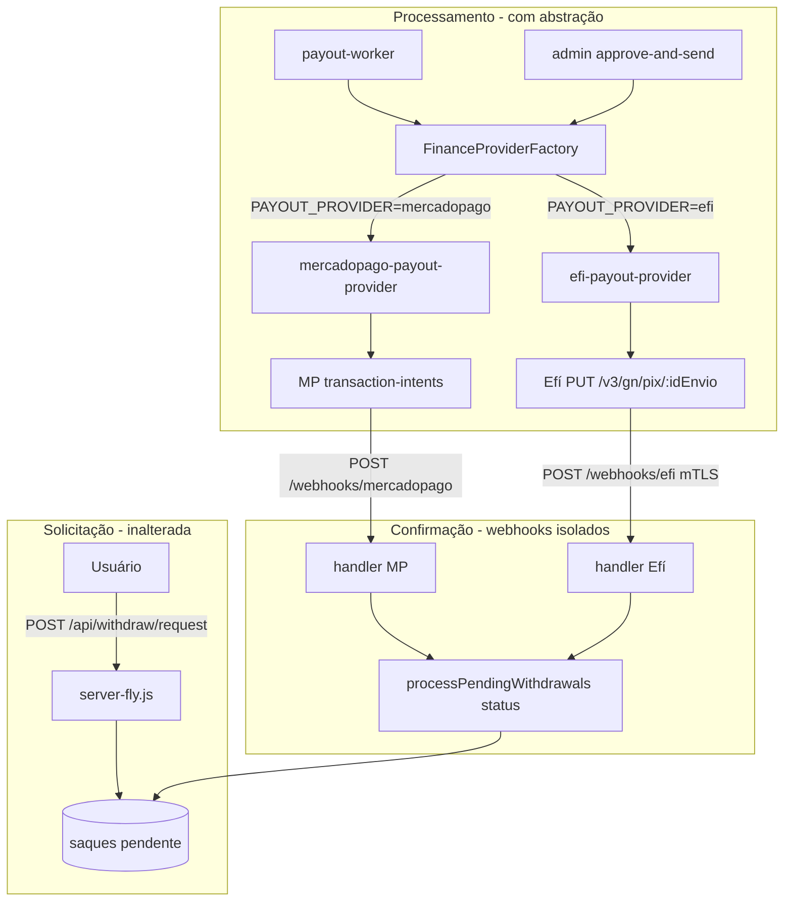

# F4.0B — Desenho Seguro da Integração Efí como Provedor Paralelo

**Data:** 2026-06-08  
**Modo:** READ-ONLY ABSOLUTO  
**Escopo:** Arquitetura proposta para adicionar **Efí Bank** como provedor financeiro **paralelo** ao Mercado Pago, sem substituir, alterar ou executar nada em runtime.  
**Proibido:** alterar código, banco, deploy, credenciais, commits, PIX real.

**Base analítica:**

- `docs/relatorios/F4.0A-MAPA-FINANCEIRO-ATUAL.md` — estado financeiro atual
- `docs/relatorios/F3-1A-AUDITORIA-READONLY-EFI-BANK.md` — requisitos documentais Efí PIX OUT
- Código ativo: `server-fly.js`, `services/pix-mercado-pago.js`, `src/domain/payout/processPendingWithdrawals.js`

---

## Resumo executivo

| Tema | Achado |
|------|--------|
| **Estado atual** | 100% Mercado Pago; acoplamento direto no monólito |
| **Efí no código** | Inexistente |
| **Estratégia recomendada** | Provedor paralelo via **camada de abstração** + flags `PAYMENT_PROVIDER` / `PAYOUT_PROVIDER` |
| **Escopo inicial (Fase 1)** | Efí **somente PIX OUT** (saque), documental e desligado por default |
| **PIX IN (depósito)** | Permanece **Mercado Pago** até Fase 3+ (Efí Cob exige outro gate comercial) |
| **Mercado Pago** | Intacto como default; rollback = reverter env para `mercadopago` |

| Veredito | **GO CONDICIONAL** — arquitetura viável com abstração, feature flags e webhooks isolados; implementação real bloqueada até Fase 3 (compliance + mTLS + liberação comercial `pix.send`) |
| Confiança | **85%** (desenho técnico sólido; dependências externas: conta Efí, mTLS em Fly.io, jurídico) |

---

## 1. Estado financeiro atual (baseline)

### 1.1 Mercado Pago PIX IN (depósito)

| Item | Valor atual |
|------|-------------|
| **Endpoint criação** | `POST /api/payments/pix/criar` |
| **Arquivo** | `server-fly.js:3038` (handler inline) |
| **API externa** | `POST https://api.mercadopago.com/v1/payments` |
| **Token** | `MERCADOPAGO_DEPOSIT_ACCESS_TOKEN` |
| **Webhook** | `POST /api/payments/webhook` |
| **Confirmação** | `claimAndCreditApprovedPixDeposit` + RPC `claim_and_credit_approved_pix_deposit` |
| **Reconciliação** | `reconcilePendingPayments` (timer `MP_RECONCILE_*`) |
| **Tabela** | `pagamentos_pix` |

### 1.2 Mercado Pago PIX OUT (saque)

| Item | Valor atual |
|------|-------------|
| **Solicitação** | `POST /api/withdraw/request` → `server-fly.js:1621` |
| **Processamento** | `processSingleWithdrawalPayout` → `createPixWithdraw` |
| **Arquivo serviço** | `services/pix-mercado-pago.js` |
| **API externa** | `POST /v1/transaction-intents/process` |
| **Token** | `MERCADOPAGO_PAYOUT_ACCESS_TOKEN` |
| **Assinatura** | Ed25519 (`MP_PAYOUT_PRIVATE_KEY`) |
| **Webhook** | `POST /webhooks/mercadopago` |
| **Worker** | `src/workers/payout-worker.js` |
| **Tabela** | `saques` (+ colunas `mp_*` da migration `20260424`) |

### 1.3 Variáveis de ambiente atuais (financeiras)

| Grupo | Variáveis principais |
|-------|---------------------|
| **Depósito** | `MERCADOPAGO_DEPOSIT_ACCESS_TOKEN`, `MERCADOPAGO_WEBHOOK_SECRET`, `BACKEND_URL`, `MP_RECONCILE_*` |
| **Payout** | `MERCADOPAGO_PAYOUT_ACCESS_TOKEN`, `MP_PAYOUT_PRIVATE_KEY`, `MP_PAYOUT_WEBHOOK_URL`, `MP_PAYOUT_TEST_TOKEN`, `MP_PAYOUT_ENFORCE_SIGNATURE` |
| **Operacional** | `PAYOUT_PIX_ENABLED`, `ENABLE_PIX_PAYOUT_WORKER`, `PAYOUT_AUTO_FROM_AT`, `PAYOUT_MODE`, `PAGAMENTO_TAXA_SAQUE` |

### 1.4 Webhooks atuais

| Rota | Fluxo | Validação |
|------|-------|-----------|
| `POST /api/payments/webhook` | PIX IN | HMAC `MERCADOPAGO_WEBHOOK_SECRET` |
| `POST /webhooks/mercadopago` | PIX OUT | Assinatura payout MP (`validateMercadoPagoPayoutWebhook`) |

### 1.5 Acoplamento crítico identificado

O sistema **não possui abstração de provedor**. O domínio de payout referencia explicitamente:

- `createPixWithdraw` (MP)
- colunas `mp_transaction_intent_id`, `mp_payout_status`, `mp_payout_raw`
- códigos de erro `MP_TERMINAL_FAIL`, `MP_UNEXPECTED`
- webhook handler MP inline em `server-fly.js:3553`

Qualquer integração Efí **sem refatoração** duplicaria lógica e aumentaria risco de dupla confirmação.

---

## 2. Arquitetura proposta — provedor paralelo

### 2.1 Princípios de desenho

1. **Mercado Pago permanece default** em todas as envs sem override explícito.
2. **Provedores independentes** para depósito e saque (`PAYMENT_PROVIDER` ≠ `PAYOUT_PROVIDER` permitido).
3. **Contrato único** (interface) no domínio; implementações por provedor em `services/providers/`.
4. **Webhooks isolados** — uma rota por provedor, nunca multiplexar no mesmo handler.
5. **Idempotência no domínio** — `correlation_id` + `payout_external_reference` permanecem agnósticos.
6. **Feature flags em camadas** — provider selection + enable por provedor + sandbox.
7. **Schema additive-only** — novas colunas genéricas; colunas `mp_*` preservadas.

### 2.2 Variáveis de seleção de provedor (propostas)

| Variável | Valores | Default | Escopo |
|----------|---------|---------|--------|
| `PAYMENT_PROVIDER` | `mercadopago` \| `efi` | `mercadopago` | PIX IN (depósito) |
| `PAYOUT_PROVIDER` | `mercadopago` \| `efi` | `mercadopago` | PIX OUT (saque) |

**Regra de boot (proposta):**

```
se PAYMENT_PROVIDER=efi e EFI_PAYMENT_ENABLED≠true → FALHA no boot (fail-closed)
se PAYOUT_PROVIDER=efi e EFI_PAYOUT_ENABLED≠true → FALHA no boot (fail-closed)
```

Isso impede ativação acidental de Efí em produção por typo de env.

### 2.3 Feature flags por provedor (propostas)

| Variável | Default | Função |
|----------|---------|--------|
| `EFI_PAYOUT_ENABLED` | `false` | Liga código Efí PIX OUT |
| `EFI_PAYMENT_ENABLED` | `false` | Liga código Efí PIX IN (futuro) |
| `EFI_SANDBOX` | `true` | Ambiente homologação Efí |
| `EFI_PAYOUT_SERIALIZE` | `true` | Serializar envios (doc Efí: aguardar webhook anterior) |

Flags MP existentes (`PAYOUT_PIX_ENABLED`, `ENABLE_PIX_PAYOUT_WORKER`) **permanecem** e aplicam-se ao provedor ativo.

### 2.4 Camada de abstração financeira (proposta)

```
┌─────────────────────────────────────────────────────────────┐
│                     server-fly.js (HTTP)                     │
│  /api/payments/pix/*  /api/withdraw/*  /webhooks/*          │
└──────────────────────────┬──────────────────────────────────┘
                           │
┌──────────────────────────▼──────────────────────────────────┐
│              src/finance/FinanceProviderFactory.js         │
│  resolvePaymentProvider()  resolvePayoutProvider()         │
└──────────┬─────────────────────────────┬──────────────────┘
           │                             │
┌──────────▼──────────┐       ┌──────────▼──────────┐
│ PaymentProvider      │       │ PayoutProvider       │
│ (interface)          │       │ (interface)          │
└──────────┬──────────┘       └──────────┬──────────┘
           │                             │
    ┌──────┴──────┐               ┌─────┴─────┐
    │ mercadopago │               │ mercadopago│
    │ efi (futuro)│               │ efi        │
    └─────────────┘               └────────────┘
```

#### Contrato `PaymentProvider` (PIX IN — futuro Efí Cob)

```javascript
// Proposta documental — não implementado
{
  name: 'mercadopago' | 'efi',
  isConfigured(): boolean,
  createPixCharge({ amount, userId, payer, idempotencyKey }): Promise<ChargeResult>,
  getChargeStatus(externalId): Promise<StatusResult>,
  validateDepositWebhook(req): WebhookValidation,
  parseDepositWebhook(body): DepositEvent
}
```

#### Contrato `PayoutProvider` (PIX OUT — escopo Fase 1–2)

```javascript
// Proposta documental — não implementado
{
  name: 'mercadopago' | 'efi',
  isConfigured(): boolean,
  createPixWithdraw({
    netAmount, pixKey, pixType, userId, saqueId,
    correlationId, payoutExternalReference, idempotencyKey,
    ownerIdentification
  }): Promise<PayoutResult>,
  getPayoutStatus(providerRef): Promise<StatusResult>,
  validatePayoutWebhook(req): WebhookValidation,
  parsePayoutWebhook(body): PayoutEvent,
  mapProviderStatus(rawStatus): 'pending' | 'processing' | 'approved' | 'rejected' | 'unknown'
}
```

**`PayoutResult` normalizado** (independente de MP/Efí):

| Campo | Uso |
|-------|-----|
| `success` | HTTP/negócio OK |
| `provider` | `mercadopago` \| `efi` |
| `providerRef` | `mp_transaction_intent_id` ou `efi_id_envio` |
| `status` | status normalizado |
| `statusDetail` | detalhe do provedor |
| `sanitized` | snapshot seguro para JSONB |
| `awaitingWebhook` | se true → `aguardando_confirmacao` |

### 2.5 Implementações por provedor (arquivos futuros)

| Provedor | Arquivo proposto | Origem atual |
|----------|------------------|--------------|
| MP depósito | `services/providers/mercadopago-payment-provider.js` | lógica inline `server-fly.js:3038` |
| MP payout | `services/providers/mercadopago-payout-provider.js` | `services/pix-mercado-pago.js` |
| Efí payout | `services/providers/efi-payout-provider.js` | novo (API `PUT /v3/gn/pix/:idEnvio`) |
| Efí depósito | `services/providers/efi-payment-provider.js` | novo (futuro — Cob/CobV) |
| Factory | `src/finance/FinanceProviderFactory.js` | novo |
| mTLS Efí | `src/finance/efi/efi-mtls-client.js` | novo |
| OAuth Efí | `src/finance/efi/efi-auth.js` | novo |

### 2.6 Mapeamento MP ↔ Efí (PIX OUT)

| Conceito Gol de Ouro | Mercado Pago | Efí |
|---------------------|--------------|-----|
| Referência externa | `payout_external_reference` (≤64) | `idEnvio` no path (único) |
| Idempotência | `X-Idempotency-Key` header | mesmo `idEnvio` em retry |
| ID do provedor | `mp_transaction_intent_id` | `idEnvio` / `e2eId` (webhook) |
| Auth | Bearer + Ed25519 | OAuth2 + certificado P12/PEM **em toda request** |
| Webhook | `POST /webhooks/mercadopago` | `POST /webhooks/efi` (+ mTLS, sufixo `/pix`) |
| Status inicial | `processing` / similar | `EM_PROCESSAMENTO` |
| Confirmação | webhook transaction-intent | webhook envio Pix |
| Sandbox | `MP_PAYOUT_TEST_TOKEN` | regras por faixa de valor + chave `[email protected]` |
| Erro 5XX | retry com mesma idempotency | **não** novo `idEnvio`; consultar GET |

**Decisão de desenho:** `payout_external_reference` existente **pode ser reutilizado** como `idEnvio` Efí (validar charset/tamanho exigido pela API Efí antes de implementar).

### 2.7 Webhooks propostos (isolados)

| Rota atual | Rota proposta | Provedor | Manter? |
|------------|---------------|----------|---------|
| `POST /api/payments/webhook` | igual | MP depósito | ✅ Sim |
| `POST /webhooks/mercadopago` | igual | MP payout | ✅ Sim |
| — | `POST /webhooks/efi` | Efí payout (+ mTLS terminator) | 🆕 Novo |

**Nunca** misturar eventos MP e Efí no mesmo endpoint. O handler Efí deve:

1. Validar mTLS (terminação no reverse proxy ou middleware dedicado)
2. Validar HMAC opcional na query (`?hmac=...`)
3. Resolver saque por `idEnvio` / `e2eId` / `payout_external_reference`
4. Aplicar mesma máquina de estados do domínio (`aguardando_confirmacao` → `processado` / rollback)

### 2.8 Infraestrutura Efí (requisito não trivial)

Efí exige **mTLS em todas as chamadas API Pix e no webhook**. Implicações para Fly.io:

| Componente | Necessidade |
|------------|-------------|
| Certificado cliente (.p12/.pem) | Secret Fly montado como arquivo ou PEM em env |
| Renovação certificado | Runbook (Efí: download único; perda = novo cert) |
| Webhook mTLS | Proxy com validação de client cert OU serviço sidecar |
| IP allowlist | Sugerido `34.193.116.226` (doc Efí) |

**Risco alto:** Fly.io pode exigir configuração adicional para mTLS inbound. Avaliar **antes** da Fase 2.

### 2.9 Schema de banco (proposta additive-only)

Preservar colunas `mp_*` existentes. Adicionar colunas genéricas:

```sql
-- PROPOSTA DOCUMENTAL — NÃO APLICAR sem gate
ALTER TABLE public.saques
  ADD COLUMN IF NOT EXISTS payout_provider TEXT DEFAULT 'mercadopago',
  ADD COLUMN IF NOT EXISTS payout_provider_ref TEXT,
  ADD COLUMN IF NOT EXISTS payout_provider_status TEXT,
  ADD COLUMN IF NOT EXISTS payout_provider_raw JSONB,
  ADD COLUMN IF NOT EXISTS last_provider_sync_at TIMESTAMPTZ;

ALTER TABLE public.pagamentos_pix
  ADD COLUMN IF NOT EXISTS payment_provider TEXT DEFAULT 'mercadopago',
  ADD COLUMN IF NOT EXISTS payment_provider_ref TEXT;
```

**Regra de migração:** registros antigos → `payout_provider = 'mercadopago'`; código lê `mp_*` quando provider = mercadopago (compat retroativa).

---

## 3. Arquivos afetados futuramente

### 3.1 Impacto ALTO (refatoração obrigatória)

| Arquivo | Mudança proposta |
|---------|------------------|
| `server-fly.js` | Extrair handlers financeiros; delegar a factory; adicionar `POST /webhooks/efi`; health check multi-provider |
| `src/domain/payout/processPendingWithdrawals.js` | Injetar `PayoutProvider` em vez de `createPixWithdraw` direto; renomear códigos `MP_*` → `PROVIDER_*`; gravar `payout_provider*` |
| `services/pix-mercado-pago.js` | Migrar para `mercadopago-payout-provider.js` (wrapper fino ou deprecate) |
| `src/workers/payout-worker.js` | Resolver provider via factory no boot |
| `controllers/adminWithdrawController.js` | Mensagens/códigos agnósticos de provedor |
| `utils/webhook-signature-validator.js` | Adicionar validador Efí (mTLS + HMAC) separado |
| `config/required-env.js` | Validar env conforme provider ativo |
| `.env.example` | Documentar bloco Efí + `PAYMENT_PROVIDER` / `PAYOUT_PROVIDER` |

### 3.2 Impacto MÉDIO

| Arquivo | Mudança proposta |
|---------|------------------|
| `utils/pix-validator.js` | Sem mudança imediata (agnóstico) |
| `utils/adminAuditLogger.js` | Incluir `payout_provider` em metadata |
| `fly.toml` | Secrets/cert Efí; possível ajuste mTLS |
| `goldeouro-admin/src/pages/Payments.jsx` | Exibir provedor do saque/depósito |
| `scripts/payouts/*` | Scripts paralelos `scripts/efi-payouts/*` |

### 3.3 Impacto BAIXO / sem mudança na Fase 1

| Arquivo | Motivo |
|---------|--------|
| `goldeouro-player/src/services/paymentService.js` | Endpoints HTTP permanecem iguais |
| `routes/paymentRoutes.js` | Legado não montado — não tocar |
| `database/migrations/20260424_mp_payout_transaction_intents.sql` | Preservado |

### 3.4 Arquivos NOVOS (proposta)

| Arquivo | Função |
|---------|--------|
| `src/finance/FinanceProviderFactory.js` | Resolução de providers |
| `src/finance/contracts/PaymentProvider.js` | Tipos/contrato |
| `src/finance/contracts/PayoutProvider.js` | Tipos/contrato |
| `services/providers/mercadopago-payout-provider.js` | Adapter MP |
| `services/providers/efi-payout-provider.js` | Adapter Efí |
| `src/finance/efi/efi-mtls-client.js` | HTTP client mTLS |
| `src/finance/efi/efi-auth.js` | OAuth token cache |
| `docs/configuracoes/EFI-PAYOUT-ONBOARDING.md` | Runbook operacional |
| `scripts/efi-payouts/audit-efi-readiness.mjs` | Readiness check |

---

## 4. Estratégia segura em fases

### Fase 1 — Efí como provedor alternativo **documental** (PIX OUT apenas)

**Objetivo:** Preparar contratos, env, schema e runbooks **sem código em produção**.

| Entrega | Detalhe |
|---------|---------|
| Documentação | Este relatório + runbook onboarding Efí |
| Contratos | Interfaces `PayoutProvider` / `PaymentProvider` em doc ou stubs |
| Env template | Vars Efí em `.env.example` (sem valores) |
| Schema design | Migration proposta revisada em staging |
| Default produção | `PAYOUT_PROVIDER=mercadopago`, `EFI_PAYOUT_ENABLED=false` |
| PIX IN | **Permanece MP** — sem Efí Cob |

**Gate de saída Fase 1:** revisão técnica interna + aprovação explícita para Fase 2.

### Fase 2 — Simulação / sandbox documentada

**Objetivo:** Implementar adapter Efí **somente em homologação**, sem tráfego de produção.

| Entrega | Detalhe |
|---------|---------|
| `efi-payout-provider.js` | Integração `PUT /v3/gn/pix/:idEnvio` sandbox |
| `POST /webhooks/efi` | Handler com mTLS em ambiente de teste |
| Factory + injeção | `processPendingWithdrawals` usa provider resolvido |
| Testes | Scripts readonly/sandbox; chave `[email protected]`; valores R$0,01–R$20 |
| Staging | `PAYOUT_PROVIDER=efi`, `EFI_SANDBOX=true`, `EFI_PAYOUT_ENABLED=true` |
| Produção | **Inalterada** — MP only |

**Gates Fase 2:**

- [ ] mTLS funcional em staging
- [ ] Webhook Efí recebido e correlacionado a `saques`
- [ ] Rollback testado (voltar para MP em staging)
- [ ] Zero regressão nos fluxos MP

### Fase 3 — Validação compliance / jurídica antes de uso real

**Objetivo:** Liberar Efí em produção somente após gates não-técnicos.

| Requisito | Responsável |
|-----------|-------------|
| Conta Efí Pro/Empresas ativa | Operações |
| Escopo `pix.send` liberado comercialmente | Efí comercial |
| Limites diários revisados (R$0,30/R$1 inicial) | Operações |
| Parecer jurídico/regulatório (jogos, PIX, KYC) | Jurídico |
| Política de titularidade Pix (CPF saque = titular) | Compliance |
| Runbook incidentes + conciliação financeira | Engenharia + Financeiro |
| Plano de rollback ensaiado em produção | SRE |

**Gate de produção:** `EFI_PAYOUT_ENABLED=true` + `PAYOUT_PROVIDER=efi` **somente** após checklist Fase 3 assinado.

**PIX IN com Efí:** fora de escopo até avaliação separada (Cob/CobV, tarifas, webhooks distintos).

---

## 5. Variáveis de ambiente propostas (Efí)

### 5.1 Seleção e flags

| Variável | Obrigatória se | Descrição |
|----------|----------------|-----------|
| `PAYMENT_PROVIDER` | — | `mercadopago` (default) |
| `PAYOUT_PROVIDER` | — | `mercadopago` (default) |
| `EFI_PAYOUT_ENABLED` | — | `false` (default) |
| `EFI_PAYMENT_ENABLED` | — | `false` (default) |
| `EFI_SANDBOX` | Efí ativo | `true` = homologação |

### 5.2 Credenciais Efí (nunca commitar)

| Variável | Uso |
|----------|-----|
| `EFI_CLIENT_ID` | OAuth2 |
| `EFI_CLIENT_SECRET` | OAuth2 |
| `EFI_CERTIFICATE_PEM` | Certificado cliente (ou path via `EFI_CERTIFICATE_PATH`) |
| `EFI_PIX_PAYER_KEY` | Chave Pix do pagador (conta Efí) |
| `EFI_WEBHOOK_URL` | URL base cadastrada em `PUT /v2/webhook/:chave` |
| `EFI_WEBHOOK_HMAC_SECRET` | HMAC opcional na query string |
| `EFI_OAUTH_CACHE_TTL_MS` | Cache token (default 3600000) |

### 5.3 Variáveis MP — permanecem obrigatórias

Mesmo com `PAYOUT_PROVIDER=efi`, **manter** credenciais MP configuradas para rollback instantâneo sem redeploy de secrets.

---

## 6. Riscos e mitigações

| # | Risco | Severidade | Mitigação proposta |
|---|-------|------------|-------------------|
| R1 | **Credenciais expostas** (PEM Efí, MP tokens) | Crítica | Secrets apenas em Fly/Vault; nunca em repo; auditoria `audit-efi-readiness.mjs` |
| R2 | **Dupla confirmação de saque** (MP + Efí) | Crítica | Um `payout_provider` por saque; lock otimista; proibir troca de provider após `aguardando_confirmacao` |
| R3 | **Divergência de ledger** | Alta | Ledger entries com campo `provider`; reconciliação diária MP vs Efí vs `saques` |
| R4 | **Webhook duplicado** | Alta | Idempotência por `providerRef` + `e2eId`; tabela `webhook_events_processed` (futuro) |
| R5 | **Provider errado em produção** | Crítica | Fail-closed no boot; `EFI_*_ENABLED` obrigatório; default `mercadopago`; alerta em `/health` |
| R6 | **Falha de rollback** após envio Efí | Alta | Reutilizar `rollbackWithdraw`; em Efí 5XX consultar GET antes de novo envio |
| R7 | **mTLS não suportado em Fly** | Alta | Spike infra na Fase 2 antes de código |
| R8 | **Envio paralelo Efí** (rate limit) | Média | `EFI_PAYOUT_SERIALIZE=true`; fila single-thread no worker |
| R9 | **Limites diários baixos Efí** | Média | Monitorar saldo/limites; fallback manual admin |
| R10 | **Regressão MP** durante refatoração | Alta | Testes de contrato; MP provider extraído sem mudar comportamento |

---

## 7. Plano de rollback — Mercado Pago intacto

### 7.1 Rollback operacional (sem deploy de código)

| Passo | Ação |
|-------|------|
| 1 | `PAYOUT_PROVIDER=mercadopago` |
| 2 | `EFI_PAYOUT_ENABLED=false` |
| 3 | Confirmar `PAYOUT_PIX_ENABLED=true` e `ENABLE_PIX_PAYOUT_WORKER=true` |
| 4 | Reiniciar processos `app` + `payout_worker` no Fly |
| 5 | Verificar `/health` → `mercadoPago: connected` |

**Tempo estimado:** minutos (somente env + restart).

### 7.2 Rollback de dados

| Situação | Ação |
|----------|------|
| Saques `aguardando_confirmacao` com `payout_provider=efi` | Consultar GET Efí; não reenviar com novo `idEnvio`; admin manual se necessário |
| Saques `pendente` nunca enviados | Seguem fila MP após rollback de env |
| Colunas `mp_*` | Preservadas; saques Efí usam `payout_provider_*` paralelas |

### 7.3 Rollback de código (se implementação causar regressão)

| Passo | Ação |
|-------|------|
| 1 | Deploy da versão anterior (MP-only) |
| 2 | Env `PAYOUT_PROVIDER=mercadopago` |
| 3 | Desabilitar rota `/webhooks/efi` no proxy |
| 4 | Auditoria de saques em estado intermediário |

### 7.4 Invariantes que **não** podem quebrar

1. Endpoints públicos (`/api/payments/pix/criar`, `/api/withdraw/request`) permanecem estáveis.
2. `claim_and_credit_approved_pix_deposit` continua exclusivo para depósitos MP.
3. Webhook MP (`/api/payments/webhook`, `/webhooks/mercadopago`) permanece ativo em paralelo.
4. Tokens MP permanecem configurados mesmo com Efí ativo.

---

## 8. Fluxo proposto (PIX OUT com provider paralelo)



---

## 9. Comparativo decisório MP vs Efí (PIX OUT)

| Critério | Mercado Pago (atual) | Efí (paralelo) |
|----------|---------------------|----------------|
| Status no código | ✅ Produção | ❌ Não implementado |
| Auth | Bearer + Ed25519 | OAuth2 + mTLS sempre |
| Webhook | HMAC / assinatura MP | mTLS obrigatório + `/pix` suffix |
| Idempotência | header + external_reference | `idEnvio` no path |
| Sandbox | `X-Test-Token` | Faixas de valor + chave fixa |
| Homologação produção | Integrations team (Ed25519) | Formulário comercial `pix.send` |
| Limites iniciais | Conta MP | R$0,30–R$1/dia (doc Efí) |
| Risco infra | Baixo (já operacional) | Médio-alto (mTLS) |

**Recomendação:** Efí como **alternativa** de payout, não substituição. MP permanece caminho primário até Efí comprovadamente estável em staging e aprovado juridicamente.

---

## 10. Próximos passos seguros (ordem recomendada)

| # | Passo | Fase | Quem |
|---|-------|------|------|
| 1 | Aprovar este desenho (F4.0B) | 1 | Tech lead |
| 2 | Spike mTLS Efí em Fly.io staging | 2 | Infra |
| 3 | Abrir conta Efí + app homologação (sem produção) | 2 | Operações |
| 4 | Implementar `PayoutProvider` interface + factory (MP wrapper primeiro) | 2 | Backend |
| 5 | Refatorar `processPendingWithdrawals` para injeção de provider | 2 | Backend |
| 6 | Implementar `efi-payout-provider` sandbox only | 2 | Backend |
| 7 | Migration additive `payout_provider*` em staging | 2 | DBA |
| 8 | Testes sandbox Efí (valores R$0,01–R$10) + webhook | 2 | QA |
| 9 | Teste de rollback MP ↔ Efí em staging | 2 | SRE |
| 10 | Parecer jurídico + liberação comercial Efí `pix.send` | 3 | Jurídico/Ops |
| 11 | Go-live Efí payout em produção (canary %) | 3 | Todos |

**Não iniciar passo 11 sem:** Fase 2 completa + checklist Fase 3 assinado.

---

## 11. Veredito final

| Aspecto | Conclusão |
|---------|-----------|
| **Viabilidade técnica** | Sim, com camada de abstração e webhooks isolados |
| **Viabilidade operacional** | Condicional — mTLS, limites Efí, gate comercial |
| **Impacto no MP** | Nenhum se defaults e rollback forem respeitados |
| **Escopo imediato** | PIX OUT apenas; PIX IN permanece MP |
| **Bloqueadores** | mTLS em Fly, liberação `pix.send` produção, parecer jurídico |

### Resposta direta aos objetivos da missão

| # | Pergunta | Resposta |
|---|----------|----------|
| 1 | Estado financeiro atual | MP PIX IN + OUT via `server-fly.js`; ver §1 |
| 2 | Estrutura recomendada | `PAYMENT_PROVIDER` + `PAYOUT_PROVIDER` + factory + adapters; ver §2 |
| 3 | Arquivos afetados | 8 alto impacto, 5 médio, 9 novos; ver §3 |
| 4 | Estratégia em fases | F1 doc → F2 sandbox → F3 compliance; ver §4 |
| 5 | Riscos | 10 riscos mapeados; ver §6 |
| 6 | Plano de rollback | Env-only em minutos; ver §7 |

---

## 12. Referências

| Documento | Conteúdo |
|-----------|----------|
| [F4.0A — Mapa Financeiro Atual](./F4.0A-MAPA-FINANCEIRO-ATUAL.md) | Baseline MP |
| [F3.1A — Auditoria Efí Bank](./F3-1A-AUDITORIA-READONLY-EFI-BANK.md) | Requisitos Efí PIX OUT |
| [Efí — Envio Pix](https://dev.efipay.com.br/docs/api-pix/envio-pagamento-pix) | API Cash-Out |
| [Efí — Webhooks](https://dev.efipay.com.br/docs/api-pix/webhooks) | mTLS + callbacks |

---

*Relatório gerado em modo READ-ONLY. Nenhum arquivo de código, banco ou credencial foi alterado.*
