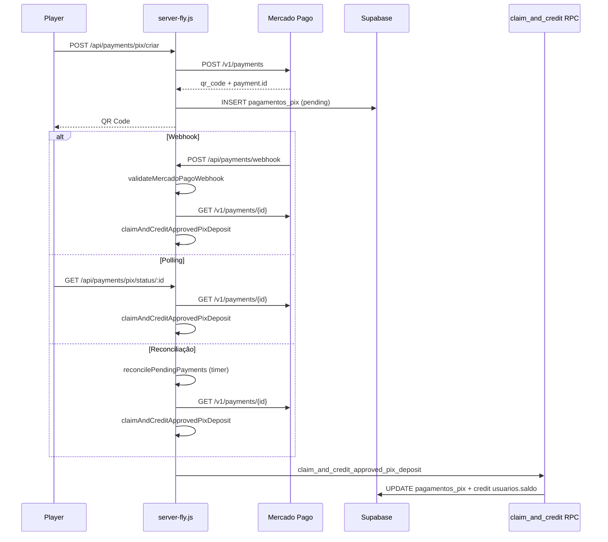
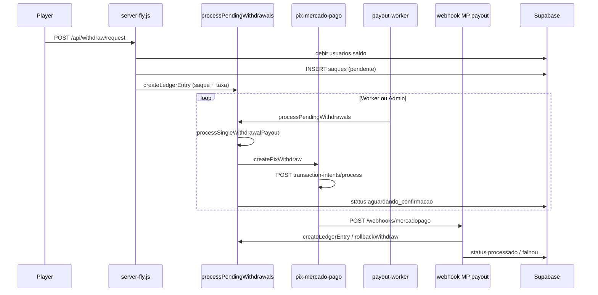

# F4.0C — Auditoria de Extração Financeira

**Data:** 2026-06-08  
**Modo:** READ-ONLY ABSOLUTO  
**Escopo:** Identificar blocos financeiros em `server-fly.js` e dependências que devem ser extraídos para arquitetura de providers (`PaymentProvider`, `PayoutProvider`, `FinanceProviderFactory`).  
**Proibido:** alterar código, commits, deploy, banco.

**Base:** `F4.0A-MAPA-FINANCEIRO-ATUAL.md`, `F4-0B-DESENHO-SEGURO-EFI-PROVEDOR-PARALELO.md`, leitura estática de `server-fly.js` (~4.695 linhas).

---

## Resumo executivo

| Métrica | Valor |
|---------|-------|
| **LOC financeiras em `server-fly.js`** | ~**1.850 linhas** (~39% do arquivo) |
| **Já extraído parcialmente** | `processPendingWithdrawals.js` (~1.730 lin), `pix-mercado-pago.js` (~632 lin) |
| **Ainda acoplado ao monólito** | PIX IN completo, webhooks, reconciliação, crédito saldo, webhook payout MP |
| **Blocos CRÍTICOS para extração** | `claimAndCreditApprovedPixDeposit`, webhook payout `3553–3829`, `POST /api/withdraw/request` |
| **Arquivos futuros estimados** | **22–28** novos + **8** modificados |

| Veredito | Extração é **necessária e viável em fatias**, começando por adapters MP (sem mudar comportamento) antes de Efí |
| Confiança | **90%** (mapeamento estático; linhas aproximadas ±5) |

---

## 1. Fluxo PIX IN — Mercado Pago (mapeamento completo)

### 1.1 Diagrama do fluxo atual



### 1.2 Blocos por etapa

#### A) Geração QR Code

| Campo | Valor |
|-------|-------|
| **Rota** | `POST /api/payments/pix/criar` |
| **Arquivo** | `server-fly.js` |
| **Linhas** | **3038–3225** (~188 lin) |
| **Tipo** | handler HTTP inline |
| **API MP** | `POST https://api.mercadopago.com/v1/payments` (linhas 3122–3137) |
| **Persistência** | `pagamentos_pix` insert (3144–3158) |
| **Dependências** | `mercadoPagoAccessToken`, `mercadoPagoConnected`, `supabase`, `req.user`, `axios`, `crypto`, `BACKEND_URL` |
| **Extração alvo** | `MercadoPagoPaymentProvider.createPixCharge()` + rota fina |

#### B) Listagem PIX do usuário

| Campo | Valor |
|-------|-------|
| **Rota** | `GET /api/payments/pix/usuario` |
| **Arquivo** | `server-fly.js` |
| **Linhas** | **3228–3319** (~92 lin) |
| **Dependências** | `supabase`, `pagamentos_pix`, `req.user.userId` |
| **Extração alvo** | `DepositQueryService.listByUser()` — **agnóstico de provedor** |

#### C) Consulta status

| Campo | Valor |
|-------|-------|
| **Rota** | `GET /api/payments/pix/status`, `GET /api/payments/pix/status/:paymentId` |
| **Arquivo** | `server-fly.js` |
| **Função** | `handleGetPixStatus` |
| **Linhas** | **3322–3423** (~102 lin); rotas **3425–3426** |
| **API MP** | `GET /v1/payments/{id}` (3379–3388) |
| **Side-effect** | chama `claimAndCreditApprovedPixDeposit` se MP=approved (3392–3393) |
| **Dependências** | `normalizeMercadoPagoPaymentResourceId`, `claimAndCreditApprovedPixDeposit`, `pagamentos_pix` |
| **Extração alvo** | `DepositStatusService.syncAndCredit()` + provider `getChargeStatus()` |

#### D) Webhook depósito

| Campo | Valor |
|-------|-------|
| **Rota** | `POST /api/payments/webhook` |
| **Arquivo** | `server-fly.js` |
| **Linhas** | **3433–3545** (~113 lin) |
| **Middleware** | `webhookSignatureValidator.validateMercadoPagoWebhook` (3449) |
| **Fluxo** | valida assinatura → responde 200 → GET MP → `claimAndCreditApprovedPixDeposit` |
| **Dependências** | `utils/webhook-signature-validator.js`, `normalizeMercadoPagoPaymentResourceId`, `financeLog` |
| **Extração alvo** | `routes/webhooks/mercadopago-deposit-webhook.js` + `MercadoPagoPaymentProvider.handleWebhook()` |

#### E) Reconciliação

| Campo | Valor |
|-------|-------|
| **Função** | `reconcilePendingPayments` |
| **Arquivo** | `server-fly.js` |
| **Linhas** | **3859–3953** (~95 lin) |
| **Agendamento** | **3956–3960** (`setInterval`, `MP_RECONCILE_*`) |
| **Helpers** | `pickMercadoPagoPaymentIdForReconcile` (**2894–2900**) |
| **Dependências** | `pagamentos_pix` (status=pending), `mercadoPagoConnected`, `claimAndCreditApprovedPixDeposit` |
| **Extração alvo** | `DepositReconcileJob` (worker/timer separado ou módulo `src/finance/deposit/reconcile-pending.js`) |

#### F) Crédito em carteira (núcleo)

| Campo | Valor |
|-------|-------|
| **Função** | `claimAndCreditApprovedPixDeposit` |
| **Arquivo** | `server-fly.js` |
| **Linhas** | **2907–3035** (~129 lin) |
| **RPC** | `claim_and_credit_approved_pix_deposit(p_mercadopago_id)` (2919–2922) |
| **Fallback** | update `pagamentos_pix` + update `usuarios.saldo` (2947–3025) |
| **Tabelas** | `pagamentos_pix`, `usuarios` |
| **Chamado por** | webhook (3524), status (3393), reconcile (3923) |
| **Extração alvo** | `DepositCreditService.claimAndCredit()` — **permanece agnóstico**; provider só fornece ID/status |
| **Criticidade** | **CRÍTICO** — idempotência e saldo |

#### G) Helpers PIX IN (MP-específicos)

| Função | Linhas | Extração |
|--------|--------|----------|
| `normalizeMercadoPagoPaymentResourceId` | 2880–2887 | `providers/mercadopago/mp-payment-id.js` |
| `pickMercadoPagoPaymentIdForReconcile` | 2894–2900 | idem |
| `testMercadoPago` | 186–214 | `MercadoPagoPaymentProvider.healthCheck()` |

#### H) Config MP depósito (boot)

| Item | Linhas | Extração |
|------|--------|----------|
| `mercadoPagoAccessToken` | 182 | factory config |
| `mercadoPagoConnected` | 183, 206, 211 | provider health state |
| `testMercadoPago()` chamada no boot | (em `startServer`) | factory init |

---

## 2. Fluxo PIX OUT — Mercado Pago (mapeamento completo)

### 2.1 Diagrama do fluxo atual



### 2.2 Blocos por etapa

#### A) Solicitação de saque

| Campo | Valor |
|-------|-------|
| **Rota** | `POST /api/withdraw/request` |
| **Arquivo** | `server-fly.js` |
| **Linhas** | **1621–1996** (~376 lin) |
| **Validação** | `pixValidator.validateWithdrawData` (1648) |
| **Saldo** | optimistic lock `usuarios.saldo` (1796–1802) |
| **Persistência** | `saques` insert (1821–1842) |
| **Ledger** | `createLedgerEntry` tipo `saque` + `taxa` (1868–1932) |
| **Rollback** | `rollbackWithdraw` em falhas (1879, 1912, 1946) |
| **Dependências** | `utils/pix-validator.js`, `processPendingWithdrawals.createLedgerEntry`, `rollbackWithdraw`, `PAGAMENTO_TAXA_SAQUE` |
| **Extração alvo** | `WithdrawRequestService.request()` — **agnóstico de provedor** |
| **Criticidade** | **CRÍTICO** — débito saldo + ledger |

#### B) Histórico de saques

| Campo | Valor |
|-------|-------|
| **Rota** | `GET /api/withdraw/history` |
| **Linhas** | **1999–2053** (~55 lin) |
| **Extração alvo** | `WithdrawQueryService.history()` |

#### C) Fila / worker

| Campo | Valor |
|-------|-------|
| **Arquivo worker** | `src/workers/payout-worker.js` (117 lin) |
| **Bridge no monólito** | `runProcessPendingWithdrawals` — `server-fly.js` **134–142** |
| **Domínio** | `processPendingWithdrawals` — `processPendingWithdrawals.js` **1596–1718** |
| **Seleção fila** | query `saques` status `pendente`/`pending`, `PAYOUT_AUTO_FROM_AT`, limit 1 (1654–1662) |
| **Processamento unitário** | `processSingleWithdrawalPayout` (**1252–1467**) |
| **Dependências** | `createPixWithdraw` injetado, `ensurePayoutExternalReference`, `buildOwnerIdentification`, `rollbackWithdraw` |
| **Extração alvo** | Factory injeta `PayoutProvider` em vez de `createPixWithdraw` |
| **Criticidade** | **CRÍTICO** — envio real de dinheiro |

#### D) Envio payout (adapter MP)

| Campo | Valor |
|-------|-------|
| **Arquivo** | `services/pix-mercado-pago.js` |
| **Função** | `createPixWithdraw` |
| **Linhas** | **425–621** (~197 lin) |
| **API** | `POST /v1/transaction-intents/process` |
| **Também** | `getTransactionIntent` (194–223), helpers Ed25519 (23–33, 544–568) |
| **Extração alvo** | `services/providers/mercadopago/mercadopago-payout-provider.js` |
| **Criticidade** | **CRÍTICO** |

#### E) Admin — aprovação e envio

| Rota | Arquivo | Linhas | Destino |
|------|---------|--------|---------|
| `POST /api/admin/withdraw/approve` | `server-fly.js` → `adminWithdrawController` | 2803–2805 | já parcialmente extraído |
| `POST /api/admin/withdraw/approve-and-send` | idem | 2807–2809 | `approveAndSendWithdrawAdmin` em domain |
| `POST /api/admin/withdraw/cancel` | idem | 2811–2813 | `cancelWithdrawManualAdmin` |

**Domínio admin:** `processPendingWithdrawals.js` — `approveWithdrawManualAdmin` (738), `approveAndSendWithdrawAdmin` (1472), `cancelWithdrawManualAdmin` (1023).

#### F) Confirmação + webhook payout

| Campo | Valor |
|-------|-------|
| **Rota** | `POST /webhooks/mercadopago` |
| **Arquivo** | `server-fly.js` |
| **Linhas** | **3553–3829** (~277 lin) |
| **Validação** | `validateMercadoPagoPayoutWebhook` (3559) |
| **Lookup saque** | `payout_external_reference`, fallback legacy UUID (3619–3646) |
| **Idempotência** | `ledger_financeiro` tipos `payout_confirmado`/`falha_payout` (3673–3699) |
| **Sucesso** | `createLedgerEntry(payout_confirmado)` + status `processado` (3721–3736) |
| **Falha** | `rollbackWithdraw` (3790–3798) |
| **Dependências** | `getTransactionIntent`, `createLedgerEntry`, `rollbackWithdraw`, `payoutCounters`, colunas `mp_*` |
| **Extração alvo** | `MercadoPagoPayoutWebhookHandler` + interface `PayoutProvider.normalizeWebhookEvent()` |
| **Criticidade** | **CRÍTICO** — confirmação final e rollback |

#### G) Ledger e rollback (já em domain)

| Função | Arquivo | Linhas | Criticidade |
|--------|---------|--------|-------------|
| `createLedgerEntry` | `processPendingWithdrawals.js` | 37–80 | CRÍTICO |
| `rollbackWithdraw` | idem | 314–446 | CRÍTICO |
| `ensurePayoutExternalReference` | idem | 83–128 | ALTO |
| `buildOwnerIdentification` | idem | 184–233 | ALTO |
| `healStuckProcessingWithRollback` | idem | 447–562 | MÉDIO |

---

## 3. Dependências compartilhadas

### 3.1 Estado global do monólito (acoplamento)

| Símbolo | Linha | Usado por | Problema na extração |
|---------|-------|-----------|---------------------|
| `supabase` | 131 | todos os fluxos | precisa injeção DI |
| `dbConnected` | 132 | guards HTTP | idem |
| `mercadoPagoAccessToken` | 182 | PIX IN | mover para provider config |
| `mercadoPagoConnected` | 183 | PIX IN, reconcile, health | idem |
| `financeLog` | 69–79 | todos financeiros | extrair util |
| `payoutCounters` | import domain | webhook payout, worker | ok (já exportado) |

### 3.2 Tabelas Supabase

| Tabela | PIX IN | PIX OUT | Operação |
|--------|--------|---------|----------|
| `pagamentos_pix` | ✅ create, read, update | — | depósito |
| `usuarios` | ✅ saldo crédito | ✅ saldo débito | carteira |
| `saques` | — | ✅ CRUD status | saque |
| `ledger_financeiro` | — | ✅ saque, taxa, payout, rollback | auditoria |
| RPC `claim_and_credit_approved_pix_deposit` | ✅ | — | crédito atômico |

### 3.3 Módulos externos já separados

| Módulo | Papel | Extração |
|--------|-------|----------|
| `utils/pix-validator.js` | valida chave/valor saque | manter; importar nos services |
| `utils/webhook-signature-validator.js` | HMAC depósito + payout MP | split: `mp-deposit-signature.js`, `mp-payout-signature.js` |
| `controllers/adminWithdrawController.js` | HTTP admin saque | manter; injetar factory |
| `services/pix-mercado-pago.js` | adapter MP payout (+ helpers PIX IN não usados) | renomear/mover para `providers/mercadopago/` |
| `src/workers/payout-worker.js` | processo Fly | injetar `resolvePayoutProvider()` |

### 3.4 Funções utilitárias admin (no monólito)

| Função | Linhas | Uso |
|--------|--------|-----|
| `classifyWithdrawLedgerState` | 2290–2308 | admin withdraw list |
| `requireAdministradorDb` | 2055+ | guards admin |

---

## 4. Arquitetura alvo (contratos e factory)

### 4.1 `PaymentProvider` (PIX IN)

```javascript
// Proposta documental — src/finance/contracts/PaymentProvider.js
{
  name: 'mercadopago' | 'efi',
  isConfigured(): boolean,
  healthCheck(): Promise<{ ok: boolean }>,
  createPixCharge(ctx): Promise<{
    providerRef, qrCode, qrCodeBase64, copyPaste, status
  }>,
  getChargeStatus(providerRef): Promise<{ status, statusDetail, amount }>,
  validateDepositWebhook(req): { valid, error?, paymentId? },
  // Opcional: parseWebhookEvent(body) se lógica MP sair do handler
}
```

**Responsabilidades que NÃO vão no provider:**

- `claimAndCreditApprovedPixDeposit` → `DepositCreditService` (domínio Gol de Ouro)
- persistência `pagamentos_pix` → `DepositRepository`
- reconciliação timer → `DepositReconcileJob`

### 4.2 `PayoutProvider` (PIX OUT)

```javascript
// Proposta documental — src/finance/contracts/PayoutProvider.js
{
  name: 'mercadopago' | 'efi',
  isConfigured(): boolean,
  createPixWithdraw(ctx): Promise<PayoutResult>,
  getPayoutStatus(providerRef): Promise<StatusResult>,
  validatePayoutWebhook(req): { valid, error?, externalRef?, providerRef? },
  mapStatusToDomain(raw): 'approved' | 'processing' | 'rejected' | 'unknown'
}
```

**Responsabilidades que permanecem no domínio:**

- `processSingleWithdrawalPayout` (orquestração)
- `rollbackWithdraw`, `createLedgerEntry`
- máquina de estados `saques.status`

### 4.3 `FinanceProviderFactory`

```javascript
// Proposta documental — src/finance/FinanceProviderFactory.js
resolvePaymentProvider()  // PAYMENT_PROVIDER, default mercadopago
resolvePayoutProvider()   // PAYOUT_PROVIDER, default mercadopago
assertBootConfig()        // fail-closed se efi sem EFI_*_ENABLED
getHealthSnapshot()       // substitui mercadoPago no /health
```

### 4.4 O que permanece em `server-fly.js` após extração (alvo)

| Responsabilidade | Linhas estimadas |
|------------------|------------------|
| `app.use` middleware global | ~300 |
| montagem de rotas financeiras (`app.use('/api', financeRoutes)`) | ~20 |
| boot: `connectSupabase`, `factory.init()`, `startReconcileJob` | ~50 |
| rotas não-financeiras (auth, games, admin users) | ~2.500 |

**Meta:** reduzir bloco financeiro inline de ~1.850 para ~50 linhas de wiring.

---

## 5. Lista de extrações futuras

### 5.1 Prioridade 1 — Fundação (sem mudar comportamento MP)

| # | Bloco | Origem | Função / Rota | Linhas | Destino proposto | Dependências | Criticidade extração |
|---|-------|--------|---------------|--------|------------------|--------------|---------------------|
| E01 | Log financeiro | `server-fly.js` | `financeLog` | 69–79 | `src/finance/finance-log.js` | console | **BAIXO** |
| E02 | MP health | `server-fly.js` | `testMercadoPago` | 186–214 | `providers/mercadopago/mp-health.js` | axios, env | **BAIXO** |
| E03 | MP payment ID utils | `server-fly.js` | `normalizeMercadoPagoPaymentResourceId` | 2880–2887 | `providers/mercadopago/mp-payment-id.js` | — | **BAIXO** |
| E04 | Reconcile ID pick | `server-fly.js` | `pickMercadoPagoPaymentIdForReconcile` | 2894–2900 | idem | — | **BAIXO** |
| E05 | Adapter payout MP | `pix-mercado-pago.js` | `createPixWithdraw`, `getTransactionIntent` | 194–223, 425–621 | `providers/mercadopago/mercadopago-payout-provider.js` | axios, crypto, env | **MÉDIO** |
| E06 | Factory | — | (novo) | — | `src/finance/FinanceProviderFactory.js` | providers | **MÉDIO** |
| E07 | Contratos | — | (novo) | — | `src/finance/contracts/*.js` | — | **BAIXO** |

### 5.2 Prioridade 2 — PIX IN (maior acoplamento no monólito)

| # | Bloco | Origem | Função / Rota | Linhas | Destino proposto | Dependências | Criticidade |
|---|-------|--------|---------------|--------|------------------|--------------|-------------|
| E08 | Crédito carteira | `server-fly.js` | `claimAndCreditApprovedPixDeposit` | 2907–3035 | `src/finance/deposit/deposit-credit-service.js` | supabase, RPC, financeLog | **CRÍTICO** |
| E09 | Criar PIX | `server-fly.js` | `POST /api/payments/pix/criar` | 3038–3225 | `routes/payments/create-pix-route.js` + MP provider | E03, supabase, auth | **ALTO** |
| E10 | Listar PIX | `server-fly.js` | `GET /api/payments/pix/usuario` | 3228–3319 | `routes/payments/list-pix-route.js` | supabase | **BAIXO** |
| E11 | Status PIX | `server-fly.js` | `handleGetPixStatus` | 3322–3423 | `deposit-status-service.js` | E08, E03, MP GET | **ALTO** |
| E12 | Webhook depósito | `server-fly.js` | `POST /api/payments/webhook` | 3433–3545 | `webhooks/mercadopago-deposit-webhook.js` | webhook-validator, E08 | **CRÍTICO** |
| E13 | Reconciliação | `server-fly.js` | `reconcilePendingPayments` + timer | 3859–3960 | `jobs/deposit-reconcile-job.js` | E08, E04 | **ALTO** |
| E14 | MP PIX IN inline | `server-fly.js` | axios calls em E09/E11/E12/E13 | várias | `providers/mercadopago/mercadopago-payment-provider.js` | token depósito | **ALTO** |

### 5.3 Prioridade 3 — PIX OUT (parcialmente extraído)

| # | Bloco | Origem | Função / Rota | Linhas | Destino proposto | Dependências | Criticidade |
|---|-------|--------|---------------|--------|------------------|--------------|-------------|
| E15 | Solicitar saque | `server-fly.js` | `POST /api/withdraw/request` | 1621–1996 | `src/finance/withdraw/withdraw-request-service.js` | pix-validator, ledger, rollback | **CRÍTICO** |
| E16 | Histórico saque | `server-fly.js` | `GET /api/withdraw/history` | 1999–2053 | `withdraw-query-service.js` | supabase | **BAIXO** |
| E17 | Bridge worker | `server-fly.js` | `runProcessPendingWithdrawals` | 134–142 | factory no worker | domain | **MÉDIO** |
| E18 | Orquestração payout | `processPendingWithdrawals.js` | `processSingleWithdrawalPayout` | 1252–1467 | refatorar injeção `PayoutProvider` | E05, ledger | **CRÍTICO** |
| E19 | Fila worker | `processPendingWithdrawals.js` | `processPendingWithdrawals` | 1596–1718 | manter; trocar `createPixWithdraw` por provider | env flags | **ALTO** |
| E20 | Webhook payout | `server-fly.js` | `POST /webhooks/mercadopago` | 3553–3829 | `webhooks/mercadopago-payout-webhook.js` | domain ledger, E05 | **CRÍTICO** |
| E21 | Admin list | `server-fly.js` | `GET /api/admin/withdraw/list` | 2529–2646 | `routes/admin/withdraw-list-route.js` | classifyWithdrawLedgerState | **MÉDIO** |
| E22 | Admin financial | `server-fly.js` | `GET /api/admin/financial/report` | 2728–2801 | `routes/admin/financial-report-route.js` | ledger | **BAIXO** |
| E23 | Ledger classify | `server-fly.js` | `classifyWithdrawLedgerState` | 2290–2308 | `src/finance/ledger/ledger-state.js` | — | **BAIXO** |

### 5.4 Prioridade 4 — Efí (após MP estável em providers)

| # | Bloco | Origem | Destino | Criticidade |
|---|-------|--------|---------|-------------|
| E24 | Efi payout adapter | (novo) | `providers/efi/efi-payout-provider.js` | **ALTO** |
| E25 | Efi mTLS client | (novo) | `providers/efi/efi-mtls-client.js` | **ALTO** |
| E26 | Efi OAuth | (novo) | `providers/efi/efi-auth.js` | **MÉDIO** |
| E27 | Webhook Efi | (novo) | `webhooks/efi-payout-webhook.js` | **CRÍTICO** |

### 5.5 Observabilidade

| # | Bloco | Origem | Linhas | Destino | Criticidade |
|---|-------|--------|--------|---------|-------------|
| E28 | Health MP | `server-fly.js` | 4009 (`mercadoPago`) | `factory.getHealthSnapshot()` | **BAIXO** |
| E29 | Health workers | `server-fly.js` | 4017–4032 | `routes/health-workers-route.js` | **BAIXO** |

---

## 6. Risco da extração (classificação)

### 6.1 Por bloco

| Bloco | Risco | Motivo |
|-------|-------|--------|
| `financeLog`, utils MP ID | **BAIXO** | sem efeito colateral; move puro |
| `GET pix/usuario`, `withdraw/history`, admin report | **BAIXO** | read-only |
| `testMercadoPago`, factory, contratos | **BAIXO** | wiring |
| `pix-mercado-pago.js` → provider | **MÉDIO** | já isolado; risco de regressão em assinatura Ed25519 |
| `runProcessPendingWithdrawals`, admin list | **MÉDIO** | injeção DI |
| `POST pix/criar`, `handleGetPixStatus` | **ALTO** | contrato player + MP API + persistência |
| `reconcilePendingPayments` | **ALTO** | timer + race com webhook |
| `POST /api/withdraw/request` | **CRÍTICO** | débito saldo + ledger + rollback |
| `claimAndCreditApprovedPixDeposit` | **CRÍTICO** | crédito saldo + RPC idempotente |
| `POST /api/payments/webhook` | **CRÍTICO** | path de confirmação principal |
| `POST /webhooks/mercadopago` | **CRÍTICO** | confirmação saque + rollback |
| `processSingleWithdrawalPayout` refactor | **CRÍTICO** | envio dinheiro real |
| Webhook Efí + mTLS | **CRÍTICO** | infra + novo provedor |

### 6.2 Riscos transversais da extração

| Risco | Severidade | Mitigação na extração |
|-------|------------|----------------------|
| Regressão contrato HTTP player | ALTA | manter rotas/paths; testes de contrato antes/depois |
| Perda de idempotência depósito | CRÍTICA | extrair `claimAndCredit` sem alterar RPC/fallback |
| Dupla confirmação saque | CRÍTICA | extrair webhook sem duplicar handlers |
| `supabase` global → DI | MÉDIA | passar `{ supabase }` em construtores |
| Import circular factory ↔ domain | MÉDIA | factory só importa providers; domain importa contratos |
| Deploy parcial (worker vs app) | ALTA | versionar contrato `PayoutProvider`; deploy conjunto |

### 6.3 Ordem segura de extração (fatias)

```
Fatiar 1: E01–E07 (utils + factory + MP payout provider wrapper)
Fatiar 2: E20 (webhook payout → módulo, mesmo código)
Fatiar 3: E17–E19 (injetar PayoutProvider no domain/worker)
Fatiar 4: E08 (deposit credit service)
Fatiar 5: E12–E14 (PIX IN provider + webhook depósito)
Fatiar 6: E09–E11, E13 (rotas depósito + reconcile)
Fatiar 7: E15–E16 (withdraw request service)
Fatiar 8: E21–E23, E28–E29 (admin + health)
Fatiar 9: E24–E27 (Efí — somente após F4.0B Fase 2)
```

---

## 7. Estimativa de arquivos futuros

### 7.1 Árvore proposta

```
src/finance/
├── FinanceProviderFactory.js          # E06
├── finance-log.js                     # E01
├── contracts/
│   ├── PaymentProvider.js             # E07
│   └── PayoutProvider.js            # E07
├── deposit/
│   ├── deposit-credit-service.js    # E08
│   ├── deposit-status-service.js    # E11
│   ├── deposit-repository.js        # (opcional) pagamentos_pix
│   └── deposit-reconcile-job.js       # E13
├── withdraw/
│   ├── withdraw-request-service.js  # E15
│   └── withdraw-query-service.js    # E16
├── ledger/
│   └── ledger-state.js              # E23
├── webhooks/
│   ├── mercadopago-deposit-webhook.js   # E12
│   └── mercadopago-payout-webhook.js    # E20
└── routes/
    ├── payment-routes.js            # monta E09–E11
    ├── withdraw-routes.js           # monta E15–E16
    ├── webhook-routes.js            # monta E12, E20
    └── admin-finance-routes.js      # E21–E22

services/providers/
├── mercadopago/
│   ├── mercadopago-payment-provider.js  # E14
│   ├── mercadopago-payout-provider.js   # E05
│   ├── mp-health.js                     # E02
│   ├── mp-payment-id.js                 # E03–E04
│   └── mp-deposit-client.js             # (opcional) axios wrapper
└── efi/
    ├── efi-payout-provider.js         # E24
    ├── efi-mtls-client.js             # E25
    └── efi-auth.js                    # E26

src/finance/webhooks/
└── efi-payout-webhook.js              # E27
```

### 7.2 Contagem

| Categoria | Arquivos novos | Arquivos modificados |
|-----------|----------------|---------------------|
| Contratos + factory | 3 | 0 |
| Deposit (PIX IN) | 4–5 | 0 |
| Withdraw (PIX OUT) | 2 | 0 |
| Webhooks | 2–3 | 0 |
| Routes (montagem) | 4 | 0 |
| Providers MP | 4–5 | 1 (`pix-mercado-pago.js` deprecate) |
| Providers Efí | 3–4 | 0 |
| Domain existente | 0 | 1 (`processPendingWithdrawals.js`) |
| Worker | 0 | 1 (`payout-worker.js`) |
| Monólito | 0 | 1 (`server-fly.js`) |
| Config | 0 | 2 (`required-env.js`, `.env.example`) |
| Admin controller | 0 | 1 (`adminWithdrawController.js`) |
| **Total** | **22–28 novos** | **~8 modificados** |

### 7.3 LOC estimado pós-extração

| Arquivo | LOC atual | LOC pós-extração (est.) |
|---------|-----------|-------------------------|
| `server-fly.js` | ~4.695 | ~2.850 (−1.850 financeiro + wiring +50) |
| `processPendingWithdrawals.js` | ~1.730 | ~1.650 (refator injeção) |
| `pix-mercado-pago.js` | ~632 | 0 (deprecated → providers) |
| Novos módulos | 0 | ~2.400–2.800 |

---

## 8. Mapa de linhas financeiras em `server-fly.js`

Referência rápida para cirurgia futura:

| Seção | Linhas aprox. | LOC | Destino extração |
|-------|---------------|-----|------------------|
| `financeLog` | 69–79 | 11 | `finance-log.js` |
| `runProcessPendingWithdrawals` | 134–142 | 9 | worker + factory |
| Config MP depósito | 178–214 | 37 | MP provider |
| **SAQUES** `POST /api/withdraw/request` | 1621–1996 | 376 | `withdraw-request-service` |
| `GET /api/withdraw/history` | 1999–2053 | 55 | `withdraw-query-service` |
| `classifyWithdrawLedgerState` | 2290–2308 | 19 | `ledger-state.js` |
| `GET /api/admin/withdraw/list` | 2529–2646 | 118 | admin routes |
| `GET /api/admin/dashboard/stats` | 2648–2726 | 79 | parcial financeiro |
| `GET /api/admin/financial/report` | 2728–2801 | 74 | admin routes |
| Admin withdraw POST ×3 | 2803–2813 | 11 | já em controller |
| Helpers PIX IN | 2880–2900 | 21 | `mp-payment-id.js` |
| **`claimAndCreditApprovedPixDeposit`** | 2907–3035 | 129 | **`deposit-credit-service`** |
| `POST /api/payments/pix/criar` | 3038–3225 | 188 | payment provider + route |
| `GET /api/payments/pix/usuario` | 3228–3319 | 92 | route |
| `handleGetPixStatus` | 3322–3423 | 102 | deposit-status-service |
| `POST /api/payments/webhook` | 3433–3545 | 113 | deposit webhook |
| **`POST /webhooks/mercadopago`** | 3553–3829 | 277 | **payout webhook** |
| `reconcilePendingPayments` + timer | 3859–3960 | 102 | reconcile job |
| `/health` mercadoPago | 4009 | 1 | factory health |
| `/health/workers` | 4017–4032 | 16 | health route |
| **Subtotal financeiro** | — | **~1.850** | — |

---

## 9. Veredito final

| Pergunta | Resposta |
|----------|----------|
| O que extrair primeiro? | Utils + `MercadoPagoPayoutProvider` (wrapper sem mudança de comportamento) |
| O que não extrair cedo? | `claimAndCreditApprovedPixDeposit`, webhooks, `withdraw/request` — até testes de regressão |
| Onde está o maior acoplamento MP? | `server-fly.js` linhas 2907–3960 (PIX IN + webhooks + reconcile) |
| O que já está bem separado? | `processPendingWithdrawals.js`, `pix-mercado-pago.js` (payout), `payout-worker.js` |
| Pronto para Efí? | Não — exige Fatiar 1–8 antes de `efi-payout-provider` |

### Próximos passos seguros (somente documentação/planejamento)

1. Validar este mapa de linhas com `git grep` antes da primeira fatia.
2. Criar testes de contrato HTTP para rotas PIX/saque (baseline MP).
3. Implementar Fatiar 1 (E01–E07) com diff mínimo e zero mudança de comportamento.
4. Só então mover webhook payout (E20) — maior bloco CRÍTICO isolável.
5. Efí (E24–E27) apenas após `FinanceProviderFactory` em produção com MP.

---

## 10. Referências

| Documento | Relação |
|-----------|---------|
| [F4.0A — Mapa Financeiro Atual](./F4.0A-MAPA-FINANCEIRO-ATUAL.md) | Baseline endpoints e env |
| [F4.0B — Desenho Efí Paralelo](./F4-0B-DESENHO-SEGURO-EFI-PROVEDOR-PARALELO.md) | Arquitetura alvo providers |
| [F3.1A — Auditoria Efí](./F3-1A-AUDITORIA-READONLY-EFI-BANK.md) | Requisitos Efi pós-extração |

---

*Relatório gerado em modo READ-ONLY. Nenhum arquivo de código foi alterado.*
