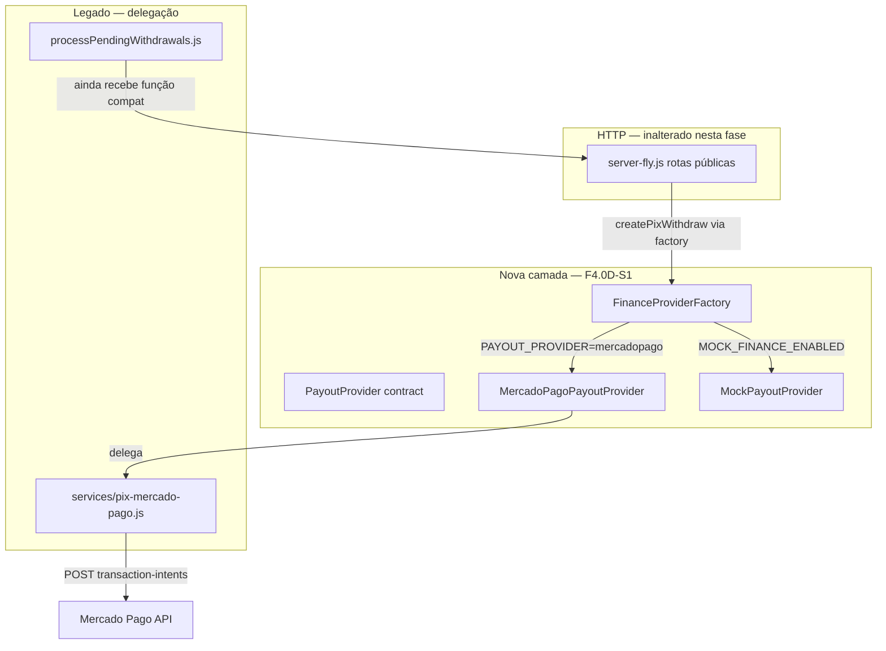

# F4.0D — Pré-Execução Técnica da Abstração Financeira

**Data:** 2026-06-08  
**Modo:** READ-ONLY + PLANO DE CIRURGIA  
**Escopo:** Preparar a extração da camada financeira **sem ativar Efí**, **sem alterar comportamento Mercado Pago**, **sem operações reais**.  
**Proibido nesta fase:** alterar código, banco, credenciais, commits, deploy, PIX real.

**Base analítica:**

- [F4.0A — Mapa Financeiro Atual](./F4.0A-MAPA-FINANCEIRO-ATUAL.md)
- [F4.0B — Desenho Efí Paralelo](./F4-0B-DESENHO-SEGURO-EFI-PROVEDOR-PARALELO.md)
- [F4.0C — Auditoria de Extração](./F4-0C-AUDITORIA-EXTRACAO-FINANCEIRA.md)

---

## Resumo executivo

| Item | Decisão |
|------|---------|
| **Objetivo da cirurgia F4.0D-S1** | Introduzir factory + contratos + **wrapper MP payout** sem mudar HTTP, payloads MP nem fluxos de crédito/saque |
| **Efí** | **Ausente** do código e da factory nesta fase |
| **Mercado Pago** | Comportamento **byte-a-byte equivalente** via delegação a `services/pix-mercado-pago.js` |
| **Mocks** | Somente com `MOCK_FINANCE_ENABLED=true` e **bloqueados em produção** |
| **Primeira fatia** | 6–8 arquivos novos, 2–3 arquivos tocados, ~150–250 LOC de diff |
| **Deploy** | Staging primeiro; produção só após checklist GO |

| Veredito pré-execução | **GO CONDICIONAL** para iniciar **F4.0D-S1** (wrapper only) após revisão humana deste plano |
| Bloqueador absoluto | Qualquer diff que altere payload MP, rota pública ou path de `claimAndCreditApprovedPixDeposit` |

---

## 1. Arquitetura futura (visão F4.0D)

### 1.1 Diagrama de componentes (pós-S1, alvo parcial)



### 1.2 Componentes e responsabilidades

| Componente | Arquivo futuro | Fase F4.0D-S1 | Fase posterior |
|------------|----------------|---------------|----------------|
| **PaymentProvider** | `src/finance/contracts/PaymentProvider.js` | Contrato JSDoc apenas | Implementação MP PIX IN |
| **PayoutProvider** | `src/finance/contracts/PayoutProvider.js` | Contrato JSDoc | Wrapper MP ativo |
| **FinanceProviderFactory** | `src/finance/FinanceProviderFactory.js` | `resolvePayoutProvider()` | + `resolvePaymentProvider()` |
| **MercadoPagoPayoutProvider** | `services/providers/mercadopago/MercadoPagoPayoutProvider.js` | **Implementar** (delegação) | Único payout ativo |
| **MercadoPagoPaymentProvider** | `services/providers/mercadopago/MercadoPagoPaymentProvider.js` | **Não criar** ainda | F4.0D-S2+ |
| **MockPaymentProvider** | `services/providers/mock/MockPaymentProvider.js` | Stub + fail em prod | Testes locais |
| **MockPayoutProvider** | `services/providers/mock/MockPayoutProvider.js` | Stub + fail em prod | Testes locais |
| **EfiPayoutProvider** | — | **Proibido** nesta epic | F4.0B Fase 2 |

### 1.3 Princípios invioláveis (F4.0D)

1. Rotas públicas **inalteradas** (`/api/payments/pix/*`, `/api/withdraw/*`, `/webhooks/*`).
2. Payloads enviados ao Mercado Pago **idênticos** (mesmo JSON, headers, idempotency).
3. `claimAndCreditApprovedPixDeposit` permanece em `server-fly.js` até fatia S3+.
4. Webhooks permanecem inline em `server-fly.js` até fatia S2+.
5. Factory retorna **apenas** `mercadopago` em produção quando `MOCK_FINANCE_ENABLED≠true`.
6. Nenhum import `efi` em qualquer arquivo da fatia S1.

---

## 2. Contratos mínimos

### 2.1 `PaymentProvider` (PIX IN — contrato apenas na S1)

Arquivo: `src/finance/contracts/PaymentProvider.js`

```javascript
/**
 * @typedef {Object} PixDepositCreateInput
 * @property {number} amount
 * @property {string} userId
 * @property {string} userEmail
 * @property {string} [userName]
 * @property {string} [payerCpf]
 * @property {string} idempotencyKey
 * @property {string} notificationUrl
 */

/**
 * @typedef {Object} PixDepositCreateResult
 * @property {boolean} success
 * @property {string} [providerRef]      // payment.id MP
 * @property {string} [qrCode]
 * @property {string} [qrCodeBase64]
 * @property {string} [copyPaste]
 * @property {string} [status]
 * @property {string} [error]
 */

/**
 * @typedef {Object} PaymentProvider
 * @property {string} name                // 'mercadopago' | 'mock'
 * @property {() => boolean} isConfigured
 * @property {(input: PixDepositCreateInput) => Promise<PixDepositCreateResult>} createPixDeposit
 * @property {(providerRef: string) => Promise<{ success, status, statusDetail?, amount?, error? }>} getPixDepositStatus
 * @property {(req: import('express').Request) => Promise<{ valid: boolean, error?: string, providerRef?: string }>} handleDepositWebhook
 */
```

| Método | Origem atual (MP) | Linhas | Ativo em S1? |
|--------|-------------------|--------|--------------|
| `createPixDeposit()` | `POST /api/payments/pix/criar` + axios MP | 3038–3137 | **Não** — só contrato |
| `getPixDepositStatus()` | `handleGetPixStatus` + GET MP | 3322–3388 | **Não** |
| `handleDepositWebhook()` | `POST /api/payments/webhook` | 3433–3545 | **Não** |

**Nota:** Na S1, `FinanceProviderFactory.resolvePaymentProvider()` pode retornar `null` ou lançar se chamado — o monólito continua inline.

### 2.2 `PayoutProvider` (PIX OUT — wrapper ativo na S1)

Arquivo: `src/finance/contracts/PayoutProvider.js`

```javascript
/**
 * @typedef {Object} PixPayoutRequestInput
 * @property {number} netAmount
 * @property {string} pixKey
 * @property {string} pixType
 * @property {string} userId
 * @property {string} saqueId
 * @property {string} correlationId
 * @property {string} payoutExternalReference  // <= 64 chars
 * @property {string} idempotencyKey
 * @property {string} [notificationUrl]
 * @property {{ type: 'CPF'|'CNPJ', number: string }} ownerIdentification
 */

/**
 * @typedef {Object} PixPayoutRequestResult
 * @property {boolean} success
 * @property {object} [data]
 * @property {string} [data.id]              // mp_transaction_intent_id
 * @property {string} [data.status]
 * @property {string} [data.status_detail]
 * @property {string} [data.external_reference]
 * @property {object} [data.sanitized]
 * @property {string} [error]
 */

/**
 * @typedef {Object} PayoutProvider
 * @property {string} name                    // 'mercadopago' | 'mock'
 * @property {() => boolean} isConfigured
 * @property {(input: PixPayoutRequestInput) => Promise<PixPayoutRequestResult>} requestPixPayout
 * @property {(providerRef: string) => Promise<{ success, data?, error? }>} getPayoutStatus
 * @property {(req: import('express').Request) => Promise<{ valid, error?, externalReference?, status?, statusDetail?, providerRef? }>} handlePayoutWebhook
 */
```

| Método | Origem atual (MP) | Delegação S1 |
|--------|-------------------|--------------|
| `requestPixPayout()` | `createPixWithdraw()` | `pix-mercado-pago.js:425–621` |
| `getPayoutStatus()` | `getTransactionIntent()` | `pix-mercado-pago.js:194–223` |
| `handlePayoutWebhook()` | `POST /webhooks/mercadopago` | **Não wired na S1** — contrato + doc |

### 2.3 Adapter de compatibilidade (ponte S1)

`processPendingWithdrawals` hoje injeta `createPixWithdraw` com assinatura:

```text
(amount, pixKey, pixType, userId, saqueId, correlationId, options)
```

**Plano S1:** factory expõe **ambos**:

| Export | Consumidor | Comportamento |
|--------|------------|---------------|
| `resolvePayoutProvider()` | novo código / testes | objeto `PayoutProvider` |
| `createPixWithdrawCompat()` | `server-fly.js`, `payout-worker.js`, domain | wrapper fino que chama `provider.requestPixPayout()` mapeando args 1:1 |

Isso evita refatorar `processSingleWithdrawalPayout` (1252–1467) na primeira fatia.

### 2.4 `MercadoPagoPayoutProvider` — implementação planejada

Arquivo: `services/providers/mercadopago/MercadoPagoPayoutProvider.js`

```javascript
// Pseudocódigo do plano — NÃO é código commitado
const mp = require('../../pix-mercado-pago'); // re-export temporário

module.exports = {
  name: 'mercadopago',
  isConfigured: mp.isConfigured,
  async requestPixPayout(input) {
    return mp.createPixWithdraw(
      input.netAmount,
      input.pixKey,
      input.pixType,
      input.userId,
      input.saqueId,
      input.correlationId,
      {
        payoutExternalReference: input.payoutExternalReference,
        idempotencyKey: input.idempotencyKey,
        notificationUrl: input.notificationUrl,
        ownerIdentification: input.ownerIdentification
      }
    );
  },
  async getPayoutStatus(providerRef) {
    return mp.getTransactionIntent(providerRef);
  },
  async handlePayoutWebhook(req) {
    throw new Error('handlePayoutWebhook not wired in F4.0D-S1');
  }
};
```

**Garantia:** zero alteração no corpo de `createPixWithdraw` / `getTransactionIntent`.

### 2.5 `MockPayoutProvider` / `MockPaymentProvider`

| Regra | Detalhe |
|-------|---------|
| Ativação | `MOCK_FINANCE_ENABLED=true` **e** `NODE_ENV≠production` |
| Produção | `assertBootConfig()` **falha o boot** se mock em produção |
| `requestPixPayout` | retorna `{ success: true, data: { id: 'mock-intent-...', status: 'in_process' } }` sem HTTP |
| `createPixDeposit` | retorna QR fake; não chama MP |
| Webhooks mock | não registrados em rotas públicas |

---

## 3. `FinanceProviderFactory` — especificação

Arquivo: `src/finance/FinanceProviderFactory.js`

### 3.1 API planejada

```javascript
// resolvePayoutProvider(): PayoutProvider
// resolvePaymentProvider(): PaymentProvider | null  // null em S1
// assertBootConfig(): void
// getHealthSnapshot(): { paymentProvider, payoutProvider, mercadoPagoDeposit?, mercadoPagoPayout? }
// createPixWithdrawCompat: função legado (opcional export)
```

### 3.2 Lógica de resolução (payout)

```
SE NODE_ENV=production E MOCK_FINANCE_ENABLED=true → ERRO boot

SE MOCK_FINANCE_ENABLED=true E NODE_ENV≠production
  → MockPayoutProvider

SENÃO SE PAYOUT_PROVIDER=mercadopago (default)
  → MercadoPagoPayoutProvider

SENÃO SE PAYOUT_PROVIDER=efi
  → ERRO boot ("Efi not implemented — F4.0D")

SENÃO → ERRO boot ("Unknown PAYOUT_PROVIDER")
```

### 3.3 Lógica de resolução (payment) — S1

```
SE PAYMENT_PROVIDER=mercadopago (default)
  → null (monólito inline; provider na S2)

SE PAYMENT_PROVIDER≠mercadopago → ERRO boot até S2
```

### 3.4 Integração mínima em `server-fly.js` (diff planejado S1)

| Antes | Depois (S1) |
|-------|-------------|
| `const { createPixWithdraw } = require('./services/pix-mercado-pago')` | `const { createPixWithdrawCompat } = require('./src/finance/FinanceProviderFactory')` |
| `createPixWithdraw` em `runProcessPendingWithdrawals` (134–141) | `createPixWithdrawCompat` (mesma assinatura) |
| `getTransactionIntent` import direto (linha 20) | manter direto **ou** via provider (opcional S1; preferir manter para zero diff webhook) |

**Webhook payout (3553–3829):** **não tocar** na S1.

---

## 4. Feature flags

### 4.1 Flags obrigatórias (F4.0D)

| Variável | Valores | Default produção | Default dev | Função |
|----------|---------|------------------|-------------|--------|
| `PAYMENT_PROVIDER` | `mercadopago` | `mercadopago` | `mercadopago` | Seleção PIX IN (S2+) |
| `PAYOUT_PROVIDER` | `mercadopago` | `mercadopago` | `mercadopago` | Seleção PIX OUT |
| `EFI_PAYOUT_ENABLED` | `true`/`false` | `false` | `false` | Gate Efí — **ignorado** se provider≠efi |
| `MOCK_FINANCE_ENABLED` | `true`/`false` | `false` | `false` | Mocks locais |

### 4.2 Flags existentes — permanecem inalteradas

| Variável | Papel na S1 |
|----------|-------------|
| `MERCADOPAGO_DEPOSIT_ACCESS_TOKEN` | PIX IN inline (sem factory) |
| `MERCADOPAGO_PAYOUT_ACCESS_TOKEN` | Via `MercadoPagoPayoutProvider` → `pix-mercado-pago.js` |
| `MP_PAYOUT_PRIVATE_KEY` | Idem |
| `PAYOUT_PIX_ENABLED` | Worker/webhook — **desligar em smoke saque** |
| `ENABLE_PIX_PAYOUT_WORKER` | Worker Fly |
| `PAYOUT_MODE=manual` | Impede envio real no worker |
| `PAYOUT_AUTO_FROM_AT` | Corte fila worker |

### 4.3 Matriz de combinações permitidas (S1)

| PAYMENT_PROVIDER | PAYOUT_PROVIDER | MOCK | EFI_PAYOUT | Resultado |
|------------------|-----------------|------|------------|-----------|
| mercadopago | mercadopago | false | false | ✅ **Produção padrão** |
| mercadopago | mercadopago | true | false | ✅ Dev/testes (mock payout) |
| mercadopago | mercadopago | true | true | ⚠️ EFI ignorado; mock prevalece em dev |
| * | efi | * | true | ❌ Boot error (Efí não implementado) |
| * | * | true | * | ❌ Boot error em `NODE_ENV=production` |

### 4.4 Documentação `.env.example` (planejado S1)

Adicionar bloco (somente na execução, não nesta auditoria):

```bash
# F4.0D — Provider abstraction (defaults = Mercado Pago)
PAYMENT_PROVIDER=mercadopago
PAYOUT_PROVIDER=mercadopago
EFI_PAYOUT_ENABLED=false
MOCK_FINANCE_ENABLED=false
```

---

## 5. Primeira cirurgia segura — **F4.0D-S1**

### 5.1 Escopo IN

| Item | Incluído |
|------|----------|
| Contratos JSDoc `PaymentProvider`, `PayoutProvider` | ✅ |
| `FinanceProviderFactory.js` com `assertBootConfig` | ✅ |
| `MercadoPagoPayoutProvider.js` (delegação pura) | ✅ |
| `MockPayoutProvider.js` + `MockPaymentProvider.js` (stubs) | ✅ |
| `createPixWithdrawCompat` no factory | ✅ |
| Trocar import em `server-fly.js` (1 linha + uso em 134–141) | ✅ |
| Trocar import em `payout-worker.js` (opcional, mesma compat) | ✅ opcional |
| Teste unitário factory (mock mode) | ✅ recomendado |

### 5.2 Escopo OUT (proibido na S1)

| Item | Motivo |
|------|--------|
| Mover `claimAndCreditApprovedPixDeposit` | CRÍTICO — fora da S1 |
| Mover webhooks depósito/payout | CRÍTICO — S2 |
| `MercadoPagoPaymentProvider` implementado | S2 |
| Refatorar `processSingleWithdrawalPayout` | S2 |
| Qualquer arquivo `efi/` | Proibido |
| Alterar payloads MP | Proibido |
| Alterar rotas HTTP | Proibido |
| Migration banco | Proibido |

### 5.3 Arquivos tocados (estimativa)

| Ação | Arquivo |
|------|---------|
| **Criar** | `src/finance/contracts/PaymentProvider.js` |
| **Criar** | `src/finance/contracts/PayoutProvider.js` |
| **Criar** | `src/finance/FinanceProviderFactory.js` |
| **Criar** | `services/providers/mercadopago/MercadoPagoPayoutProvider.js` |
| **Criar** | `services/providers/mock/MockPaymentProvider.js` |
| **Criar** | `services/providers/mock/MockPayoutProvider.js` |
| **Criar** | `tests/finance/factory-payout-provider.test.js` (opcional) |
| **Editar** | `server-fly.js` (~5–15 linhas) |
| **Editar** | `src/workers/payout-worker.js` (~3–8 linhas, opcional) |
| **Editar** | `.env.example` (~5 linhas comentadas) |
| **Não deprecar ainda** | `services/pix-mercado-pago.js` |

**Total:** 6–7 novos + 2–3 edits | **LOC diff estimado:** 180–280

### 5.4 Sequência de execução (quando autorizado)

```
Passo 0 — Gate humano: aprovar F4.0D-S1
Passo 1 — Criar contratos (sem runtime)
Passo 2 — Criar MercadoPagoPayoutProvider (delegação 1:1)
Passo 3 — Criar mocks + guards produção
Passo 4 — Criar FinanceProviderFactory + assertBootConfig
Passo 5 — Wire createPixWithdrawCompat em server-fly.js
Passo 6 — node --check em todos os arquivos novos/alterados
Passo 7 — Smoke suite (seção 6)
Passo 8 — Deploy staging Fly (se GO)
Passo 9 — Observar 24h logs [PAYOUT][WORKER] sem regressão
```

### 5.5 Roadmap pós-S1 (referência, não executar agora)

| Fatia | Conteúdo | Depende de |
|-------|----------|------------|
| **S2** | Webhook payout → módulo + `handlePayoutWebhook` wired | S1 estável |
| **S3** | `DepositCreditService` + `MercadoPagoPaymentProvider` | S2 |
| **S4** | Webhook depósito + reconcile job | S3 |
| **S5** | `WithdrawRequestService` extraído | S3 |
| **S6** | `processPendingWithdrawals` injeta `PayoutProvider` direto | S2 |
| **S7** | Efí (F4.0B Fase 2) | S6 + infra mTLS |

---

## 6. Testes obrigatórios (pré e pós S1)

### 6.1 Checklist estático

| # | Comando / ação | Critério PASS |
|---|----------------|---------------|
| T01 | `node --check src/finance/FinanceProviderFactory.js` | exit 0 |
| T02 | `node --check services/providers/mercadopago/MercadoPagoPayoutProvider.js` | exit 0 |
| T03 | `node --check server-fly.js` | exit 0 |
| T04 | `node --check src/workers/payout-worker.js` | exit 0 |
| T05 | `grep -r "efi" services/providers src/finance` (pós-S1) | 0 matches |
| T06 | `grep "createPixWithdraw" server-fly.js` | só via compat/factory |

### 6.2 Smoke HTTP (staging ou local)

| # | Teste | Comando / rota | Env | Critério PASS |
|---|-------|----------------|-----|---------------|
| T10 | **Meta** | `GET /meta` | qualquer | `success: true`, `features.pix: true` |
| T11 | **Health** | `GET /health` | MP token configurado | `mercadoPago: connected` (inalterado S1) |
| T12 | **Health workers** | `GET /health/workers` | default | JSON com `payoutWorker.enabledByEnv` |
| T13 | **Boot factory** | subir servidor | `PAYOUT_PROVIDER=mercadopago`, `MOCK=false` | boot sem erro; log factory provider=mercadopago |
| T14 | **Boot reject efi** | subir servidor | `PAYOUT_PROVIDER=efi` | **deve falhar** boot com mensagem clara |
| T15 | **Boot reject mock prod** | `NODE_ENV=production`, `MOCK=true` | **deve falhar** boot |

### 6.3 Smoke depósito MP (sem pagar PIX real)

| # | Teste | Detalhe | Critério PASS |
|---|-------|---------|---------------|
| T20 | Criar PIX | `POST /api/payments/pix/criar` + JWT válido + `amount: 10` | `success: true`, `qr_code` presente |
| T21 | Status inválido | `GET /api/payments/pix/status/abc` | 400 `paymentId inválido` |
| T22 | Listar PIX | `GET /api/payments/pix/usuario` | 200 array (pode vazio) |

**Nota:** T20 chama MP sandbox/produção — usar conta de teste; **não** completar pagamento se política proibir PIX real.

### 6.4 Smoke saque sem envio real

| # | Teste | Env obrigatório | Critério PASS |
|---|-------|-----------------|---------------|
| T30 | Solicitar saque | `PAYOUT_PIX_ENABLED=false` **ou** `PAYOUT_MODE=manual` | `POST /api/withdraw/request` → 201, saque `pendente`, saldo debitado |
| T31 | Worker sem payout | `ENABLE_PIX_PAYOUT_WORKER=true`, `PAYOUT_PIX_ENABLED=false` | logs: payout desativado; **nenhum** POST MP |
| T32 | Worker manual mode | `PAYOUT_MODE=manual` | log `[PAYOUT][MANUAL_MODE]`; fila não processa |
| T33 | Histórico | `GET /api/withdraw/history` | 200 com saque T30 |

### 6.5 Validação worker sem Efí

| # | Verificação | Como |
|---|-------------|------|
| T40 | Provider resolvido | log boot: `PayoutProvider: mercadopago` |
| T41 | Sem rota Efi | `POST /webhooks/efi` → 404 |
| T42 | `EFI_PAYOUT_ENABLED` ignorado | `true` + `PAYOUT_PROVIDER=mercadopago` → boot OK, comportamento MP |
| T43 | Compat function | saque admin `approve-and-send` em staging com valor mínimo sandbox — **somente se política permitir**; senão validar via mock em dev |

### 6.6 Teste factory mock (dev only)

```bash
# Plano — não executar em produção
NODE_ENV=development \
MOCK_FINANCE_ENABLED=true \
PAYOUT_PROVIDER=mercadopago \
node -e "const f=require('./src/finance/FinanceProviderFactory'); f.assertBootConfig(); console.log(f.resolvePayoutProvider().name)"
# Esperado: mock
```

---

## 7. Plano de rollback

### 7.1 Rollback imediato (sem revert de código)

| Passo | Ação |
|-------|------|
| 1 | `PAYOUT_PROVIDER=mercadopago` |
| 2 | `MOCK_FINANCE_ENABLED=false` |
| 3 | `EFI_PAYOUT_ENABLED=false` |
| 4 | Reiniciar `app` + `payout_worker` no Fly |

### 7.2 Rollback de código (se S1 causar regressão)

| Passo | Ação |
|-------|------|
| 1 | Revert commit S1 (ou redeploy imagem anterior) |
| 2 | Confirmar `server-fly.js` importa `createPixWithdraw` direto de `pix-mercado-pago.js` |
| 3 | Executar T10–T13, T30–T33 |
| 4 | Verificar saques `aguardando_confirmacao` não reenviados |

### 7.3 Invariantes pós-rollback

- Mercado Pago tokens **inalterados**
- Efí **ausente**
- Rotas públicas **idênticas**
- `pix-mercado-pago.js` **intacto** como fonte de verdade MP

---

## 8. Riscos da fatia S1

| # | Risco | Severidade | Mitigação |
|---|-------|------------|-----------|
| R1 | Quebra assinatura `createPixWithdraw` no compat wrapper | ALTA | Teste T43/mock; mapeamento 1:1 documentado §2.3 |
| R2 | Import circular factory ↔ server-fly | MÉDIA | Factory não importa server-fly |
| R3 | Boot fail em prod por env typo | MÉDIA | Defaults explícitos; `assertBootConfig` só valida novos flags |
| R4 | Mock acidental em produção | CRÍTICA | Guard `NODE_ENV=production` + T15 |
| R5 | Desenvolvedor assume Efí disponível | BAIXA | Boot error explícito para `PAYOUT_PROVIDER=efi` |
| R6 | Diff creep (mover webhook na mesma PR) | ALTA | PR scope checklist §5.2; review obrigatório |

---

## 9. Critérios GO / NO-GO

### 9.1 GO para **iniciar codificação S1**

| # | Critério | Status |
|---|----------|--------|
| G1 | F4.0A, F4.0B, F4.0C, F4.0D aprovados por tech lead | ☐ Pendente humano |
| G2 | Baseline `/meta` e `/health` documentados em staging | ☐ |
| G3 | Nenhum saque crítico em `aguardando_confirmacao` sem dono | ☐ |
| G4 | Janela de deploy staging disponível | ☐ |

### 9.2 GO para **deploy staging S1**

| # | Critério | Obrigatório |
|---|----------|-------------|
| G5 | T01–T06 PASS | ✅ |
| G6 | T10–T15 PASS | ✅ |
| G7 | T20–T22 PASS (ou T20 skipped com justificativa sandbox) | ✅ |
| G8 | T30–T33 PASS | ✅ |
| G9 | T40–T42 PASS | ✅ |
| G10 | Diff ≤ 300 LOC; sem arquivos fora §5.3 | ✅ |
| G11 | Review: zero mudança em webhook/claimAndCredit | ✅ |

### 9.3 GO para **deploy produção S1**

| # | Critério |
|---|----------|
| G12 | Staging estável ≥ 24h sem erro `[PAYOUT][MP]` novo |
| G13 | `payoutCounters` sem spike anormal |
| G14 | Rollback ensaiado (§7.2) |
| G15 | Aprovação explícita ops |

### 9.4 NO-GO automático

| Condição | Ação |
|----------|------|
| Qualquer alteração em payload `transaction-intents/process` | Abortar PR |
| `claimAndCreditApprovedPixDeposit` movido na mesma PR | Abortar PR |
| Arquivo `efi/` presente | Abortar PR |
| T14 falha (boot aceita `PAYOUT_PROVIDER=efi`) | Abortar PR |
| T15 falha (mock em produção) | Abortar PR |
| `node --check` falha | Abortar merge |

---

## 10. Inventário de arquivos futuros (S1 + visão completa)

### 10.1 Somente F4.0D-S1 (7 arquivos)

```
src/finance/
├── contracts/
│   ├── PaymentProvider.js          # JSDoc
│   └── PayoutProvider.js           # JSDoc
└── FinanceProviderFactory.js       # resolve + compat + assertBootConfig

services/providers/
├── mercadopago/
│   └── MercadoPagoPayoutProvider.js
└── mock/
    ├── MockPaymentProvider.js
    └── MockPayoutProvider.js
```

### 10.2 Visão completa pós-roadmap (referência F4.0C)

```
src/finance/
├── finance-log.js
├── deposit/
│   ├── deposit-credit-service.js
│   ├── deposit-status-service.js
│   └── deposit-reconcile-job.js
├── withdraw/
│   ├── withdraw-request-service.js
│   └── withdraw-query-service.js
├── ledger/
│   └── ledger-state.js
├── webhooks/
│   ├── mercadopago-deposit-webhook.js
│   ├── mercadopago-payout-webhook.js
│   └── efi-payout-webhook.js          # S7 — não S1
└── routes/                            # S3+

services/providers/
├── mercadopago/
│   ├── MercadoPagoPaymentProvider.js
│   ├── MercadoPagoPayoutProvider.js
│   ├── mp-health.js
│   └── mp-payment-id.js
└── efi/                               # S7 — proibido S1
    ├── EfiPayoutProvider.js
    ├── efi-mtls-client.js
    └── efi-auth.js
```

**Contagem total eventual:** 22–28 arquivos (F4.0C §7.2)

---

## 11. Mapeamento contrato → código atual

| Contrato | Função/rota atual | Arquivo | Linhas |
|----------|-------------------|---------|--------|
| `createPixDeposit()` | handler `POST /api/payments/pix/criar` | `server-fly.js` | 3038–3225 |
| `getPixDepositStatus()` | `handleGetPixStatus` | `server-fly.js` | 3322–3423 |
| `handleDepositWebhook()` | `POST /api/payments/webhook` | `server-fly.js` | 3433–3545 |
| `requestPixPayout()` | `createPixWithdraw` | `pix-mercado-pago.js` | 425–621 |
| `getPayoutStatus()` | `getTransactionIntent` | `pix-mercado-pago.js` | 194–223 |
| `handlePayoutWebhook()` | `POST /webhooks/mercadopago` | `server-fly.js` | 3553–3829 |
| *(domínio, não provider)* | `claimAndCreditApprovedPixDeposit` | `server-fly.js` | 2907–3035 |
| *(domínio)* | `processSingleWithdrawalPayout` | `processPendingWithdrawals.js` | 1252–1467 |

---

## 12. Veredito final

| Pergunta | Resposta |
|----------|----------|
| Pode codificar agora? | **Não** — este documento é o gate; codificação requer G1 aprovado |
| O que codificar primeiro? | **F4.0D-S1:** factory + `MercadoPagoPayoutProvider` wrapper + compat function |
| Efí? | **Ausente** até S7; boot deve rejeitar `PAYOUT_PROVIDER=efi` |
| Mercado Pago muda? | **Não** — delegação pura a `pix-mercado-pago.js` |
| Maior risco S1? | Compat wrapper `createPixWithdraw`; mitigar com T30–T33 e mapeamento 1:1 |

### Próximo artefato após aprovação humana

**F4.0D-S1-EXEC** — checklist de PR com diff máximo, revisores obrigatórios e evidências T01–T42 anexadas.

---

## 13. Referências

| Documento | Uso |
|-----------|-----|
| [F4.0C §5.1](./F4-0C-AUDITORIA-EXTRACAO-FINANCEIRA.md) | Extrações E01–E07 = escopo S1 |
| [F4.0B §4](./F4-0B-DESENHO-SEGURO-EFI-PROVEDOR-PARALELO.md) | Flags e factory alvo |
| `services/pix-mercado-pago.js` | Fonte de delegação MP payout |
| `server-fly.js:134–141` | Ponto de injeção worker |

---

*Relatório gerado em modo READ-ONLY. Nenhum arquivo de código, banco ou credencial foi alterado.*
