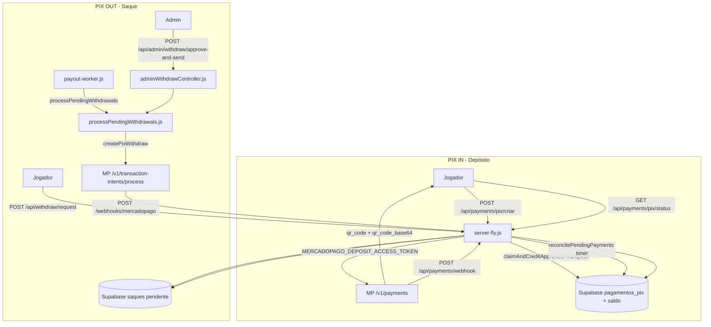

# F4.0A — Mapa Financeiro Atual (Auditoria READ-ONLY)

**Data:** 2026-06-08  
**Modo:** READ-ONLY ABSOLUTO  
**Escopo:** Mapeamento completo do sistema financeiro Gol de Ouro — gateway ativo, arquivos, endpoints, fluxos PIX IN/OUT, variáveis de ambiente e status da integração Efí.  
**Proibido:** alterar código, commits, deploy, banco de dados.

---

## Resumo executivo

| Pergunta | Resposta |
|----------|----------|
| **Gateway financeiro ativo** | **Mercado Pago** (apps separadas: depósito + payout) |
| **Efí / Gerencianet** | **Não implementado** no código ativo |
| **Asaas** | **Não implementado** |
| **Entry point HTTP** | `server-fly.js` (`npm start`) |
| **Worker de saque** | `src/workers/payout-worker.js` (processo Fly separado) |
| **Rotas em `routes/`** | Existem mas **não são montadas** no servidor ativo |

| Veredito | Sistema financeiro 100% acoplado ao **Mercado Pago** via monólito `server-fly.js` |
| Confiança | **95%** (auditoria estática do repositório; sem inspeção de secrets em runtime) |

---

## 1. Gateway financeiro ativo

### 1.1 Veredito

O Gol de Ouro utiliza exclusivamente **Mercado Pago** como provedor financeiro em produção.

| Provedor | PIX IN (depósito) | PIX OUT (saque) | Evidência |
|----------|-------------------|-----------------|-----------|
| **Mercado Pago** | ✅ Sim | ✅ Sim | `server-fly.js`, `services/pix-mercado-pago.js` |
| Efí / Gerencianet | ❌ Não | ❌ Não | Zero código de integração |
| Asaas | ❌ Não | ❌ Não | Zero código de integração |
| Outro | ❌ Não | — | — |

### 1.2 Arquitetura dual-app Mercado Pago

O sistema separa credenciais por função:

| Função | Token de ambiente | API Mercado Pago |
|--------|-------------------|------------------|
| **Depósito (PIX IN)** | `MERCADOPAGO_DEPOSIT_ACCESS_TOKEN` | `POST /v1/payments` |
| **Saque (PIX OUT)** | `MERCADOPAGO_PAYOUT_ACCESS_TOKEN` | `POST /v1/transaction-intents/process` |

### 1.3 Entry point e deploy

| Item | Valor |
|------|-------|
| Arquivo principal | `server-fly.js` |
| `package.json` | `"main": "server-fly.js"`, `"start": "node server-fly.js"` |
| Fly.io app | `goldeouro-backend-v2` (`fly.toml`) |
| Processo HTTP | `app` → `npm start` |
| Processo worker | `payout_worker` → `node src/workers/payout-worker.js` |

**Registro de rotas:** monolítico — todas as rotas financeiras são declaradas com `app.get/post(...)` diretamente em `server-fly.js`. Não há `app.use('/api/...', require('./routes/...'))`.

---

## 2. Integração Efí — existe?

**Não.** Não há nenhum arquivo de serviço, controller, rota ou SDK Efí/Gerencianet no código ativo.

| Busca | Resultado |
|-------|-----------|
| `efi`, `gerencianet`, `efipay` em `*.js`/`*.mjs` ativos | **0 matches** de integração real |
| Documentação futura | `docs/relatorios/F3-1A-AUDITORIA-READONLY-EFI-BANK.md` (viabilidade PIX OUT Efí, sem código) |

A integração Efí está **documentada como alternativa futura**, mas **não implementada** no repositório auditado.

---

## 3. Inventário de arquivos financeiros

### 3.1 Código ATIVO (servido em produção)

| Arquivo | Papel |
|---------|-------|
| `server-fly.js` | Entry point; todas as rotas HTTP financeiras inline |
| `services/pix-mercado-pago.js` | SDK HTTP Mercado Pago: PIX IN helpers + PIX OUT (`createPixWithdraw`, `getTransactionIntent`) |
| `src/domain/payout/processPendingWithdrawals.js` | Domínio de saques: ledger, rollback, payout automático e admin |
| `src/workers/payout-worker.js` | Worker background para processar saques pendentes |
| `controllers/adminWithdrawController.js` | Ações admin: aprovar manual, aprovar+enviar, cancelar |
| `utils/pix-validator.js` | Validação de chave/valor de saque |
| `utils/webhook-signature-validator.js` | HMAC depósito + assinatura payout MP |
| `config/required-env.js` | Validação de env obrigatórias no boot |

### 3.2 Código LEGADO (existe, não montado / não importado)

| Arquivo | Status | Observação |
|---------|--------|------------|
| `routes/paymentRoutes.js` | Não montado | ~80 rotas declaradas; maioria sem implementação no controller |
| `routes/mpWebhook.js` | Não montado | Webhook alternativo `POST /mercadopago` |
| `routes/adminRoutes.js` | Não montado | Inclui `GET /exportar/saques-csv` |
| `routes/index.js` | Vazio | `module.exports = {}` |
| `controllers/paymentController.js` | Não usado | SDK MP legado com `MERCADOPAGO_ACCESS_TOKEN` único |
| `services/pix-service.js` | Não importado | Usa `MERCADO_PAGO_ACCESS_TOKEN` |
| `services/pix-service-real.js` | Não importado | Config alternativa com limites PIX |
| `server-fly-deploy.js` | Legado | Versão antiga com token único `MERCADOPAGO_ACCESS_TOKEN` |
| `config/production.js` | Legado | `MERCADOPAGO_ACCESS_TOKEN` (não usado por `server-fly.js`) |
| `config/env.js` | Legado | Idem |

### 3.3 Banco de dados (schema e patches)

| Arquivo | Papel |
|---------|-------|
| `database/schema.sql` | Schema base |
| `database/schema-ledger-financeiro.sql` | Ledger financeiro |
| `database/claim_and_credit_approved_pix_deposit.sql` | RPC de crédito PIX |
| `database/patches/V1.1B-M1-R3-claim_and_credit_approved_pix_deposit.sql` | Patch RPC depósito |
| `database/migrations/20260201_manual_withdraw_v1_ledger_and_status.sql` | Ledger saques manuais |
| `database/migrations/20260424_mp_payout_transaction_intents.sql` | Campos payout MP |
| `database/migrations/20260428_add_cpf_cnpj_usuarios.sql` | CPF para payout |
| `database/patches/F2-3C-saques-status-check-only-2026-05-29.sql` | Constraint status saques |

### 3.4 Scripts operacionais

| Arquivo | Papel |
|---------|-------|
| `scripts/payouts/audit-payout-readiness.mjs` | Auditoria readiness payout |
| `scripts/payouts/test-payout-sandbox.mjs` | Teste sandbox payout |
| `scripts/payouts/run-sandbox-battery.mjs` | Bateria sandbox |
| `scripts/payouts/validate-payout-production.mjs` | Validação produção |
| `scripts/payouts/test-payout-via-service.mjs` | Teste via service |
| `scripts/payouts/lib/payout-env.mjs` | Leitura segura de env payout |
| `scripts/test-payment-endpoints.js` | Teste endpoints pagamento |
| `scripts/test-mercadopago-connection.js` | Teste conexão MP |
| `scripts/test-withdraw-admin.js` | Teste saque admin |
| `scripts/auditoria-mcp4-financeiro-pix.js` | Auditoria financeira PIX |

### 3.5 Frontend (consumidores das APIs)

| Arquivo | Papel |
|---------|-------|
| `goldeouro-player/src/services/paymentService.js` | Cliente PIX depósito (`/api/payments/pix/*`) |
| `goldeouro-admin/src/pages/Payments.jsx` | Painel admin pagamentos |

### 3.6 Documentação e configuração

| Arquivo | Papel |
|---------|-------|
| `docs/configuracoes/CONFIGURACAO-MERCADO-PAGO.md` | Guia MP |
| `docs/configuracoes/CONFIGURAR-WEBHOOKS-MERCADO-PAGO.md` | Webhooks MP |
| `docs/configuracoes/ATIVAR-MERCADOPAGO-PRODUCAO.md` | Ativação produção |
| `docs/configuracoes/GUIA-TOKEN-MERCADO-PAGO-PIX-REAL.md` | Token PIX real |
| `docs/auditorias/MERCADO-PAGO-ATIVADO-PRODUCAO.md` | Auditoria ativação |
| `mercado-pago-config.env` | Template config MP |
| `.env.example` | Documentação vars financeiras (linhas 59–68) |

---

## 4. Endpoints ATIVOS

### 4.1 Depósito (PIX IN)

| Método | Rota | Arquivo | Função |
|--------|------|---------|--------|
| `POST` | `/api/payments/pix/criar` | `server-fly.js:3038` | handler inline — cria pagamento MP + QR Code |
| `GET` | `/api/payments/pix/usuario` | `server-fly.js:3228` | handler inline — lista PIX do usuário |
| `GET` | `/api/payments/pix/status` | `server-fly.js:3425` | `handleGetPixStatus` (def. `3322`) |
| `GET` | `/api/payments/pix/status/:paymentId` | `server-fly.js:3426` | `handleGetPixStatus` |

### 4.2 Saque (PIX OUT)

| Método | Rota | Arquivo | Função |
|--------|------|---------|--------|
| `POST` | `/api/withdraw/request` | `server-fly.js:1621` | handler inline — solicita saque (valida, debita saldo, grava `saques`) |
| `GET` | `/api/withdraw/history` | `server-fly.js:1999` | handler inline — histórico de saques do jogador |

### 4.3 Admin — saques

| Método | Rota | Arquivo | Função |
|--------|------|---------|--------|
| `GET` | `/api/admin/withdraw/list` | `server-fly.js:2529` | handler inline — lista saques |
| `POST` | `/api/admin/withdraw/approve` | `server-fly.js:2803` | `adminWithdrawController.approveManualWithdraw` |
| `POST` | `/api/admin/withdraw/approve-and-send` | `server-fly.js:2807` | `adminWithdrawController.approveAndSendWithdraw` |
| `POST` | `/api/admin/withdraw/cancel` | `server-fly.js:2811` | `adminWithdrawController.cancelManualWithdraw` |
| `GET` | `/api/admin/financial/report` | `server-fly.js:2728` | handler inline — relatório financeiro |
| `GET` | `/api/admin/audit/logs` | `server-fly.js:2815` | handler inline — logs auditoria (inclui saques) |

### 4.4 Webhooks

| Método | Rota | Arquivo | Função | Fluxo |
|--------|------|---------|--------|-------|
| `POST` | `/api/payments/webhook` | `server-fly.js:3433` | middleware assinatura + handler inline | **Depósito PIX IN** |
| `POST` | `/webhooks/mercadopago` | `server-fly.js:3553` | handler inline | **Saque PIX OUT** (transaction-intents) |

### 4.5 Observabilidade financeira

| Método | Rota | Arquivo | Função |
|--------|------|---------|--------|
| `GET` | `/health` | `server-fly.js:3985` | inclui status `mercadoPago` |
| `GET` | `/health/workers` | `server-fly.js:4017` | flags `ENABLE_PIX_PAYOUT_WORKER`, `PAYOUT_PIX_ENABLED` |

### 4.6 Background (sem HTTP)

| Processo | Arquivo | Função |
|----------|---------|--------|
| Reconciliação PIX pendente | `server-fly.js:3859` | `reconcilePendingPayments` (intervalo `MP_RECONCILE_INTERVAL_MS`) |
| Worker payout automático | `src/workers/payout-worker.js` | `runCycle` → `processPendingWithdrawals` |

---

## 5. Fluxos críticos — arquivo, função, rota

### 5.1 Geração de QR Code PIX (depósito)

| Campo | Valor |
|-------|-------|
| **Rota** | `POST /api/payments/pix/criar` |
| **Arquivo** | `server-fly.js` |
| **Função** | handler inline (linha 3038) |
| **Provedor** | `POST https://api.mercadopago.com/v1/payments` |
| **Token** | `MERCADOPAGO_DEPOSIT_ACCESS_TOKEN` |
| **Retorno** | `qr_code`, `qr_code_base64`, `pix_copy_paste` de `payment.point_of_interaction.transaction_data` |
| **Persistência** | tabela `pagamentos_pix` (Supabase) |

### 5.2 Confirmação de pagamento (crédito de saldo)

Existem **três caminhos** que convergem na mesma função de crédito:

| Caminho | Rota / Processo | Arquivo | Função de crédito |
|---------|-----------------|---------|-------------------|
| **Webhook depósito** | `POST /api/payments/webhook` | `server-fly.js:3463` | `claimAndCreditApprovedPixDeposit` (def. `2907`) |
| **Polling status** | `GET /api/payments/pix/status/:paymentId` | `server-fly.js:3322` | `handleGetPixStatus` → `claimAndCreditApprovedPixDeposit` |
| **Reconciliação** | timer interno | `server-fly.js:3859` | `reconcilePendingPayments` → `claimAndCreditApprovedPixDeposit` |

**Função central de crédito:**

| Campo | Valor |
|-------|-------|
| **Arquivo** | `server-fly.js` |
| **Função** | `claimAndCreditApprovedPixDeposit(idStr)` |
| **RPC SQL** | `claim_and_credit_approved_pix_deposit(p_mercadopago_id)` |
| **Fallback** | update manual em `pagamentos_pix` + crédito saldo se RPC ausente |

### 5.3 Processamento de saque (PIX OUT)

| Etapa | Rota / Processo | Arquivo | Função |
|-------|-----------------|---------|--------|
| **1. Solicitação** | `POST /api/withdraw/request` | `server-fly.js:1621` | handler inline — valida, debita, grava `saques` status `pendente` |
| **2a. Payout automático** | worker background | `src/workers/payout-worker.js` | `runCycle` → `processPendingWithdrawals` |
| **2b. Payout admin** | `POST /api/admin/withdraw/approve-and-send` | `controllers/adminWithdrawController.js` | `approveAndSendWithdraw` → `approveAndSendWithdrawAdmin` |
| **3. Envio MP** | — | `src/domain/payout/processPendingWithdrawals.js:1252` | `processSingleWithdrawalPayout` |
| **4. API MP** | — | `services/pix-mercado-pago.js` | `createPixWithdraw` → `POST /v1/transaction-intents/process` |
| **5. Confirmação** | `POST /webhooks/mercadopago` | `server-fly.js:3553` | handler inline — atualiza status saque via `external_reference` |

**Aprovação manual (sem envio PIX):**

| Campo | Valor |
|-------|-------|
| **Rota** | `POST /api/admin/withdraw/approve` |
| **Arquivo** | `controllers/adminWithdrawController.js` |
| **Função** | `approveManualWithdraw` → `approveWithdrawManualAdmin` |

---

## 6. Serviços exportados (`pix-mercado-pago.js`)

| Função | Uso |
|--------|-----|
| `createPixPayment` | Criação PIX IN (não usada diretamente — `server-fly.js` chama MP inline) |
| `getPaymentStatus` | Consulta status pagamento |
| `processWebhook` | Processamento webhook depósito |
| `createPixWithdraw` | **PIX OUT** — `POST /v1/transaction-intents/process` |
| `getTransactionIntent` | Consulta transaction-intent (webhook payout) |
| `isConfigured` | Verifica token payout configurado |
| `sanitizeMercadoPagoError` | Sanitização de erros MP |

---

## 7. Domínio de payout exportado (`processPendingWithdrawals.js`)

| Função | Uso |
|--------|-----|
| `processPendingWithdrawals` | Loop worker — seleciona saques `pendente` e dispara payout |
| `processSingleWithdrawalPayout` | Dispara PIX Out para um saque individual |
| `createLedgerEntry` | Registro no ledger financeiro |
| `rollbackWithdraw` | Reversão de saque com falha |
| `approveWithdrawManualAdmin` | Marca saque como pago manual (admin) |
| `approveAndSendWithdrawAdmin` | Aprova e envia PIX Out (admin) |
| `cancelWithdrawManualAdmin` | Cancela saque pendente (admin) |
| `rollbackWithdrawManualAdmin` | Rollback manual (admin) |
| `payoutCounters` | Contadores de observabilidade |

---

## 8. Rotas LEGADO em `routes/paymentRoutes.js` (NÃO ATIVAS)

Se montadas em `/api/payments`, existiriam (entre outras):

| Método | Path relativo | Controller |
|--------|---------------|------------|
| `POST` | `/webhook` | `PaymentController.webhookMercadoPago` |
| `POST` | `/pix/criar` | `PaymentController.criarPagamentoPix` |
| `GET` | `/pix/status/:payment_id` | `PaymentController.consultarStatusPagamento` |
| `POST` | `/deposito` | `PaymentController.solicitarDeposito` (**não implementado**) |
| `POST` | `/saque` | `PaymentController.solicitarSaque` |
| `POST` | `/saque/:id/processar` | `PaymentController.processarSaque` |

**Divergência importante:** paths legados (`/saque`, `/deposito`) ≠ paths ativos (`/api/withdraw/request`, `/api/payments/pix/criar`).

---

## 9. Variáveis de ambiente financeiras

### 9.1 Obrigatórias no boot (`config/required-env.js`)

| Variável | Quando obrigatória |
|----------|-------------------|
| `JWT_SECRET` | Sempre |
| `SUPABASE_URL` | Sempre |
| `SUPABASE_SERVICE_ROLE_KEY` | Sempre |
| `MERCADOPAGO_DEPOSIT_ACCESS_TOKEN` | Apenas `NODE_ENV=production` |

### 9.2 Mercado Pago — depósito (PIX IN)

| Variável | Arquivo(s) | Uso | Default |
|----------|------------|-----|---------|
| `MERCADOPAGO_DEPOSIT_ACCESS_TOKEN` | `server-fly.js:182` | API payments, webhook, reconciliação | — |
| `MERCADOPAGO_WEBHOOK_SECRET` | `utils/webhook-signature-validator.js:87` | HMAC webhook depósito | — |
| `MERCADOPAGO_WEBHOOK_MAX_TS_SKEW_MS` | `utils/webhook-signature-validator.js:205` | Tolerância timestamp | — |
| `MERCADOPAGO_WEBHOOK_DEBUG_LOG` | `utils/webhook-signature-validator.js:518` | Debug (`=1`) | — |
| `BACKEND_URL` | `server-fly.js:3114` | `notification_url` ao criar PIX | `https://goldeouro-backend-v2.fly.dev` |
| `MP_RECONCILE_ENABLED` | `server-fly.js:3956` | Liga reconciliação | `true` (se `!== 'false'`) |
| `MP_RECONCILE_INTERVAL_MS` | `server-fly.js:3957` | Intervalo reconciliação | `60000` |
| `MP_RECONCILE_MIN_AGE_MIN` | `server-fly.js:3868` | Idade mínima PIX pendente | `2` |
| `MP_RECONCILE_LIMIT` | `server-fly.js:3869` | Limite por ciclo | `10` |

### 9.3 Mercado Pago — payout (PIX OUT)

| Variável | Arquivo(s) | Uso | Default |
|----------|------------|-----|---------|
| `MERCADOPAGO_PAYOUT_ACCESS_TOKEN` | `pix-mercado-pago.js:7`, `payout-worker.js:26` | transaction-intents | — |
| `MP_PAYOUT_PRIVATE_KEY` | `pix-mercado-pago.js:24` | Assinatura Ed25519 | — |
| `MP_PAYOUT_TEST_TOKEN` | `pix-mercado-pago.js:17,202,544` | Modo sandbox | `false` |
| `MP_PAYOUT_ENFORCE_SIGNATURE` | `pix-mercado-pago.js:545` | Exigir assinatura em prod | `false` |
| `MP_PAYOUT_WEBHOOK_URL` | `processPendingWithdrawals.js:1366` | URL notificação payout | — |
| `MP_PAYOUT_APP_ID` | `.env.example:63`, scripts payout | ID app Payouts | — |
| `PIX_WEBHOOK_URL` | `pix-mercado-pago.js:9` | Fallback legado webhook | URL fly.dev hardcoded |

### 9.4 Saques / payout operacional

| Variável | Arquivo(s) | Uso | Default |
|----------|------------|-----|---------|
| `PAGAMENTO_TAXA_SAQUE` | `server-fly.js:1785` | Taxa fixa de saque | `2.00` |
| `PAYOUT_PIX_ENABLED` | `server-fly.js:135,3582`, worker, admin | Habilita processamento PIX OUT | `false` |
| `ENABLE_PIX_PAYOUT_WORKER` | `payout-worker.js:6`, `server-fly.js:4025` | Liga processo worker no Fly | `false` |
| `PAYOUT_WORKER_INTERVAL_MS` | `payout-worker.js:14` | Intervalo do worker | `30000` |
| `PAYOUT_WORKER_HEARTBEAT_LOG_MS` | `payout-worker.js:105` | Heartbeat log | `60000` |
| `PAYOUT_AUTO_FROM_AT` | `processPendingWithdrawals.js:14` | Corte mínimo `created_at` para auto-payout | — (sem valor = worker não processa) |
| `PAYOUT_MODE` | `processPendingWithdrawals.js:1613` | `manual` desliga auto | — |
| `PAYOUT_USUARIOS_CPF_CANDIDATES` | `processPendingWithdrawals.js:134` | Colunas CPF candidatas | lista default |
| `PAYOUT_USUARIOS_CPF_COLUMN` | `processPendingWithdrawals.js:156` | Coluna CPF extra | — |
| `SAQUE_ROLLBACK_STATUS_LIST` | `processPendingWithdrawals.js:218` | Status para rollback | `cancelado,falhou` |

### 9.5 Legado (arquivos não usados por `server-fly.js`)

| Variável | Arquivo |
|----------|---------|
| `MERCADOPAGO_ACCESS_TOKEN` | `config/production.js`, `controllers/paymentController.js`, `server-fly-deploy.js` |
| `MERCADO_PAGO_ACCESS_TOKEN` | `services/pix-service.js`, `services/pix-service-real.js` |
| `MERCADO_PAGO_PUBLIC_KEY` | `services/pix-service-real.js` |
| `MERCADO_PAGO_WEBHOOK_SECRET` | `services/pix-service-real.js` |
| `PIX_MIN_AMOUNT` | `services/pix-service-real.js` (default `1.00`) |
| `PIX_MAX_AMOUNT` | `services/pix-service-real.js` (default `1000.00`) |
| `MP_WEBHOOK_SECRET` | comentado em `routes/mpWebhook.js` |

### 9.6 Frontend (Vite — não backend, mas financeiro)

| Variável | Arquivo |
|----------|---------|
| `VITE_PIX_LIVE_KEY` | `goldeouro-player/src/services/paymentService.js` |
| `VITE_PIX_LIVE_SECRET` | idem |
| `VITE_PIX_LIVE_WEBHOOK` | idem |
| `VITE_PIX_SANDBOX_KEY` | idem |
| `VITE_PIX_SANDBOX_SECRET` | idem |
| `VITE_PIX_SANDBOX_WEBHOOK` | idem |

---

## 10. Diagrama do fluxo financeiro ativo

---

## 11. Tabelas Supabase envolvidas

| Tabela | Uso |
|--------|-----|
| `pagamentos_pix` | Registro de depósitos PIX |
| `saques` | Solicitações de saque |
| `usuarios` | Saldo, CPF (payout), dados pagador |
| `ledger` / `financeiro_ledger` | Registro contábil de movimentações |
| `admin_audit_logs` | Auditoria ações admin de saque |

---

## 12. Condições para payout automático funcionar

O worker de saque automático exige **todas** as condições:

1. `ENABLE_PIX_PAYOUT_WORKER=true` (processo Fly `payout_worker` ativo)
2. `PAYOUT_PIX_ENABLED=true`
3. `MERCADOPAGO_PAYOUT_ACCESS_TOKEN` configurado
4. `PAYOUT_AUTO_FROM_AT` definido (sem isso, `processPendingWithdrawals` não processa saques)
5. `PAYOUT_MODE` ≠ `manual`
6. Saque em status `pendente` com `correlation_id` e dados PIX válidos

---

## 13. Conclusões

1. **Gateway único:** Mercado Pago com arquitetura dual-app (depósito vs payout).
2. **Monólito ativo:** `server-fly.js` concentra 100% das rotas HTTP financeiras.
3. **Efí inexistente:** nenhuma integração implementada; apenas documentação de viabilidade em `F3-1A`.
4. **Legado perigoso:** `routes/paymentRoutes.js` e `paymentController.js` divergem dos paths reais e não devem ser considerados fonte da verdade.
5. **Três caminhos de confirmação de depósito:** webhook, polling de status e reconciliação — todos convergem em `claimAndCreditApprovedPixDeposit`.
6. **Saque em duas fases:** solicitação (`/api/withdraw/request`) + processamento assíncrono (worker ou admin approve-and-send) + confirmação webhook payout.

---

## 14. Referências cruzadas

| Documento | Relação |
|-----------|---------|
| `F3-1A-AUDITORIA-READONLY-EFI-BANK.md` | Viabilidade Efí PIX OUT (futuro) |
| `F2-4A-AUDITORIA-PIX-OUT-EXISTENTE-2026-05-29.md` | Auditoria PIX OUT MP existente |
| `V1-1D-AUDITORIA-WEBHOOK-RECONCILE-PIX-2026-05-18.md` | Webhook + reconciliação depósito |
| `docs/configuracoes/PAYOUTS-EXECUCAO-ONBOARDING-E-TESTES.md` | Onboarding payout MP |

---

*Relatório gerado em modo READ-ONLY. Nenhum arquivo de código foi alterado.*
