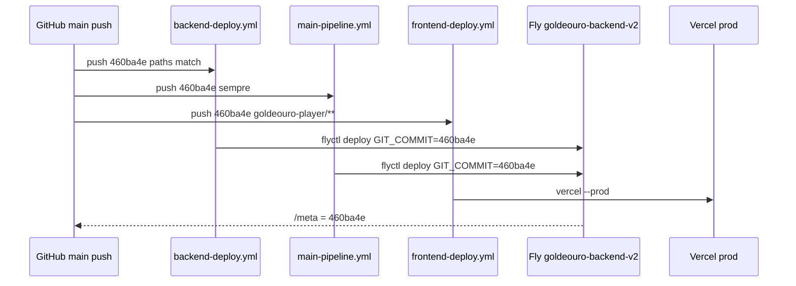

# H3.6a — AUDITORIA ESTRUTURAL DO PIPELINE REAL DE DEPLOY V1

**Data:** 2026-05-16  
**Baseline oficial:** `/meta.gitCommit` = `460ba4e6412b9e66b2eb67f4e8cb06ac0b4552e3` · tag `v1-baseline-460ba4e-2026-05-16`  
**Modo:** exclusivamente read-only — nenhum workflow, secret, Fly ou Vercel alterado.  
**Fontes:** `.github/workflows/*.yml` em `main` @ `460ba4e`, API GitHub (`gh`), relatórios [H3.4c](H3-4C-ANALISE-CHECKS-PR87-2026-05-16.md), [H3.4d](H3-4D-MERGE-CONTROLADO-PR87-2026-05-16.md), [H3.5](H3-5-CONSOLIDACAO-BASELINE-OPERACIONAL-460BA4E-2026-05-16.md).

---

## 1. Resumo executivo

O pipeline **real** de produção V1 é **automático em todo `push` para `main`**, sem gate humano de deploy e **sem** GitHub Environment protection nos jobs de publicação.

| Pergunta | Verdade operacional |
|----------|---------------------|
| **Quem deploya Fly?** | Dois workflows em paralelo: `backend-deploy.yml` e `main-pipeline.yml` |
| **Quem deploya Vercel prod?** | Exclusivamente `frontend-deploy.yml` → job `🚀 Deploy Produção` (`amondnet/vercel-action`, `--prod`) |
| **Quando?** | Imediatamente após merge/push em `main` (paths-filtered onde aplicável) |
| **Como?** | `flyctl deploy --build-arg GIT_COMMIT=${{ github.sha }}` · Vercel CLI via action |
| **PR deploya prod?** | **Não** — jobs `if: github.ref == 'refs/heads/main'` ficam **SKIPPED** |
| **Merge PR #87 deployou?** | **Sim** — Fly (2×) + Vercel prod; `/meta` passou a `460ba4e` |

O sistema **funciona** (deploy pós-merge #87 concluiu com sucesso; produção saudável na baseline). A **governança** planeada em H3.2 (“deploy bloqueado até H3.6”) **não está implementada** no código dos workflows — o merge em `main` **é** o gatilho de produção.

**Decisão final (secção 11):** **GO COM RESSALVAS**

---

## 2. Workflows encontrados

Inventário dos workflows **activos** em `.github/workflows/` (excl. `backup-pre-limpeza-*`):

| Ficheiro | Nome | Triggers | Deploy produção? |
|----------|------|----------|------------------|
| `backend-deploy.yml` | 🚀 Backend Deploy (Fly.io) | `push` main/dev (paths backend), `pull_request` main | **Sim** — job `deploy-backend` se `ref == main` |
| `frontend-deploy.yml` | 🎨 Frontend Deploy (Vercel) | `push` main/dev (paths `goldeouro-player/**`), `pull_request` main, `workflow_dispatch` | **Sim** — job `deploy-production` se `ref == main` |
| `main-pipeline.yml` | 🚀 Pipeline Principal - Gol de Ouro | `push` **main** (sem path filter), `workflow_dispatch` | **Sim** — passo `flyctl deploy` (Fly) |
| `deploy-on-demand.yml` | Deploy On Demand | `workflow_dispatch` apenas | Fly prod + Vercel **preview** (não `--prod`) |
| `rollback.yml` | ⚠️ Rollback Automático | `workflow_run` após falha do **Pipeline Principal** | Rollback Fly (opcional); front **desactivado** |
| `frontend-rollback-manual.yml` | 🔙 Frontend — rollback manual | `workflow_dispatch` + confirm `ROLLBACK` | Rollback Vercel prod (manual) |
| `ci.yml` | CI | `push`/`pull_request` main | Não |
| `tests.yml` | 🧪 Testes Automatizados | `push` main/dev, `pull_request`, cron | Não |
| `security.yml` | 🔒 Segurança e Qualidade | `push`/`pull_request`, cron | Não |
| `health-monitor.yml` | 🔍 Health Monitor | cron 30 min, `workflow_dispatch` | Não (monitora; pode commitar logs) |
| `monitoring.yml` | 📊 Monitoramento Avançado | `workflow_dispatch` | Não |
| `configurar-seguranca.yml` | 🔒 Configurar Segurança | `workflow_dispatch`, push ao próprio yml | Não (tenta API branch protection) |

**Acções externas usadas em deploy:** `superfly/flyctl-actions`, `superfly/flyctl-actions/setup-flyctl`, `amondnet/vercel-action@v25`, `vercel/repository-dispatch/actions/status@v1`.

**Não existe** `npm run deploy` nos workflows de produção canónicos.

---

## 3. Quem deploya Fly

### 3.1 Workflow canónico (com gates)

**Ficheiro:** `.github/workflows/backend-deploy.yml`  
**Job:** `deploy-backend`  
**Condição:** `needs: test-and-analyze` + `if: github.ref == 'refs/heads/main'`

```yaml
flyctl deploy --remote-only --no-cache --app goldeouro-backend-v2 \
  --build-arg GIT_COMMIT="${{ github.sha }}"
```

| Aspeto | Detalhe |
|--------|---------|
| App | `goldeouro-backend-v2` |
| Token | `secrets.FLY_API_TOKEN` |
| Rastreio | `ARG GIT_COMMIT` → `ENV` no `Dockerfile` → `/meta` via `server-fly.js` |
| Pós-deploy | `flyctl status`, logs, **health `/health` com 5 retries** (falha → `exit 1`) |
| PR | Só `test-and-analyze`; deploy **SKIPPED** |

### 3.2 Workflow redundante (gates fracos)

**Ficheiro:** `.github/workflows/main-pipeline.yml`  
**Job:** `build-and-deploy` — **um único job** em todo push `main`

```yaml
uses: superfly/flyctl-actions@master
with:
  args: "deploy --remote-only --app goldeouro-backend-v2 --build-arg GIT_COMMIT=${{ github.sha }}"
continue-on-error: true   # ⚠️ falha de deploy não falha o workflow
```

| Aspeto | Detalhe |
|--------|---------|
| Path filter | **Nenhum** — corre em **qualquer** push a `main` |
| Health check | `continue-on-error: true` — falha não bloqueia |
| Frontend | Comentário explícito: deploy Vercel **removido** daqui |

### 3.3 Manual

**Ficheiro:** `.github/workflows/deploy-on-demand.yml`  
**Trigger:** `workflow_dispatch`  
**Fly:** `flyctl deploy` prod `goldeouro-backend-v2` + health check obrigatório  
**Bypass potencial:** qualquer actor com permissão `workflow_dispatch` e secret `FLY_API_TOKEN`.

### 3.4 Injeção `GIT_COMMIT`

| Camada | Mecanismo |
|--------|-----------|
| CI | `--build-arg GIT_COMMIT="${{ github.sha }}"` |
| Docker | `ARG GIT_COMMIT` / `ENV GIT_COMMIT` / label OCI revision |
| Runtime | `process.env.GIT_COMMIT` em `GET /meta` |

No merge PR #87, `github.sha` = **`460ba4e`** (merge commit) — confirmado em `/meta` pós-deploy.

### 3.5 Protecção de ambiente Fly

- **Não há** GitHub `environment:` com approval nos jobs de deploy.
- Secrets: `FLY_API_TOKEN` (org/repo secrets; não auditável nesta fase).
- **Bypass crítico:** se `FLY_API_TOKEN` vazio, `backend-deploy` faz `exit 0` (“Pulando deploy”) — workflow **verde sem publicar**.

---

## 4. Quem deploya Vercel

### 4.1 Produção canónica

**Ficheiro:** `.github/workflows/frontend-deploy.yml`  
**Job:** `deploy-production`  
**Condição:** `needs: test-frontend` + `if: github.ref == 'refs/heads/main'`

| Passo | Função |
|-------|--------|
| `npm run build` em `goldeouro-player` | Build local antes do CLI |
| `amondnet/vercel-action@v25` | `vercel-args: '--prod'` |
| Secrets | `VERCEL_TOKEN`, `VERCEL_ORG_ID`, `VERCEL_PROJECT_ID` |
| Concurrency | `group: frontend-vercel-production`, `cancel-in-progress: false` |
| Gates pós-deploy | URL obrigatória, smoke www+apex, HTML mínimo, deep links `/dashboard` e `/register` |

**Domínios canónicos:** `www.goldeouro.lol`, `goldeouro.lol`.

### 4.2 Preview / dev

| Origem | Comportamento |
|--------|----------------|
| `frontend-deploy.yml` job `deploy-development` | `ref == dev` → `--target preview` |
| `deploy-on-demand.yml` | Player: `--target preview`, secret `VERCEL_PROJECT_ID_PLAYER` |
| PR + app Vercel GitHub | Status **Vercel** SUCCESS — **preview** possível; **não** altera prod nem `/meta` |

### 4.3 Integração GitHub ↔ Vercel fora do workflow

- App Vercel ligada ao repo (status checks em PR — [H3.4c](H3-4C-ANALISE-CHECKS-PR87-2026-05-16.md)).
- **Produção pública** do player, nos workflows auditados, vem de **`frontend-deploy.yml`** com `--prod`.
- Deploy manual adicional possível via **Dashboard Vercel** (fora do âmbito dos YAML — **bypass operacional** não revogado por código).

### 4.4 Rollback frontend

- Automático: **desactivado** (`rollback.yml` só informa).
- Manual: `frontend-rollback-manual.yml` — exige `confirm == ROLLBACK` + smoke/blindagem pós-rollback.

---

## 5. Fluxo real pós-merge PR #87

### 5.1 Linha temporal (UTC)

| Hora (≈) | Evento |
|----------|--------|
| `14:48:17` | Merge PR #87 → commit `460ba4e` em `main` |
| `14:48:20` | Push dispara **6+ workflows** em paralelo |
| `14:48:34–14:49:37` | **backend-deploy** — `flyctl deploy` + health ✅ ([run 25964846213](https://github.com/indesconectavel/gol-de-ouro/actions/runs/25964846213)) |
| `14:48:39–14:49:54` | **main-pipeline** — segundo `flyctl deploy` ✅ ([run 25964846232](https://github.com/indesconectavel/gol-de-ouro/actions/runs/25964846232)) |
| `14:49:13–14:50:22` | **frontend-deploy** — `vercel --prod` ✅ ([run 25964846247](https://github.com/indesconectavel/gol-de-ouro/actions/runs/25964846247)) |
| `14:50:01` | **rollback.yml** — **skipped** (Pipeline Principal = success) |
| Pós-deploy | `/meta.gitCommit` → **`460ba4e`** (antes: `7ecedca`) |

### 5.2 Diagrama



### 5.3 O que alterou cada alvo

| Alvo | Workflow responsável | Evidência |
|------|---------------------|-----------|
| **Fly `/meta`** | Primariamente `backend-deploy` (health gate); `main-pipeline` reforçou/imagem paralela | Dois deploys Fly no mesmo minuto |
| **Vercel player** | `frontend-deploy` → `🚀 Deploy Produção` | Inclui alterações H3.0B (`dac9f8b` na árvore do merge) |
| **APK** | `frontend-deploy` → `📱 Build APK` | Artefacto CI; não é runtime web |

### 5.4 PR #87 vs push `main`

| Fase | Fly prod | Vercel prod |
|------|----------|-------------|
| PR aberto (`pull_request`) | SKIPPED | SKIPPED |
| Merge → `push` `main` | **2× deploy** | **1× deploy --prod** |

Isto confirma: **merge em `main` = deploy involuntário face ao plano H3.2**, mas **intencional face aos YAML actuais**.

---

## 6. Gates existentes

| Gate | Onde | Efectividade |
|------|------|--------------|
| `if: github.ref == 'refs/heads/main'` | backend/front deploy jobs | Impede deploy **via Actions** em PR; **não** impede após merge |
| Path filters | `backend-deploy`, `frontend-deploy` | Limita triggers; **main-pipeline ignora paths** |
| `needs: test-*` | Deploy jobs | Testes leves; `continue-on-error` em vários passos de audit |
| Health Fly pós-deploy | `backend-deploy` | **Forte** — 5 tentativas, falha bloqueia job |
| Tokens Vercel obrigatórios | `deploy-production` | **Forte** — `exit 1` se ausentes |
| Smoke + HTML + deep links | `frontend-deploy` pós-prod | **Forte** para SPA |
| Concurrency Vercel prod | `frontend-vercel-production` | Evita cancelar deploy em curso |
| Branch protection status checks | GitHub `main` | Exige jobs de **teste/segurança** — **não** exige aprovação humana nem bloqueia deploy |
| PR reviews | API protection | `required_approving_review_count: **0**` |
| Rollback Fly automático | `rollback.yml` | Só se **Pipeline Principal** falhar — não ligado a `backend-deploy` |
| Rollback Vercel manual | `frontend-rollback-manual.yml` | Confirmação `ROLLBACK` + gates HTTP |

**Branch protection actual** (`gh api .../branches/main/protection`):

- Checks: `🔒 Análise de Segurança`, `📊 Relatório de Segurança`, `🧪 Testes Backend/Frontend/Segurança`
- **Aprovações PR: 0**
- `enforce_admins: true`
- `required_conversation_resolution: true`

---

## 7. Gates ausentes

| Gate ausente | Impacto |
|--------------|---------|
| **Aprovação humana pré-deploy** | Qualquer merge em `main` publica Fly + Vercel |
| **GitHub Environment** (`production` + reviewers) | Secrets deploy sem second factor |
| **`workflow_dispatch` obrigatório para prod** | Push merge = deploy imediato |
| **Deploy único Fly** | Race/duplicidade `backend-deploy` + `main-pipeline` |
| **Bloqueio “só tag baseline”** | SHA em `/meta` segue último push, não tag assinada |
| **Gate H3.6 documental no CI** | Plano H3.2 não codificado |
| **Rollback automático alinhado** | Falha em `backend-deploy` **não** aciona `rollback.yml` |
| **Proibir `exit 0` sem token** | Deploy silenciosamente ignorado |
| **Staging obrigatório** | `dev` deploya no **mesmo** app Fly (`goldeouro-backend-v2`) em `deploy-dev` |
| **Required check nos workflows de deploy** | Merge pode passar só com testes; deploy não é “check” separado |
| **Desactivar Vercel Git auto-prod** | Dashboard pode divergir do workflow (não verificado nesta auditoria) |

---

## 8. Riscos encontrados

| ID | Risco | Severidade | Classificação |
|----|-------|------------|---------------|
| R1 | **Deploy involuntário** em merge `main` (PR #87) | Alta | Governança — drift H3.2 |
| R2 | **Dois deployers Fly** no mesmo push | Alta | Race / imagem dupla / custo |
| R3 | `main-pipeline` `continue-on-error: true` no deploy | Alta | Falso positivo; rollback não dispara |
| R4 | `FLY_API_TOKEN` ausente → `exit 0` | Média | Bypass silencioso |
| R5 | **0 approvals** em `main` | Alta | Sem gate humano |
| R6 | `npm audit` / testes com `continue-on-error` | Média | CI verde com débito técnico |
| R7 | `dev` → mesmo app Fly produção | Alta | Confusão staging/prod |
| R8 | Rollback auto só no Pipeline Principal | Média | Rollback perigoso/incompleto |
| R9 | Vercel dashboard / `workflow_dispatch` | Média | Bypass fora do caminho canónico |
| R10 | `/meta` = merge SHA, não tag | Baixa | Rastreio correcto mas não imutável por tag |
| R11 | `health-monitor` com `contents: write` | Baixa | Commits automáticos em `docs/logs` |
| R12 | Pipeline **confuso** (3 entradas Fly + docs históricos) | Média | Erro operacional humano |

**Nenhum incidente de saúde** na baseline `460ba4e` — riscos são **estruturais e de processo**.

---

## 9. Workflows redundantes

| Par | Relação | Recomendação (só planeamento) |
|-----|---------|-------------------------------|
| `backend-deploy.yml` ↔ `main-pipeline.yml` | **Ambos** `flyctl deploy` em push `main` | Unificar num só; desactivar `main-pipeline` deploy |
| `main-pipeline.yml` log “Frontend deploy OK” | **Obsoleto** — front removido do job | Remover mensagem enganosa |
| `deploy-on-demand.yml` vs canónicos | Sobreposição Fly manual | Manter só emergência com environment approval |
| `backup-pre-limpeza-*/.github/workflows/*` | Cópias históricas no repo | Não executam; risco de confusão humana |
| `rollback.yml` ↔ `backend-deploy` | Rollback não escuta falha do deploy “bom” | Ligar rollback ao workflow que realmente gateia |

**Canónico recomendado (operacional actual):**

- **Fly prod:** `backend-deploy.yml`
- **Vercel prod:** `frontend-deploy.yml`
- **Não canónico mas activo:** `main-pipeline.yml` (Fly duplicado)

---

## 10. Pipeline alvo recomendado (V1 — não implementar nesta etapa)

### 10.1 Princípios

1. **Um deployer por superfície** (Fly, Vercel).
2. **Produção só com intenção explícita** — tag ou `workflow_dispatch` aprovado.
3. **Staging isolado** (app Fly + projeto Vercel separados).
4. **Rastreio:** `GIT_COMMIT` = tag ou SHA aprovado; `/meta` validado no fim.

### 10.2 Arquitectura alvo

```text
┌─────────────┐     PR      ┌──────────┐     merge     ┌─────────────┐
│  feature    │ ──────────► │   main   │ ────────────► │  CI only    │
│  branches   │   checks    │ (protegida)│  (sem deploy) │  tests/sec  │
└─────────────┘             └──────────┘               └─────────────┘
                                   │
                    tag v1-x / workflow_dispatch (approval)
                                   ▼
                    ┌──────────────────────────────┐
                    │  deploy-production.yml       │
                    │  environment: production   │
                    │  1× Fly + 1× Vercel --prod │
                    └──────────────────────────────┘
                                   │
                    smoke /meta /health / player
```

### 10.3 Componentes

| Componente | Alvo |
|------------|------|
| **CI em PR/push main** | Testes + build + Docker build — **sem** `flyctl`/`vercel --prod` |
| **Gate manual** | GitHub Environment `production` com 1–2 reviewers |
| **Fly** | Só `backend-deploy` (ou renomeado `deploy-production.yml`) |
| **Vercel** | Só `frontend-deploy` com `--prod` |
| **Desactivar** | Deploy Fly em `main-pipeline.yml` (ou arquivo total) |
| **Staging** | Branch `staging` → apps `*-staging` |
| **Rollback** | Manual documentado; auto opcional só com confirmação e smoke |
| **Approval flow** | PR: 1 review + checks; Deploy: environment approval |
| **Baseline** | Deploy só a partir de tag `v1-baseline-*` ou SHA registado em relatório GO |

### 10.4 Critério de fecho H3.6b (futuro)

- [ ] Um único workflow publica Fly em prod  
- [ ] Push `main` **não** dispara `--prod` / `flyctl deploy`  
- [ ] Environment `production` com reviewers  
- [ ] Documentação alinhada com YAML  
- [ ] Verificação de auto-deploy Vercel Dashboard desligado para Production Branch  

---

## 11. Decisão final

| Veredito | **GO COM RESSALVAS** |
|----------|----------------------|

### Justificação

| Dimensão | Avaliação |
|----------|-----------|
| **Técnica** | Pipeline **real** entregou baseline `460ba4e`; gates pós-deploy Vercel e health Fly em `backend-deploy` são **sólidos** |
| **Governança** | **NO-GO** para “deploy controlado V1” — merge `main` dispara produção; H3.2 foi **violado** no PR #87 |
| **Segurança operacional** | Duplicidade Fly, bypasses `exit 0` / `continue-on-error`, 0 approvals — **exigem remediação** antes de confiar como pipeline enterprise |

### Resumo em uma frase

> A verdade operacional é: **`push` em `main` deploya produção** via `backend-deploy` + `main-pipeline` (Fly) e `frontend-deploy` (Vercel); o sistema funciona, mas **não há gate H3.6** — apenas CI de testes antes do deploy automático.

### Próxima etapa sugerida (fora desta auditoria)

**H3.6b** — implementar pipeline alvo (secção 10) com PR dedicado, após aprovação explícita; até lá, tratar **merge em `main` como release de produção**.

---

*Fim do relatório H3.6a — auditoria read-only do pipeline real V1.*
