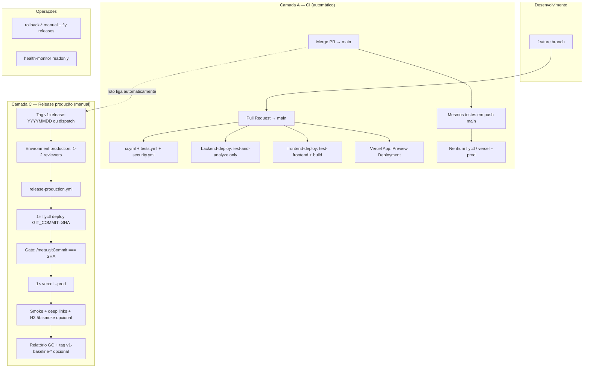

# H3.6b — PLANEJAMENTO CIRÚRGICO DO HARDENING DO PIPELINE V1

**Data:** 2026-05-16  
**Modo:** read-only — sem alteração de workflows, código, GitHub, Fly, Vercel, commit ou deploy.  
**Baseline:** `/meta` = `460ba4e6412b9e66b2eb67f4e8cb06ac0b4552e3` · tag `v1-baseline-460ba4e-2026-05-16`  
**Entrada:** [H3.6a — Auditoria pipeline real](H3-6A-AUDITORIA-PIPELINE-REAL-DEPLOY-V1-2026-05-16.md)  
**Próxima etapa (fora deste doc):** H3.6c — implementação em PR dedicado(s).

---

## 1. Resumo executivo

Este documento define a **arquitectura operacional final** do pipeline V1 após hardening, sem implementar alterações.

| Decisão cirúrgica | Escolha |
|-------------------|---------|
| **Deployer Fly oficial** | `backend-deploy.yml` (evoluído) — **único** `flyctl deploy` em prod |
| **Perde deploy Fly** | `main-pipeline.yml` — passa a CI/validação **sem** `flyctl` |
| **Deployer Vercel prod** | `frontend-deploy.yml` — mantém `--prod` + gates SPA existentes |
| **Gatilho de produção** | Deixa de ser `push` em `main`; passa a ser **`workflow_dispatch`** + GitHub Environment `production` (aprovação humana) **ou** tag `v1-release-*` com input SHA validado |
| **Merge em `main`** | Integração Git + CI completo — **não** equivale a release |
| **Anti-race** | `concurrency` global `release-production` (1 deploy por vez, Fly→Vercel sequencial no mesmo workflow ou `needs` entre jobs) |
| **Rastreio** | `GIT_COMMIT` = SHA aprovado; pós-deploy: `/meta` === SHA + relatório GO |

**Maturidade actual:** ~**nível 2** (CI automatizado + deploy automático, gates técnicos parciais).  
**Maturidade pós-H3.6c (alvo):** ~**nível 4** (release controlado, um deployer, rollback documentado, aprovação humana).

**Decisão final (secção 11):** **GO COM RESSALVAS** — plano aprovado para implementação faseada; **NO-GO** para implementação “big bang” num único PR.

---

## 2. Pipeline actual

### 2.1 Mapa de responsabilidades (estado @ `460ba4e`)

```text
                    pull_request                    push main
                         │                              │
         ┌───────────────┼───────────────┐              │
         ▼               ▼               ▼              ▼
      ci.yml      tests.yml      security.yml    main-pipeline.yml ──► flyctl deploy (2º)
         │               │               │              │
         │               │               │       backend-deploy.yml ──► flyctl deploy (1º)
         │               │               │              │
         └───────────────┴───────────────┘       frontend-deploy.yml ──► vercel --prod
                    (testes only)                      deploy-on-demand (manual)
                                                       rollback.yml (só main-pipeline fail)
```

### 2.2 Problemas que o hardening deve resolver

| ID H3.6a | Problema | Prioridade hardening |
|----------|----------|----------------------|
| R1 | Merge = deploy involuntário | **P0** |
| R2 | Fly duplicado | **P0** |
| R3 | `continue-on-error` no deploy | **P0** |
| R4 | Token ausente → `exit 0` | **P1** |
| R5 | 0 approvals PR/deploy | **P1** |
| R7 | `dev` no mesmo app Fly | **P2** (V1.1) |
| R8 | Rollback desalinhado | **P1** |
| R9 | Bypass Vercel dashboard | **P1** (config manual) |

### 2.3 O que **não** se mexe nesta fase (baseline congelada)

- Runtime actual em produção (`460ba4e`) — **não** rollback preventivo.
- Lógica de negócio `server-fly.js` / player — fora do âmbito pipeline.
- Secrets existentes — só **política de uso**, não rotação neste plano.

---

## 3. Pipeline alvo

### 3.1 Visão geral

Três **camadas** separadas por intenção:

| Camada | Nome operacional | Trigger | Publica prod? |
|--------|------------------|---------|---------------|
| **A** | Integração contínua | `pull_request`, `push` `main` | **Não** |
| **B** | Release candidate | Tag `v1-rc-*` ou branch `release/*` (opcional V1.1) | **Não** (só staging) |
| **C** | Produção | `workflow_dispatch` + env `production` **ou** tag `v1-release-*` | **Sim** |

### 3.2 Fluxo completo (alvo V1)



### 3.3 Workflows que sobrevivem (pós-hardening)

| Workflow | Papel final |
|----------|-------------|
| `ci.yml` | CI base backend |
| `tests.yml` | Testes alargados |
| `security.yml` | Segurança / CodeQL |
| `backend-deploy.yml` | **CI em PR/push** + **único** deploy Fly (só job release) |
| `frontend-deploy.yml` | **CI em PR/push** + **único** deploy Vercel `--prod` (só job release) |
| `release-production.yml` | **NOVO** — orquestra release única (opcional: unifica dispatch) |
| `frontend-rollback-manual.yml` | Rollback Vercel (mantém `ROLLBACK`) |
| `deploy-on-demand.yml` | **Restrito** — environment `break-glass`, sem `--prod` Vercel |
| `health-monitor.yml` | Monitorização (remover `contents: write` ou branch dedicada — P2) |
| `monitoring.yml` | Manual |
| `rollback.yml` | **Reescrever** trigger → falha do deployer canónico, ou desactivar auto |

### 3.4 Workflows que perdem capacidade de deploy prod

| Workflow | Acção cirúrgica |
|----------|-----------------|
| `main-pipeline.yml` | **Remover** passo `flyctl deploy`; manter validação estrutura + artefactos; renomear para `main-ci.yml` (opcional) |
| `backend-deploy.yml` job `deploy-backend` | **Remover** trigger `push: main` para deploy; deploy só via `workflow_dispatch` / `release-production` |
| `frontend-deploy.yml` job `deploy-production` | **Remover** trigger `push: main`; idem |
| `deploy-on-demand.yml` | Fly só com environment `break-glass`; nunca `--prod` Vercel |
| `rollback.yml` | Não fazer rollback Fly se o deploy canónico nem correu |

---

## 4. Deploy Fly alvo

### 4.1 Deployer oficial

**Ficheiro:** `backend-deploy.yml` (ou conteúdo migrado para `release-production.yml` job `deploy-fly`).

**Comando canónico (inalterado semanticamente):**

```bash
flyctl deploy --remote-only --no-cache \
  --app goldeouro-backend-v2 \
  --build-arg GIT_COMMIT="${RELEASE_SHA}"
```

| Regra | Implementação planeada |
|-------|------------------------|
| 1 deploy por release | `concurrency: group: production-fly, cancel-in-progress: false` |
| 1 SHA por release | Input `release_sha` validado (`git cat-file -e`) + usado no build-arg |
| 1 runtime por release | Health gate obrigatório; sem `continue-on-error` |
| Sem deploy em push `main` | `on.push` mantém só paths para **jobs de teste**; deploy job só `workflow_dispatch` / `workflow_call` |

### 4.2 Eliminar deploy duplicado

| Passo | Mudança | Risco |
|-------|---------|-------|
| **H3.6c-1** | Remover `flyctl deploy` de `main-pipeline.yml` | Baixo — validação mantida |
| **H3.6c-2** | Remover job `deploy-backend` do trigger `push: branches: [main]` | **Médio** — deixa de haver auto-deploy; equipa deve usar dispatch |
| **H3.6c-3** | Adicionar `release-production.yml` com `needs: [validate-sha]` | Médio |

### 4.3 Gate pós-deploy Fly (obrigatório)

```text
1. flyctl status
2. GET /health → 200 (5 retries, sem continue-on-error)
3. GET /meta → data.gitCommit === RELEASE_SHA
4. Falha em qualquer passo → job FAILED (sem exit 0)
```

### 4.4 Token ausente

**Política:** se `FLY_API_TOKEN` vazio → **`exit 1`** com mensagem explícita (nunca `exit 0`).

### 4.5 Staging (V1.1 — não bloquear H3.6c mínimo)

- App Fly separado: `goldeouro-backend-staging` (ou suffix `-staging`).
- Job `deploy-dev` deixa de apontar para `goldeouro-backend-v2`.

---

## 5. Deploy Vercel alvo

### 5.1 Produção

| Aspeto | Alvo |
|--------|------|
| Workflow | `frontend-deploy.yml` job `deploy-production` **ou** job dentro de `release-production.yml` |
| Trigger prod | Só após **sucesso** Fly + `/meta` gate (job `needs: deploy-fly`) |
| CLI | `amondnet/vercel-action@v25`, `vercel-args: '--prod'` |
| Concurrency | `frontend-vercel-production` (mantido) |
| Gates | Manter: URL evidência, smoke www+apex, HTML mínimo, `/dashboard`, `/register` |

### 5.2 Preview vs produção

| Contexto | Comportamento alvo |
|----------|-------------------|
| **PR** | `test-frontend` + build; Vercel Git **Preview** apenas; job `deploy-production` **inexistente** no evento PR |
| **push `main`** | Testes + build; **sem** `--prod` |
| **push `dev`** | Preview (`--target preview`) — projeto pode ser o mesmo com target preview |
| **Release** | `--prod` uma vez por release |

### 5.3 Deploy em merge — **proibido** (alvo)

Merge PR #87 não deve voltar a acontecer: **push `main` após merge não chama `--prod`**.

### 5.4 Gate manual opcional

- GitHub Environment `production` envolve **ambos** Fly e Vercel no mesmo workflow de release.
- Alternativa leve V1: só `workflow_dispatch` com input `confirm: DEPLOY` + lista de reviewers no environment.

### 5.5 Bypass Vercel Dashboard

| Acção manual (fora do repo) | Responsável |
|-----------------------------|-------------|
| Vercel → Project → Git → **Production Branch** | Desligar auto-deploy prod se ligado a `main` |
| Documentar em `docs/PIPELINE-V1.md` | Só `frontend-deploy` / `release-production` publica `goldeouro.lol` |

### 5.6 Deep-link e smoke SPA

Reutilizar passos actuais de `frontend-deploy.yml` (blindagem enterprise). Adicionar opcional pós-H3.5b:

- `/game` → 200 + HTML (sem login).

---

## 6. Gates obrigatórios

### 6.1 Matriz de gates (alvo)

| Gate | Onde | Momento | Bloqueante? |
|------|------|---------|-------------|
| PR review | Branch protection `main` | Antes merge | **Sim** — `required_approving_review_count: 1` |
| Status checks CI | Branch protection | Antes merge | **Sim** — manter jobs actuais |
| Conversation resolution | Já activo | Antes merge | Sim |
| **Sem deploy em merge** | Workflows YAML | Push `main` | **Sim** — arquitectura |
| Environment `production` | `release-production.yml` | Antes `flyctl` | **Sim** — 1–2 reviewers |
| SHA explícito | Input `release_sha` | Início release | Sim — deve existir em `main` |
| `/meta` === SHA | Pós Fly | Antes Vercel | Sim |
| Health `/health` | Pós Fly | Antes Vercel | Sim |
| Smoke Vercel | Pós `--prod` | Fim release | Sim |
| Rollback confirm `ROLLBACK` | `frontend-rollback-manual.yml` | Rollback front | Sim |
| Break-glass | `deploy-on-demand` + env | Emergência | Sim + auditoria |

### 6.2 Branch protection (alvo)

```text
main:
  required_pull_request_reviews:
    required_approving_review_count: 1
  required_status_checks:
    strict: true
    contexts: [lista actual de testes + "Release gate" opcional futuro]
  enforce_admins: true
  allow_force_pushes: false
```

**Nota:** checks de **deploy** não devem correr em PR como required se forem skipped — usar jobs de CI com nomes estáveis.

### 6.3 GitHub Environments

| Environment | Secrets | Reviewers | Uso |
|-------------|---------|-----------|-----|
| `production` | `FLY_API_TOKEN`, `VERCEL_*` | 1–2 (tech lead + backup) | Release V1 |
| `break-glass` | Idem | 2+ | Emergência documentada |

### 6.4 Production approval — fluxo

```text
1. Relatório GO (ex.: H3-5B smoke + checklist release)
2. Operador abre Actions → "Release Production V1"
3. Inputs: release_sha (ex. 460ba4e ou commit em main), confirm: DEPLOY
4. Reviewer aprova environment "production"
5. Pipeline corre Fly → meta → Vercel → smoke
6. Operador regista tag v1-baseline-YYYYMMDD se nova baseline
```

---

## 7. Política operacional

### 7.1 Glossário obrigatório

| Termo | Significado V1 | Não significa |
|-------|----------------|---------------|
| **Merge** | Integrar código em `main` via PR (histórico Git unificado) | Publicar em Fly/Vercel prod |
| **Release** | Decisão humana de publicar um **SHA específico** com pipeline C | Merge automático |
| **Deploy** | Aplicar artefacto/imagem a runtime (`flyctl deploy`, `vercel --prod`) | Commit local ou build CI sem publish |
| **Promote** | Associar deployment Vercel a domínio prod **ou** rollback para deployment anterior | Novo build sem controlo |
| **Baseline** | SHA + tag anotada (`v1-baseline-*`) com `/meta` confirmado | Qualquer commit em `main` |
| **Candidate** | SHA em `main` testado por CI, ainda **não** em prod | Release |

### 7.2 Três verdades alinhadas (pós-hardening)

| Verdade | Fonte |
|---------|--------|
| **Git oficial** | `main` @ SHA + tag `v1-baseline-*` após GO |
| **Runtime backend** | `/meta.gitCommit` === SHA da release |
| **Runtime frontend** | Deployment Vercel documentado no run + smoke URLs |

### 7.3 Regra de ouro

> **Nenhum evento automático de Git (`push`, `merge`) dispara `flyctl deploy` nem `vercel --prod` em produção.**

---

## 8. Estratégia de rollback

### 8.1 Tipos de rollback

| Tipo | Mecanismo | Quando usar |
|------|-----------|-------------|
| **Rollback Git** | Revert PR / novo commit em `main` | Correcção código — **não** altera prod até nova **release** |
| **Rollback Fly** | `flyctl releases` + `fly releases rollback` ou deploy imagem anterior | Backend degradado pós-release |
| **Rollback Vercel** | `frontend-rollback-manual.yml` (`ROLLBACK`) | Player degradado |
| **Rollback baseline** | Promover tag `v1-baseline-460ba4e-2026-05-16` via release com SHA da tag | Regressão grave — decisão humana |
| **Rollback runtime** | Combinação Fly + Vercel para mesmo par SHA conhecido | Incidente P0 |
| **Emergência** | `deploy-on-demand` + env `break-glass` + relatório incidente | Bypass controlado |

### 8.2 Ordem recomendada em incidente

```text
1. Confirmar /meta e deployment Vercel actual
2. Decisão: só front / só back / ambos
3. Vercel rollback manual (mais rápido para SPA)
4. Fly rollback para release anterior estável (última com /meta bom)
5. Smoke H3.5b
6. Relatório incidente + actualizar baseline se necessário
```

### 8.3 Rollback automático (política alvo)

| Opção | Recomendação V1 |
|-------|-----------------|
| Auto rollback Fly em falha de health | **Desactivado** por defeito — rollback automático falhou silenciosamente no modelo actual (`continue-on-error`, workflow errado) |
| Auto rollback | Só **futuro** com feature flag e confirmação; preferir **manual** documentado |

### 8.4 `rollback.yml` (plano)

- **Opção A (preferida):** desactivar job automático; documentar só manual.
- **Opção B:** retrigger em `workflow_run` de `release-production.yml` failed + confirmação.

---

## 9. Estratégia de implementação

### 9.1 Fases cirúrgicas (ordem obrigatória)

| Fase | ID | Mudança | Risco | O que pode quebrar | Teste |
|------|-----|---------|-------|-------------------|-------|
| **0** | Doc | `docs/PIPELINE-V1.md` + aviso merge≠deploy | Nulo | Confusão equipa | Leitura |
| **1** | H3.6c-1 | Remover deploy de `main-pipeline.yml` | Baixo | Nenhum se backend-deploy ainda auto | Push main: 1× Fly apenas |
| **2** | H3.6c-2 | `exit 1` sem `FLY_API_TOKEN` | Baixo | CI falha se secret removido | Workflow test |
| **3** | H3.6c-3 | Criar `release-production.yml` + environment | Médio | Primeiro release manual | Dispatch SHA `460ba4e` em staging primeiro |
| **4** | H3.6c-4 | Desactivar deploy `push main` em backend/front | **Alto** | **Para auto-deploy** — equipa deve adoptar dispatch | Merge teste **sem** prod |
| **5** | H3.6c-5 | Branch protection: 1 approval | Médio | PRs bloqueados até review | PR dummy |
| **6** | H3.6c-6 | Vercel dashboard: desligar auto prod | Médio | Preview pode continuar | Verificar settings |
| **7** | H3.6c-7 | Ajustar `rollback.yml` / `deploy-on-demand` | Médio | Emergência mal configurada | Tabletop |
| **8** | H3.6d | Smoke regressão + tag nova baseline | Baixo | — | H3.5b checklist |

### 9.2 O que **não** fazer no mesmo PR

- Desactivar auto-deploy **e** mudar app Fly staging **e** reescrever todos os workflows.
- Rotacionar secrets sem janela.

### 9.3 Rollback do próprio hardening

Se fase 4 causar bloqueio operacional:

1. Reverter PR que remove `push` deploy (restaura comportamento H3.6a temporariamente).
2. Manter fase 1 (sem duplicidade Fly) — ganho seguro mesmo em rollback parcial.
3. Produção permanece em `460ba4e` até nova release explícita.

### 9.4 Critério de fecho H3.6 (implementação completa)

- [ ] Um único `flyctl deploy` por release  
- [ ] Zero `vercel --prod` em `push main`  
- [ ] Environment `production` com reviewers testado  
- [ ] `/meta` gate no pipeline de release  
- [ ] Relatório GO pós-release  
- [ ] Documentação glossário (secção 7) publicada  
- [ ] Vercel auto-prod desligado (evidência screenshot ou export settings)

---

## 10. Riscos

### 10.1 Protecções críticas — mapa mitigação

| Ameaça | Estado actual | Mitigação H3.6c |
|--------|---------------|-----------------|
| `continue-on-error` no deploy | `main-pipeline` | Remover deploy; proibir em release job |
| Race Fly duplo | Dois workflows | Um deployer + concurrency |
| Shadow deploy | `main-pipeline` | Remover passo |
| Manual bypass | Dashboard Vercel, dispatch | Environments + break-glass |
| `workflow_dispatch` | Sem approval | Environment reviewers |
| Secrets ausentes | `exit 0` | `exit 1` |
| Drift Git/runtime | Merge auto-deploy | Release SHA + `/meta` gate |
| Rollback imprevisível | Auto ligado ao workflow errado | Manual canónico + runbook |

### 10.2 Riscos da implementação

| Risco | Probabilidade | Impacto | Mitigação |
|-------|---------------|---------|-----------|
| Equipa faz merge esperando deploy | Alta | Médio | Comunicação + doc; fase 0 |
| Esquecer release manual | Média | Alto | Checklist pós-merge |
| Primeiro dispatch com SHA errado | Média | Alto | Validar `git merge-base --is-ancestor` |
| Regressão CI em PR | Baixa | Médio | Não alterar jobs de teste, só deploy triggers |

---

## 11. Decisão final

### 11.1 Critério final (secção 9 do prompt)

| Pergunta | Resposta |
|----------|----------|
| Pipeline actual é **seguro**? | **Parcialmente** — produção estável em `460ba4e`, mas há race, bypass e deploy involuntário |
| Pipeline actual é **aceitável**? | **Para V1 ad-hoc sim**; **para V1 governada não** |
| Pipeline actual é **escalável**? | **Não** — duplicidade e confusão aumentam com cada merge |
| Maturidade **actual** | **Nível 2** — CI/CD automático sem release management |
| Maturidade **após H3.6c** | **Nível 4** — release explícito, gates humanos + técnicos, rollback runbook |

### 11.2 Decisão sobre o plano H3.6b

| Veredito | **GO COM RESSALVAS** |
|----------|----------------------|

**GO** para iniciar implementação faseada (H3.6c) conforme secção 9.1.

**RESSALVAS:**

1. **Não** implementar tudo num único PR — ordem 0→1→3→4 é crítica.  
2. Fase 4 (cortar auto-deploy) exige **comunicação** e primeiro release manual de prova (pode usar SHA `460ba4e` sem mudança de código).  
3. Config Vercel Dashboard deve ser verificada **manualmente** (não visível só no repo).  
4. Staging Fly isolado fica **V1.1** — não bloquear hardening mínimo.  
5. Até H3.6c concluído, tratar **cada merge em `main` como release** (comportamento actual).

### 11.3 NO-GO explícito

- **NO-GO** a “hardening” que apenas adiciona documentação sem remover deploy duplicado.  
- **NO-GO** a deploy automático continuado após H3.6c declarado fechado.  
- **NO-GO** a rollback automático Fly sem redesign (risco de rollback errado).

---

## Anexo A — Workflow alvo `release-production.yml` (especificação, não código)

```yaml
# ESPECIFICAÇÃO — não implementado nesta etapa
on:
  workflow_dispatch:
    inputs:
      release_sha: { required: true }
      confirm: { required: true }  # valor: DEPLOY

concurrency:
  group: production-release
  cancel-in-progress: false

jobs:
  validate:
    # SHA existe, está em main, confirm === DEPLOY
  deploy-fly:
    needs: validate
    environment: production
    # flyctl + /health + /meta gate
  deploy-vercel:
    needs: deploy-fly
    environment: production
    # --prod + smoke + deep links
  record-baseline:
    needs: deploy-vercel
    # opcional: instruções tag git
```

---

## Anexo B — Referências

| Documento | Uso |
|-----------|-----|
| [H3.6a](H3-6A-AUDITORIA-PIPELINE-REAL-DEPLOY-V1-2026-05-16.md) | Estado actual |
| [H3.2](H3-2-SOURCE-OF-TRUTH-V1-PLANEAMENTO-2026-05-16.md) | Governança source of truth |
| [H3.5](H3-5-CONSOLIDACAO-BASELINE-OPERACIONAL-460BA4E-2026-05-16.md) | Baseline `460ba4e` |
| [H3.5b](H3-5B-SMOKE-PLAYER-PRODUCAO-2026-05-16.md) | Smoke pós-release |

---

*Fim do relatório H3.6b — planeamento cirúrgico do hardening do pipeline V1 (read-only).*
