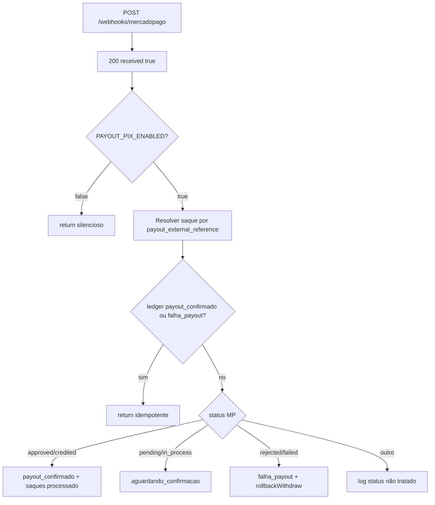

# V1.1F — Hardening webhook payout Mercado Pago

**Data:** 2026-05-18  
**Modo:** Fase 1 read-only · Fase 2 proposta ( **sem apply** · sem deploy · sem alterar inbound PIX / player / admin / gameplay )

**Origem:** [V1.1E](V1-1E-AUDITORIA-PAYOUT-SAQUES-2026-05-18.md) — risco residual: `POST /webhooks/mercadopago` sem validação HMAC.

**Referências código:** `server-fly.js` · `utils/webhook-signature-validator.js` · [CIRURGIA V1-S](CIRURGIA-V1-S-MERCADOPAGO-PIX-OUT-TRANSACTION-INTENTS.md) · [MP Webhooks doc](https://www.mercadopago.com.br/developers/en/docs/your-integrations/notifications/webhooks)

---

## Respostas diretas (Fase 2)

| Pergunta | Resposta |
|----------|----------|
| **Webhook payout vulnerável** | **Sim** |
| **Existe secret reutilizável** | **Sim** — `MERCADOPAGO_WEBHOOK_SECRET` (mesma aplicação MP Integrações); opcional futuro `MP_PAYOUT_WEBHOOK_SECRET` |
| **Patch recomendado** | Middleware HMAC **antes** do `200`, reutilizando `validateMercadoPagoWebhook` com extensão de `data.id` para transaction-intent + gate staging |
| **Arquivos alterados (previstos)** | `utils/webhook-signature-validator.js`, `server-fly.js` (+ script de teste opcional) |
| **Veredito cirurgia** | **GO COM RESSALVAS** |

---

## Fase 1 — Auditoria read-only

### 1. Endpoint `POST /webhooks/mercadopago`

| Item | Valor |
|------|-------|
| Ficheiro | `server-fly.js` (~L3542–3804) |
| Método / path | `POST /webhooks/mercadopago` |
| Auth | **Nenhuma** |
| Rate limit | Global `limiter` em `/api/` apenas — **rota `/webhooks/*` fora do prefixo `/api/`** |
| `rawBody` | Disponível via `express.json` verify (~L342–350) — **não usado** na validação payout |

**Ordem atual (crítica):**

1. Log keys do body  
2. **`res.status(200).json({ received: true })`** — MP considera entregue  
3. Processamento assíncrono no mesmo handler (sem fila)  

Qualquer cliente HTTP que atinja a URL recebe **200** antes de qualquer verificação de origem.

### 2. Payload esperado (transaction-intent / payout)

Corpo típico (inferido do handler + CIRURGIA V1-S):

| Campo | Uso |
|-------|-----|
| `id` | Intent MP (`mp_transaction_intent_id`) |
| `status` | Estado do intent (`approved`, `rejected`, `pending`, …) |
| `status_detail` | Detalhe (`approved` em `processed`, etc.) |
| `external_reference` | `payout_external_reference` (`wd_…`) |
| `type` | Se `payment` + `data.id` numérico → **ignorado** (defesa depósito) |

Se `external_reference` ou `status` ausentes → **GET** `getTransactionIntent(id)` com `MERCADOPAGO_PAYOUT_ACCESS_TOKEN` (~L3573–3581).

**Não** usa o formato `type: payment` + `data.id` do webhook de depósito.

### 3. Headers disponíveis

| Header | Usado hoje (payout) | Usado no depósito (inbound) |
|--------|---------------------|-----------------------------|
| `x-signature` | **Não** | **Sim** (`ts=…,v1=…`) |
| `x-request-id` | **Não** | **Sim** (manifest HMAC) |
| `Authorization` | Não | Não |
| Query `data.id` | **Não** (validação) | **Sim** (manifest MP) |

MP documentação padrão de webhooks envia `x-signature` + `data.id` em **query string** para o manifest `id:{data.id};request-id:{x-request-id};ts:{ts};` — independente do shape do JSON body.

### 4. Comparação com webhook PIX inbound

| Aspeto | `POST /api/payments/webhook` (depósito) | `POST /webhooks/mercadopago` (payout) |
|--------|----------------------------------------|--------------------------------------|
| Validação | `webhookSignatureValidator.validateMercadoPagoWebhook(req)` **antes** do handler | **Ausente** |
| Falha assinatura | **401** + `deposit_webhook_rejected` | N/A — sempre **200** |
| Secret | `MERCADOPAGO_WEBHOOK_SECRET` | Não lido |
| `data.id` | `query['data.id']` ou `body.data.id` | Deveria ser `query['data.id']` e/ou `body.id` (intent) |
| Resposta após OK | 200 + processamento | 200 **imediato** + processamento |
| Token MP | `MERCADOPAGO_DEPOSIT_ACCESS_TOKEN` | `MERCADOPAGO_PAYOUT_ACCESS_TOKEN` (só no GET intent) |

**Conclusão:** o padrão seguro **já existe** no inbound; payout **não o reutiliza**.

### 5. Secrets / env

| Variável | Função | Reutilizável para payout webhook? |
|----------|--------|----------------------------------|
| `MERCADOPAGO_WEBHOOK_SECRET` | HMAC inbound (`WebhookSignatureValidator` constructor) | **Sim** — se notificações payout estiverem na **mesma aplicação** MP (secret único por app) |
| `MERCADOPAGO_WEBHOOK_MAX_TS_SKEW_MS` | Janela anti-replay (default 30 min) | **Sim** |
| `MP_PAYOUT_WEBHOOK_URL` | URL registrada no POST intent (`notification_url`) | Configurar HTTPS; pode incluir path secreto adicional (defesa extra, não substitui HMAC) |
| `MP_PAYOUT_WEBHOOK_SECRET` | — | **Não existe** hoje; opcional se payout for app MP separada |
| `MP_PAYOUT_ENFORCE_SIGNATURE` | Ed25519 no **outbound** POST ao MP | **Não** é validação de webhook inbound |

Fly secrets listados em auditorias anteriores incluem `MERCADOPAGO_WEBHOOK_SECRET` — **secret reutilizável: sim**, com confirmação operacional no painel Integrações.

### 6. Efeitos do webhook (mapa financeiro)



| Ramo MP | Ledger | `saques.status` | Saldo usuário |
|---------|--------|-----------------|---------------|
| Approved-like | `payout_confirmado` | `processado` | **Sem alteração** (já debitado no request) |
| Pending-like | — | `aguardando_confirmacao` | — |
| Rejected/failed | `falha_payout` + `rollback` ×2 | terminal via `rollbackWithdraw` | **+valor + taxa** (estorno) |

**Riscos se evento forjado (estado atual):**

| Ataque | Possível hoje? | Impacto |
|--------|----------------|---------|
| Confirmar payout falso | **Sim**, se adivinhar `payout_external_reference` válido + saque não terminal | `processado` + ledger payout sem MP real |
| Forçar rollback | **Sim**, mesmo cenário | `falha_payout` + estorno saldo indevido |
| Replay MP legítimo | Parcialmente mitigado | Idempotência ledger + status terminal |
| Spam / log noise | **Sim** | 200 sempre; custo ops |

Mitigações **já presentes** (não substituem HMAC): lookup por `payout_external_reference`, match `mp_transaction_intent_id`, saque já `processado`/`falhou` → skip, dedup ledger.

### 7. Resposta a eventos inválidos

| Situação | HTTP | Corpo | Efeito colateral |
|----------|------|-------|------------------|
| Qualquer request | **200** | `{ received: true }` | MP não reenvia |
| Assinatura N/A | 200 | idem | — |
| `PAYOUT_PIX_ENABLED=false` | 200 | idem | Ignora após 200 |
| Saque não encontrado | 200 | idem | Log warn |
| Intent divergente | 200 | idem | Abort |
| Erro interno | 200 (catch) | idem | Log error |

**Gap:** não existe **401** para origem não confiável (contraste com depósito).

### 8. Idempotência atual

| Camada | Mecanismo |
|--------|-----------|
| HTTP | Sempre 200 — MP para de retry; replays manuais possíveis |
| Saque terminal | `processado` / `falhou` → return |
| Ledger | `SELECT` existente `payout_confirmado` \| `falha_payout` por `(correlation_id, referencia=saqueId)` |
| Escrita ledger | `createLedgerEntry` dedup `(correlation_id, tipo, referencia)` |
| Rollback | `rollbackWithdraw` dedup linhas `rollback` existentes |

**Conclusão:** idempotência **financeira** razoável; **autenticidade da origem** ausente.

---

## Fase 2 — Proposta cirúrgica (não aplicada)

### Objetivo

Blindar contra: replay (janela `ts`), chamada falsa (HMAC), URL vazada (HMAC + opcional path secret), evento forjado (manifest + `data.id`), confirmação/rollback indevidos (só após saque resolvido + mantendo invariantes atuais).

### Patch recomendado (único escopo)

**A. Refatorar rota payout em dois estágios** (espelhar depósito):

```text
POST /webhooks/mercadopago
  → middleware validatePayoutWebhookMercadoPago  // 401 se falhar
  → handler processamento                        // 200 só após OK
```

**B. Estender `utils/webhook-signature-validator.js`:**

Função `getMercadoPagoWebhookDataId(req)` hoje:

1. `query['data.id']`  
2. `body.data.id`  

**Adicionar** (somente se ainda ausente e body não for depósito `type=payment` numérico):

3. `body.id` (transaction-intent id)  
4. Opcional: `body.data?.id` genérico não numérico de payment  

Nova função exportada (recomendado):

`validateMercadoPagoPayoutWebhook(req)` → chama a mesma lógica de manifest + `MERCADOPAGO_WEBHOOK_SECRET`, com `dataId` estendido e log `MERCADOPAGO_WEBHOOK_DEBUG_LOG`.

**C. `server-fly.js` — handler payout:**

- Mover `res.status(200)` para **depois** da validação.  
- Em falha: `401` + `financeLog('withdraw_webhook_rejected', { reason })` — simétrico ao depósito.  
- Manter **todo** o corpo do processamento financeiro **inalterado** (sem mudar inbound).

**D. Defesa em profundidade (opcional fase 1.1, mesma PR ou follow-up):**

Após HMAC OK, se `intentId` presente: exigir que `getTransactionIntent(intentId)` com token payout **confirme** `external_reference` e `status` coerentes com o body antes de ledger/rollback. Reduz impacto de manifest mal configurado.

**E. Não fazer nesta cirurgia:**

- Alterar `POST /api/payments/webhook`  
- Alterar worker / `processPendingWithdrawals` (exceto imports se necessário)  
- Deploy direto em produção sem gate  
- Assinatura Ed25519 do body (é do **outbound** POST ao MP, não do webhook recebido)

### Arquivos previstos

| Ficheiro | Alteração |
|----------|-----------|
| `utils/webhook-signature-validator.js` | `getMercadoPagoWebhookDataId` + `validateMercadoPagoPayoutWebhook` / middleware factory |
| `server-fly.js` | Apenas bloco `POST /webhooks/mercadopago` (~40–80 linhas movidas/reordenadas) |
| `scripts/test-payout-webhook-signature.js` (opcional) | Gerar manifest + request fake para staging |
| `.env.example` (opcional) | Documentar `MP_PAYOUT_WEBHOOK_SECRET` fallback |

**Fora de escopo:** `goldeouro-player`, `goldeouro-admin`, RPC PIX, patches SQL.

### Variáveis de ambiente

| Env | Ação |
|-----|------|
| `MERCADOPAGO_WEBHOOK_SECRET` | **Obrigatório** em prod (já usado no inbound) |
| `MP_PAYOUT_WEBHOOK_SECRET` | Opcional — só se secret de notificação payout ≠ pagamentos |
| `MERCADOPAGO_WEBHOOK_MAX_TS_SKEW_MS` | Manter (anti-replay) |
| `MERCADOPAGO_WEBHOOK_DEBUG_LOG=1` | Staging: validar manifest com MP Simulator |

### Gate antes de produção (obrigatório)

1. **Staging / sandbox:** MP Notifications Simulator — evento payout/transaction-intent com `x-signature` + `data.id` na query.  
2. Confirmar no painel qual `data.id` o MP envia (intent id vs outro).  
3. Regressão: depósito `POST /api/payments/webhook` continua 401 sem assinatura.  
4. Teste negativo: POST forjado para `/webhooks/mercadopago` → **401**, **sem** `payout_confirmado` / rollback.  
5. `PAYOUT_PIX_ENABLED=false`: ainda **401** sem assinatura (não vazar processamento por flag).  
6. Deploy Fly **após** gate; monitorar `withdraw_webhook_rejected` vs `withdraw_webhook_confirmed`.

### Riscos da cirurgia

| Risco | Mitigação |
|-------|-----------|
| Manifest `data.id` diferente no payout MP | Validar com simulador; fallback GET intent; debug log manifest |
| MP reenvia sem `data.id` na query | Rejeitar 401; documentar requisito; alinhar URL no painel Integrações |
| Secret errado entre apps | `MP_PAYOUT_WEBHOOK_SECRET` opcional |
| Falso positivo 401 em prod | Rollout staging primeiro; feature flag `MP_PAYOUT_WEBHOOK_ENFORCE=false` temporário **não recomendado** em prod |
| Quebrar depósito | Diff restrito a `/webhooks/mercadopago` apenas |

### Riscos residuais pós-hardening

- URL vazada + secret vazado → mesmo risco que inbound (rotação de secret).  
- Replay dentro da janela `ts` (30 min) — igual inbound.  
- Ataque interno com secret Fly — fora do escopo webhook.

---

## Matriz de veredito — cirurgia

| Critério | Status |
|----------|--------|
| Problema bem delimitado (só payout webhook) | **PASS** |
| Reuso de `webhook-signature-validator.js` | **PASS** |
| Secret existente em prod | **PASS** (ressalva: confirmar painel MP) |
| Documentação MP confirma headers no payout | **RESSALVA** (validar no simulador) |
| Sem impacto inbound/player/admin | **PASS** (se diff cirúrgico) |
| Gate staging definido | **PASS** |

| Veredito | **GO COM RESSALVAS** |
|----------|----------------------|
| Motivo | Implementação recomendada e alinhada ao inbound; **bloquear apply prod** até prova com MP Simulator de que `data.id` + manifest funcionam para transaction-intent. Se o simulador falhar, aplicar **plano B**: HMAC quando query presente + obrigatoriedade de `getTransactionIntent` autoritativo antes de efeitos financeiros. |

**NO-GO** apenas se: MP confirmar que notificações payout **não** suportam `x-signature` / `data.id` **e** plano B também for inviável.

---

## Plano B (fallback documentado)

Se o manifest padrão não cobrir payout:

1. Rejeitar requests **sem** `x-signature` válida **quando** query `data.id` presente.  
2. Para requests **sem** assinatura MP (legado): não processar efeitos financeiros; apenas log + 401.  
3. Processar **somente** após `GET /v1/transaction-intents/{id}` 200 com Bearer payout, cruzando `external_reference` com saque existente e `mp_transaction_intent_id` (se já persistido).

Isto não substitui HMAC ideal, mas elimina POST JSON arbitrário como gatilho de rollback/confirmação.

---

## Snippet alvo (referência — estado atual)

Ordem a corrigir em `server-fly.js`:

```3542:3548:server-fly.js
app.post('/webhooks/mercadopago', async (req, res) => {
  try {
    console.log('🟦 [WEBHOOK][MP][PAYOUT] recebido', {
      keys: req.body && typeof req.body === 'object' ? Object.keys(req.body) : []
    });

    res.status(200).json({ received: true });
```

Padrão alvo (depósito):

```3437:3451:server-fly.js
  const validation = webhookSignatureValidator.validateMercadoPagoWebhook(req);
  if (!validation.valid) {
    financeLog('deposit_webhook_rejected', { ... });
    return res.status(401).json({ error: 'Invalid signature' });
  }
  ...
  res.status(200).json({ received: true });
```

---

*Relatório V1.1F — hardening webhook payout (auditoria + proposta), 2026-05-18. Nenhuma alteração de código ou produção nesta missão.*
