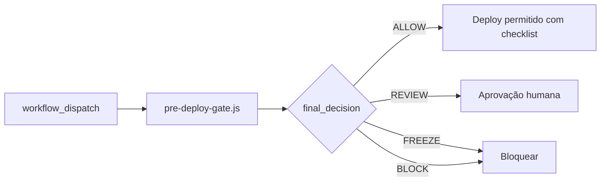

# Modelo CI — Activation Gate (V1.5B)

Transforma o gate manual V1.5A em **modelo de CI futura** sem ativação automática.

## Fluxo

## Decisões

| Decisão | CI (quando ativo) | Humano |
|---------|-------------------|--------|
| ALLOW | Job verde; deploy job pode prosseguir | Checklist DEPLOY |
| REVIEW | Job amarelo; aguardar approval environment | ops + deploy-owner |
| FREEZE | Job vermelho (`enforce_gate`) | Contenção + re-run gate |
| BLOCK | Job vermelho (`enforce_gate`) | NO-GO até resolução |

## Artefatos

| Saída | Path |
|-------|------|
| JSON | `docs/relatorios/V1-5A-ACTIVATION-GATE-PRE-DEPLOY-DATA-2026-05-19.json` |
| Markdown | `docs/relatorios/V1-5A-ACTIVATION-GATE-PRE-DEPLOY-2026-05-19.md` |
| CI artifact | upload no workflow |

## Baseline operacional (referência)

| Item | Valor certificado |
|------|-------------------|
| Runtime SHA | `a83c3cf` |
| Fly | v461 |
| Player bundle | `index-B6M2smS9.js` |

Gate **REVIEW** atual ≠ produção down — exige sign-off antes de deploy.

## Secrets (somente quando ativar)

| Secret | Uso |
|--------|-----|
| `SUPABASE_URL_PROD` | Métricas financeiras read-only |
| `SUPABASE_SERVICE_ROLE_KEY_PROD` | PostgREST read-only |
| `PROD_API_BASE` | Opcional env var (público) |

**Não** commitar secrets. **Não** usar em PR de forks sem environment protection.

## Diferença: exemplo vs workflow ativo

| Aspeto | `.github/examples/` | `.github/workflows/` |
|--------|----------------------|----------------------|
| Executado pelo GitHub | Não | Sim |
| Bloqueia merge/deploy | Não | Pode (`enforce_gate`) |
| Triggers | Comentado | `workflow_dispatch` (+ PR futuro) |
| Risco | Zero | Médio se mal configurado |

## Critérios para promover a workflow ativo

1. [ ] 14 dias `workflow_dispatch` sem falsos BLOCK por rede
2. [ ] Gate manual local alinhado ao CI (mesmo JSON path)
3. [ ] Documentação FREEZE/ROLLBACK assinada
4. [ ] Secrets em GitHub Environments com reviewers
5. [ ] `enforce_gate: false` por 7 dias, depois `true` para BLOCK/FREEZE
6. [ ] Zero incidentes P0 correlacionados a gate
7. [ ] Postmortem template testado

## Relacionados

- [ACTIVATION-GATE-MODEL.md](../ACTIVATION-GATE-MODEL.md)
- [FREEZE-GOVERNANCE-POLICY.md](../freeze/FREEZE-GOVERNANCE-POLICY.md)
- [pre-deploy-gate.js](../../../scripts/activation/pre-deploy-gate.js)
