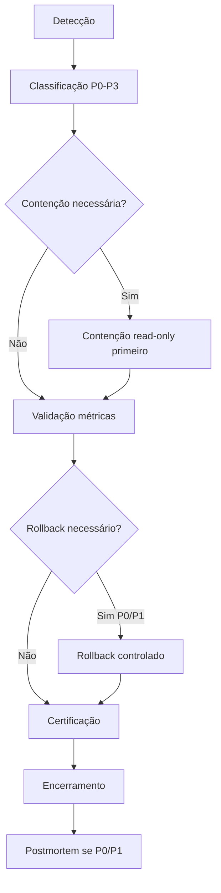

# Incident Response Flow — Gol de Ouro

**Versão:** V1.2D · 2026-05-19  
**Princípio:** observar → classificar → conter → validar → (rollback) → certificar → encerrar → postmortem

---

## Fluxo

---

## 1. Detecção

**Fontes:**

- `node scripts/v1-2b-operational-alerts.js` (alertas financeiro/runtime)
- `node scripts/v1-2c-runtime-drift-deploy-integrity.js` (drift deploy)
- `node scripts/v1-2a-runtime-financial-health.js` (baseline saúde)
- Monitoramento GitHub Actions / Fly / logs `financeLog`
- Suporte usuário / admin

**Registro mínimo:** timestamp UTC, alerta ID, métrica live vs baseline, link runbook.

---

## 2. Classificação

Usar [CLASSIFICACAO-DE-INCIDENTES.md](CLASSIFICACAO-DE-INCIDENTES.md).

- Atribuir **P0–P3**
- Abrir canal incidente (se P0/P1)
- Definir owner e SLA

---

## 3. Contenção

**Ordem preferencial (read-only primeiro):**

1. Confirmar `/health`, webhooks 401 sem assinatura, `/meta` SHA.
2. Parar ações manuais não autorizadas (crédito, SQL, deploy).
3. Se P0 financeiro: avaliar freeze saques/payouts via config (requer change control — **não** automático neste runbook).
4. Coletar evidências: JSON V1.2A/B/C, logs Fly filtrados por `financeLog`, `deposit_webhook_rejected`, `withdraw_webhook_rejected`.

---

## 4. Validação

| Check | Comando / probe |
|-------|-----------------|
| Saúde API | `GET /health` |
| SHA live | `GET /meta` |
| Alertas | `node scripts/v1-2b-operational-alerts.js` |
| Drift | `node scripts/v1-2c-runtime-drift-deploy-integrity.js` |
| Ledger duplicatas | SQL read-only (runbook financeiro) |

**Critério de saída da contenção:** métrica estabilizada ou causa raiz identificada.

---

## 5. Rollback

**Quando:** P0/P1 com deploy correlacionado (&lt; 24 h) ou regressão confirmada.

| Camada | Procedimento |
|--------|--------------|
| Backend Fly | `.github/workflows/rollback.yml` ou release anterior documentada · **não** ad-hoc sem relatório |
| Frontend | `frontend-rollback-manual.yml` · snapshot H3-6C |
| Financeiro | **Não** rollback SQL sem plano B documentado |

Referência: [RUNBOOK-fly-release-inesperada](runtime/RUNBOOK-fly-release-inesperada.md).

---

## 6. Certificação

Após mitigação:

1. Reexecutar V1.2A + V1.2B + V1.2C.
2. Veredito **PASS** ou **PASS COM RESSALVAS** documentado.
3. Atualizar baseline se novo deploy controlado (novo relatório V1.1F-style).

---

## 7. Encerramento

- Fechar incidente com resumo: causa, impacto, ações, métricas antes/depois.
- Atualizar runbook se gap identificado.

---

## 8. Postmortem

**Obrigatório para:** P0, P1 recorrente, qualquer perda financeira.

**Template mínimo:**

- Timeline UTC
- Root cause (5 whys)
- Detecção: por que alerta não pegou antes?
- Ações corretivas / preventivas
- Donos e prazos

---

## Ações sempre proibidas em incidente (até decisão explícita)

- Deploy não planejado em P0/P1 aberto
- `claim_and_credit_approved_pix_deposit` em U1–U4 sem runbook
- SQL mutável em produção sem change ticket
- Rollback financeiro “no escuro”
- Desabilitar HMAC para “destravar” webhook
